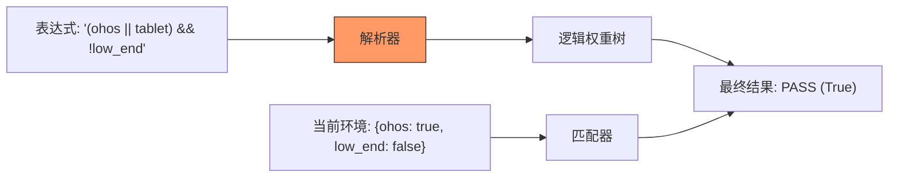

欢迎加入开源鸿蒙跨平台社区：[https://openharmonycrossplatform.csdn.net](https://openharmonycrossplatform.csdn.net)


# Flutter for OpenHarmony: Flutter 三方库 boolean_selector 复杂的条件布尔逻辑筛选引擎（多维度筛选利器）

## 前言

在 OpenHarmony 应用中，我们经常需要处理“由于多种条件交织而成的逻辑规则”。例如：
1. **测试平台筛选**：一段代码只在 `(ohos || android) && !web` 时运行。
2. **复杂的权限判定**：用户必须满足 `(有会员 && 有积分) || 是特邀嘉宾` 才能进入某个页面。
3. **特征匹配**：在电商搜索中，筛选 `(产地:广东 && 价格<100) || (品牌:华为)` 的商品。

如果手动写一系列 `if...else`，代码会变得极其难以阅读和配置。**`boolean_selector`** 提供了一种类似于 SQL `WHERE` 子句或代码表达式的声明式方案，让你能用字符串定义逻辑，并高效地进行模式匹配。

---

## 一、核心逻辑匹配流

该库将逻辑表达式解析为一棵树，并根据给定的“环境（Context）”输出布尔结果。



---

## 二、核心 API 实战

### 2.1 解析布尔表达式

```dart
import 'package:boolean_selector/boolean_selector.dart';

void basicUsage() {
  // 💡 定义一条逻辑规则
  final selector = BooleanSelector.parse('(chrome || safari) && !mobile');
  
  // 💡 检查某个标签集合是否满足规则
  bool isMatch = selector.evaluate((tag) {
    if (tag == 'chrome') return true;
    if (tag == 'mobile') return false;
    return false;
  });

  print('匹配结果: $isMatch');
}
```

### 2.2 多端联合判定 (推荐用法)

```dart
final ohosSelector = BooleanSelector.parse('openharmony & high_performance');

// 使用一个简单的 List 判定
bool isOhosVip = ohosSelector.evaluate((t) => ['openharmony', 'high_performance'].contains(t));
```

---

## 三、常见应用场景

### 3.1 鸿蒙应用内功能开关（Feature Toggles）
在后端下发的一组开关配置中，利用字符串控制功能的显示。例如下发配置 `"(v1.2.0 | v1.3.0) & enable_dark_mode"`，客户端直接解析并执行。

### 3.2 自定义测试框架
为你的鸿蒙插件编写单测时，利用标签系统标记哪些用例属于 `native`，哪些属于 `mock`，然后通过 `BooleanSelector` 灵活选择要运行的子集。

---

## 四、OpenHarmony 平台适配

### 4.1 适配鸿蒙多设备特征识别
💡 **技巧**：鸿蒙生态涵盖了手机、手表、电视等多种形态。你可以根据 `device_type` 和 `api_level` 构建一个特征集合（Tags），然后通过 `boolean_selector` 快速判断当前设备是否应该启用某项高级动效或高负载渲染逻辑。

### 4.2 极致的执行效率
由于该库核心逻辑非常精简，不依赖任何第三方运行时，在鸿蒙真机 AOT 编译后表现出非常强劲的评估速度。即使在复杂的瀑布流每一项中进行一次逻辑判定，也不会由于计算量大而引起 UI 掉帧。

---

## 五、完整实战示例：鸿蒙云端功能动态分发器

本示例展示如何利用字符串逻辑实现复杂的路由拦截。

```dart
import 'package:boolean_selector/boolean_selector.dart';

class OhosFeatureGate {
  /// 根据规则判定是否启用鸿蒙流转功能
  bool canEnableMirroring(String rule, Map<String, bool> context) {
    print('🧐 正在审计鸿蒙动态特征匹配...');
    
    try {
      final selector = BooleanSelector.parse(rule);
      // 💡 评估上下文
      return selector.evaluate((variable) => context[variable] ?? false);
    } catch (e) {
      print('❌ 非法的逻辑语法');
      return false;
    }
  }
}

void main() {
  final gate = OhosFeatureGate();
  
  // 目标场景：必须是鸿蒙系统 且 (是折叠屏 或者 拥有分布式权限)
  const rule = "ohos & (foldable | distributed_auth)";
  
  final myDevice = {
    'ohos': true,
    'foldable': false,
    'distributed_auth': true,
  };

  bool ok = gate.canEnableMirroring(rule, myDevice);
  print('结果：${ok ? "允许开启流转" : "条件不足"}');
}
```

<!-- IMAGE_PLACEHOLDER: 鸿蒙设备展示不同设备特征标签通过布尔引擎计算出不同功能的演示截图 -->

---

## 六、总结

`boolean_selector` 软件包是 OpenHarmony 开发者处理“多变业务逻辑”的利器。它将原本硬编码在项目各处的布尔逻辑抽离出来，转化为易于配置、可从云端下发的动态字符串表达式。在追求高度灵活性和快速响应业务变更的鸿蒙原生应用开发中，引入这套轻量级的逻辑引擎，能为你的架构提供极强的扩展性。
