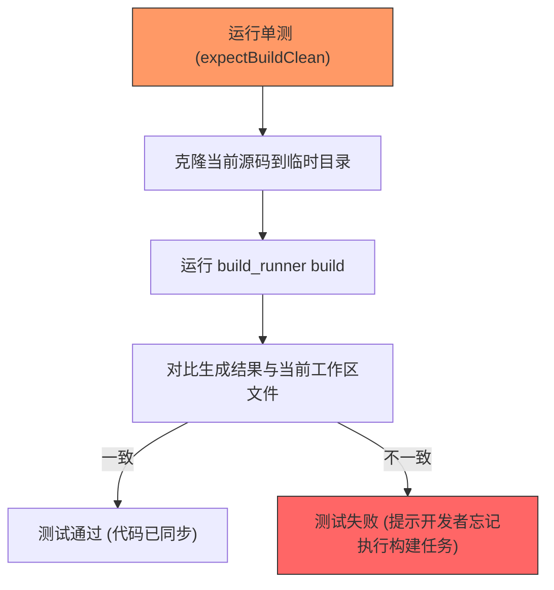

欢迎加入开源鸿蒙跨平台社区：[https://openharmonycrossplatform.csdn.net](https://openharmonycrossplatform.csdn.net)


# Flutter for OpenHarmony: Flutter 三方库 build_verify 确保你的代码生成始终与源码保持同步（工程化验证利器）

## 前言

在 OpenHarmony 项目的工程化建设中，自动化代码生成（Code Generation）如 `json_serializable`、`freezed` 或 `retrofit` 已经成为标配。但随之而来一个隐患：如果某个开发者修改了源代码，却忘记运行 `dart run build_runner build`，那么提交到代码仓库的 `.g.dart` 文件就会与源码脱节，导致线上出现难以排查的 Bug。

**`build_verify`** 是一个专门用于持续集成（CI）阶段的验证工具。它能以极低的配置成本，确保你当前的 `.g.dart` 文件是由最新的源码生成的。

---

## 一、核心校验原理

`build_verify` 会在临时目录执行一次完整的构建过程，并对比生成的产物。



---

## 二、核心 API 实战

### 2.1 极简用法

你只需要在项目的 `test` 目录下创建一个简单的单测文件。

```dart
import 'package:build_verify/build_verify.dart';
import 'package:test/test.dart';

void main() {
  test('验证代码生成一致性', () {
    // 💡 该函数会自动调用 build_runner 并检查工作区是否变“脏”
    expectBuildClean(
      packageRelativePath: '.', // 相对于项目根目录的路径
    );
  });
}
```

### 2.2 自定义构建路径

如果你的鸿蒙项目在多模块环境下。

```dart
expectBuildClean(
  packageRelativePath: 'packages/ohos_core_module',
);
```

---

## 三、常见应用场景

### 3.1 鸿蒙 CI 流水线守门员
在鸿蒙应用的自动化流水线（如 GitHub Actions 或 AtomGit CI）中，将此测试作为必选流程。

```yaml
# CI 脚本示例
jobs:
  verify:
    runs-on: ubuntu-latest
    steps:
      - uses: actions/checkout@v3
      - uses: subosito/flutter-action@v2
      - run: flutter test test/build_verify_test.dart
```

### 3.2 规范多人协作流程
在大型鸿蒙项目组中，不同开发者的 `build_runner` 版本或配置可能略有差异。通过 `build_verify` 统一验证，可以强制所有提交者产出完全一致的代码片段。

---

## 四、OpenHarmony 平台适配

### 4.1 适配鸿蒙多模块 (HAR/HSP) 结构
💡 **技巧**：在鸿蒙复杂的原生/Flutter 混合工程中，如果你使用了大量的自定义代码生成器（如生成 ArkTS 桥接代码），`build_verify` 足以保障这些跨语言生成的桥接文件在每次提交前都是由最新的 Dart 协议生成的，极大降低了运行时崩溃的风险。

### 4.2 零运行时开销
该库完全作为 `dev_dependencies` 使用。它不参与鸿蒙系统的渲染和业务执行。它的意义在于保障构建产物的 100% 确定性，这对于对稳定性有极高要求的鸿蒙金融级应用至关重要。

---

## 五、完整实战示例：鸿蒙数据模型同步卫士

本示例展示如何将 `build_verify` 集成到一个典型的鸿蒙 Flutter 项目中。

```dart
// 💡 文件路径: test/ensure_build_test.dart

import 'package:build_verify/build_verify.dart';
import 'package:test/test.dart';

void main() {
  // 1. 设置测试组
  group('鸿蒙工程自动化审计', () {
    
    test('模型序列化文件同步验证', () async {
      print('🚀 正在执行鸿蒙代码生成一致性审计...');
      
      // 2. 调用核心校验 logic
      // 它会检查所有的 .g.dart 文件是否匹配当前源码
      await expectBuildClean(
        packageRelativePath: '.',
        customCommand: ['flutter', 'pub', 'run', 'build_runner', 'build', '--delete-conflicting-outputs'],
      );
      
      print('✅ 审计通过！所有生成文件均已同步。');
    });
    
  });
}
```

<!-- IMAGE_PLACEHOLDER: 鸿蒙设备运行测试成功的控制台截图 -->

---

## 六、总结

`build_verify` 软件包是 OpenHarmony 开发者迈向“高级开发者”的工程化勋章。它虽然不产出任何酷炫的 UI 效果，但它守护了分布式架构下最核心的数据契约一致性。如果你不想在多人协作时陷入“代码生成版本不一致”的泥潭，那么请务必在你的鸿蒙项目中加入这道强力防火墙。
