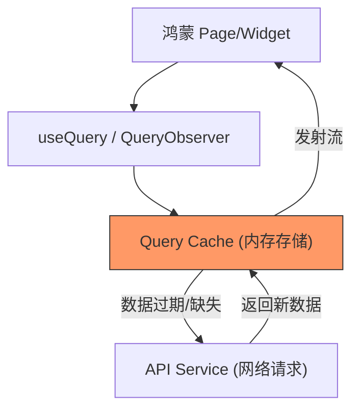

欢迎加入开源鸿蒙跨平台社区：[https://openharmonycrossplatform.csdn.net](https://openharmonycrossplatform.csdn.net)


# Flutter for OpenHarmony: Flutter 三方库 cached_query 为鸿蒙应用打造高性能声明式数据缓存系统（前端缓存终极方案）

## 前言

在进行 OpenHarmony 应用开发时，网络请求的响应速度直接决定了用户体验（体验 UX）。如果用户每次切换页面都必须等待加载动画，应用会显得非常低级。我们不仅需要处理异步数据请求，更需要一套精密的机制来解决以下痛点：
1. **自动缓存**：第二次访问时应瞬间展示历史数据。
2. **过期失效（Stale-while-revalidate）**：在展示旧数据的同时，后台静默拉取新数据。
3. **无限滚动**：简单地处理分页与数据追加内容逻辑。

**`cached_query`** 是一个类似于 Web 端 React Query 的 Dart 状态管理库。它专注于数据获取与同步，让你的鸿蒙应用具备顶级的数据缓存表现。

---

## 一、核心缓存驱动机制

`cached_query` 在内存与数据源之间建立了一层“智能感知”缓存。



---

## 二、核心 API 实战

### 2.1 定义单一查询

```dart
import 'package:cached_query/cached_query.dart';

final userQuery = Query<Map<String, dynamic>, int>(
  key: 'user_info', // 💡 唯一的缓存标识
  queryFn: (userId) async {
    // 模拟网络请求
    await Future.delayed(Duration(seconds: 1));
    return {'id': userId, 'name': '鸿蒙开发者'};
  },
  config: QueryConfig(
    staleTime: Duration(minutes: 5), // 💡 5 分钟内不重新抓取
  ),
);
```

### 2.2 执行异步突变 (Mutation)

常用于更新、删除等会导致缓存失效的操作。

```dart
final updateMutation = Mutation<void, String>(
  queryFn: (newName) => api.updateUser(newName),
  onSuccess: (res, arg) {
    // 💡 成功后通知缓存失效，自动触发重新抓取
    CachedQuery.instance.invalidateQueries(key: 'user_info');
  },
);
```

### 2.3 在 UI 中观测

```dart
QueryObserver<Map<String, dynamic>, int>(
  query: userQuery,
  arg: 123,
  builder: (context, state) {
    if (state.status == QueryStatus.loading) return CircularProgressIndicator();
    return Text('用户名：${state.data?['name']}');
  },
)
```

---

## 三、常见应用场景

### 3.1 鸿蒙新闻客户端列表
利用 `InfiniteQuery` 轻松实现“加载更多”逻辑。它会自动合并多个历史 Page 的数据，并记录每一个 Page 的滚动状态和游标（Cursor）。

### 3.2 离线优先的应用场景
结合 `cached_query_storage` 插件，可以将内存中的缓存异步序列化到鸿蒙系统的本地磁盘中。只要应用启动，即使在断网状态，也能立即看到上一次的全部内容。

---

## 四、OpenHarmony 平台适配

### 4.1 全局缓存单例
💡 **技巧**：`cached_query` 的核心 `CachedQuery.instance` 是全局共享的。在鸿蒙多端（如手机、平板）同步时，由于鸿蒙系统对内存管理的策略，通过手动配置 `cacheTime` 和 `staleTime` 的平衡，可以有效降低后台进程对 CPU 和网络的唤醒，提升续航。

### 4.2 适配鸿蒙复杂状态变更
在鸿蒙的“流转”场景下（跨设备接续），状态数据需要迅速序列化。由于 `cached_query` 的缓存数据是强类型的 JSON 或实体，我们可以通过自定义 `storage` 接口无缝对接鸿蒙的 `Storage` 模块，实现近乎无感的跨设备状态接力。

---

## 五、完整实战示例：鸿蒙天气信息同步器

本示例展示如何利用缓存策略获取天气信息，并在 10 分钟内复用缓存。

```dart
import 'package:cached_query/cached_query.dart';

class OhosWeatherService {
  late Query<String, String> weatherQuery;

  OhosWeatherService() {
    weatherQuery = Query<String, String>(
      key: 'current_weather',
      queryFn: (city) async {
        print('🌐 正在向鸿蒙气象服务发起请求 ($city)...');
        await Future.delayed(Duration(seconds: 1));
        return "25°C 晴朗";
      },
      config: QueryConfig(
        staleTime: Duration(minutes: 10), // 💡 缓存保鲜期 10 分钟
      ),
    );
  }

  void refresh() {
    // 手动强制刷新，绕过缓存
    weatherQuery.refetch();
  }
}

void main() async {
  final service = OhosWeatherService();
  
  // 第一次：发起请求
  await service.weatherQuery.getResult("深圳");
  
  // 第二次：瞬间从内存返回，不触发请求
  await service.weatherQuery.getResult("深圳");
}
```

<!-- IMAGE_PLACEHOLDER: 鸿蒙设备展示数据从“转圈”到“秒开”的加载速度对比演示截图 -->

---

## 六、总结

`cached_query` 软件包是 OpenHarmony 开发者打磨“极致快感”应用的架构首选。它不仅解决了简单的“拿数据”问题，更通过对数据生命周期的精密控制，实现了对带宽和用户等待时间的双重优化。在一个快速互联、体验至上的鸿蒙原生应用生态中，引入这样一套现代化的状态管理机制，是你构建世界级应用的基础底座。
