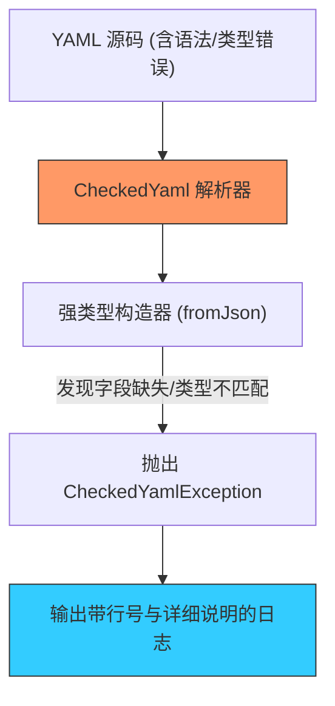

欢迎加入开源鸿蒙跨平台社区：[https://openharmonycrossplatform.csdn.net](https://openharmonycrossplatform.csdn.net)


# Flutter for OpenHarmony: Flutter 三方库 checked_yaml 带有友好报错提示的 YAML 强类型解析器（配置审计专家）

## 前言

在 OpenHarmony 应用开发中，YAML 格式常用于各种配置文件（如插件配置、多项目管理、静态资源清单）。传统的 YAML 解析库在遇到内容错误时，往往只会抛出一个模糊的 `FormatException`，让开发者对着几十行的配置找半天也看不出哪里的缩进或类型写错了。

**`checked_yaml`** 是对底层 `yaml` 库的高级封装。它的核心使命是：在将 YAML 映射到 Dart 对象时，提供极其精准、具象且带有代码位置指示的错误报告。它是构建健壮的鸿蒙插件或自动化脚本配置层的“审计专家”。

---

## 一、核心报错审计机制

它不仅解析内容，还负责“校验”内容是否符合预期的类结构。



---

## 二、核心 API 实战

### 2.1 安全地映射配置对象

```dart
import 'package:checked_yaml/checked_yaml.dart';

class OhosConfig {
  final String appName;
  final int version;

  OhosConfig({required this.appName, required this.version});

  // 💡 定义 Factory 构造函数
  factory OhosConfig.fromJson(Map json) {
    return OhosConfig(
      appName: json['appName'] as String,
      version: json['version'] as int,
    );
  }
}

void main() {
  const yamlSource = "appName: 鸿蒙应用\nversion: '2026'"; // 💡 故意将 int 写成 string
  
  try {
    // 💡 执行带检查的解析
    final config = checkedYamlDecode(
      yamlSource,
      (m) => OhosConfig.fromJson(m!),
    );
  } on CheckedYamlException catch (e) {
    // 💡 这里会输出极其详细的错误，包含行号、错误列和预期类型
    print(e);
  }
}
```

---

## 三、常见应用场景

### 3.1 鸿蒙插件配置解析
当你开发一个供他人使用的鸿蒙 Flutter 插件时，通过 `checked_yaml` 解析用户的 `pubspec.yaml` 扩展块，可以确保在配置不合规时，给用户抛出一个“由于 `version` 字段应为数字”的清晰反馈，极大降低支持成本。

### 3.2 自定义 CI/CD 流程审计
在鸿蒙应用的自动化流水线中，通过该库解析部署配置文件，防止因手抖造成的非法配置导致后续昂贵的打包流程失败。

---

## 四、OpenHarmony 平台适配

### 4.1 适配鸿蒙多层级配置结构
💡 **技巧**：在复杂的鸿蒙项目中，YAML 配置可能嵌套极深。`checked_yaml` 的错误堆栈追踪能准确指出是哪一级嵌套出现了问题。在鸿蒙设备上运行相关的配置预检工具时，它不仅能保证逻辑的健壮性，其输出的报错文本可以直接展示在鸿蒙原生的弹窗或控制台中，引导开发者快速修复。

### 4.2 零反射的高性能校验
该库完全基于 Dart 的类型系统和手动映射。在鸿蒙 AOT 坏境下，它既不需要反射（Mirrors），也不通过复杂的动态内存分析，因此在鸿蒙手机等手持设备上进行配置加载时，能实现几乎零感知的解析体验。

---

## 五、完整实战示例：鸿蒙工程化配置合法性卫士

本示例演示如何通过 `checked_yaml` 构建一个严密的配置审计类。

```dart
import 'package:checked_yaml/checked_yaml.dart';

class OhosProjectMetaData {
  final List<String> permissions;

  OhosProjectMetaData({required this.permissions});

  factory OhosProjectMetaData.fromJson(Map json) => OhosProjectMetaData(
        // 💡 这里如果 json['permissions'] 不是 List，会触发精准报错
        permissions: (json['permissions'] as List).cast<String>(),
      );
}

class ohosValidator {
  void audit(String content) {
    print('📦 正在启动鸿蒙工程配置深度审计...');
    try {
      checkedYamlDecode(content, (m) => OhosProjectMetaData.fromJson(m!));
      print('✅ 审计通过：配置格式完美');
    } catch (e) {
      print('❌ 安全告警：检测到非法配置配置项！\n$e');
    }
  }
}

void main() {
  final v = ohosValidator();
  v.audit("permissions: 'all'"); // 错误：应该是列表
}
```

<!-- IMAGE_PLACEHOLDER: 鸿蒙 DevEco Studio 的输出窗口中，由于 YAML 字段类型不匹配而显示的带色块定位的报错信息截图 -->

---

## 六、总结

`checked_yaml` 软件包是 OpenHarmony 开发者打磨“健壮应用”的细节功臣。它将原本冰冷、模棱两可的解析异常，转化为具有温度和引导性的调试指南。在追求极致可靠性和专业化工程建设的鸿蒙原生应用生态中，引入这套具备深度审计能力的解析机制，能让你的配置管理层变得坚如磐石，同时也极大提升了其使用者的开发幸福感。
