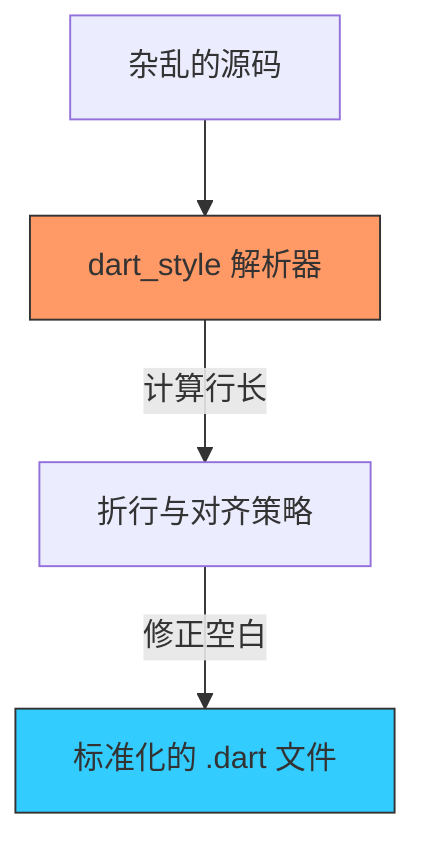

欢迎加入开源鸿蒙跨平台社区：[https://openharmonycrossplatform.csdn.net](https://openharmonycrossplatform.csdn.net)


# Flutter for OpenHarmony: Flutter 三方库 dart_style 像官方一样统一你的鸿蒙代码格式（代码美化神器）

## 前言

在 OpenHarmony 项目开发中，不论是个人的“心血之作”还是团队协作的“巨无霸”工程，代码的可读性是维护成本的生命线。每个人都有自己的编码习惯：有人喜欢紧凑型，有人喜欢在大括号前后留白。如果代码格式没有统一的标准，代码提交（Git Merge）时的差异对比将是一场灾难。

**`dart_style`**（其核心命令即 `dart format`）是 Dart 语言官方出品的格式化引擎。它通过一套被全球 Dart 开发者公认的算法，强制将你的源码重新排版为最标准、最易读的形态。

---

## 一、核心排版逻辑

`dart_style` 采用“行长度优先”的排版权重算法。



---

## 二、核心 API 实战

### 2.1 命令行全量格式化

这是鸿蒙开发者最常用的操作。

```bash
# 💡 格式化 lib 目录下所有的鸿蒙代码，并输出格式化详情
dart format lib/

# 💡 强制检查模式 (常用于 CI：如果有文件未格式化则报错)
dart format . --set-exit-if-changed
```

### 2.2 在 Dart 代码中动态调用

如果你正在开发一款在鸿蒙平板运行的代码编辑器。

```dart
import 'package:dart_style/dart_style.dart';

void formatSnippet() {
  final formatter = DartFormatter();
  
  String rawCode = "void main(){print('hello');}";
  
  // 💡 转换为官方推荐格式
  String formatted = formatter.format(rawCode);
  
  print(formatted);
}
```

---

## 三、常见应用场景

### 3.1 鸿蒙 CI 提交前置检查
在 Git Hooks (如 Husky) 或鸿蒙代码自动化审查（Audit）环节，运行 `dart_style` 校验，确保入库的代码符合“洁癖级”规范。

### 3.2 自动化脚本生成
当你利用 `source_gen` 为鸿蒙项目自动生成桥接代码时，由于拼接出来的字符串往往很乱，通过 `dart_style` 后处理，可以让生成的 `.g.dart` 文件读起来就像人写的一样自然。

---

## 四、OpenHarmony 平台适配

### 4.1 适配鸿蒙多层级目录结构
💡 **技巧**：在典型的鸿蒙 Flutter 项目中，源码分布在 `lib/` 甚至 `ohos/` 目录的某些部分。利用 `dart_style` 的递归扫描能力，可以一次性清理掉整个工程中分散的“格式垃圾”。

### 4.2 提升代码 Diff 效率
在鸿蒙开发者进行 CR（代码评审）时，标准的格式化可以杜绝因“换行差异”或“空格多寡”引起的无效变动提示，让评审者聚焦在真正的业务逻辑变动上。这在快节奏的鸿蒙系统迭代中非常关键。

---

## 五、完整实战示例：鸿蒙工程化美化脚本

本示例演示如何编写一个简单的清理工具，批量美化指定目录下的所有鸿蒙 Dart 文件。

```dart
import 'dart:io';
import 'package:dart_style/dart_style.dart';

class OhosStyleFixer {
  final _formatter = DartFormatter();

  void fixDirectory(String dirPath) {
    print('🎨 正在对鸿蒙项目执行“视觉净化”...');
    
    final dir = Directory(dirPath);
    if (!dir.existsSync()) return;

    // 1. 递归扫描所有的 dart 文件
    dir.listSync(recursive: true).forEach((file) {
      if (file is File && file.path.endsWith('.dart')) {
        try {
          final content = file.readAsStringSync();
          // 2. 执行核心美化逻辑
          final formatted = _formatter.format(content);
          // 3. 回写
          file.writeAsStringSync(formatted);
          print('✅ 已美化: ${file.path}');
        } catch (e) {
          print('⚠️ 无法处理: ${file.path} (代码可能存在语法错误)');
        }
      }
    });
  }
}

void main() {
  final fixer = OhosStyleFixer();
  fixer.fixDirectory('./lib');
}
```

<!-- IMAGE_PLACEHOLDER: 鸿蒙 DevEco Studio 中代码从凌乱变得整齐的对比截图 -->

---

## 六、总结

`dart_style` 软件包不仅是一个工具，更是一种编程态度的体现。通过它，每一个 OpenHarmony 开发者的代码都能呈现出如同“原生”般的专业感。在鸿蒙这个充满朝气的开发者社区中，统一的代码审美是高效协作、开源分享的高速公路。如果你的项目还没有开启 `dart format`，那么现在就是加入“样式正统派”的最佳时机。
