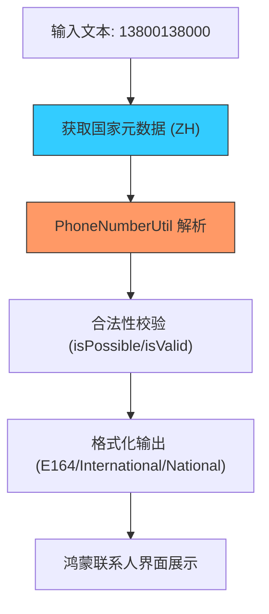

欢迎加入开源鸿蒙跨平台社区：[https://openharmonycrossplatform.csdn.net](https://openharmonycrossplatform.csdn.net)


# Flutter for OpenHarmony: Flutter 三方库 dlibphonenumber 全球电话号码格式化与校验的终极方案（国际化拨号神器）

## 前言

随着 OpenHarmony 设备走向全球，应用对“电话号码”的处理变得异常复杂。不同国家的区号、拨号倍率、固话与手机的格式差异，如果全部由开发者手动处理，几乎是不可能完成的任务。Google 的 `libphonenumber` 是公认的业界标准，而 **`dlibphonenumber`** 正是其实现在纯 Dart 下的高性能移植版。

它能帮助你在鸿蒙应用中实现：
1. 自动识别号码所属的国家/地区。
2. 实时格式化号码（如：+86 138-0000-0000）。
3. 深度校验号码是否真实存在。

---

## 一、核心工作流程架构

`dlibphonenumber` 依赖于一套庞大的全球号码元数据（Metadata）进行精准驱动。



---

## 二、核心 API 实战

### 2.1 初始化工具类

```dart
import 'package:dlibphonenumber/dlibphonenumber.dart';

// 💡 重点：获取 PhoneNumberUtil 的单例实例
final phoneUtil = PhoneNumberUtil.instance;
```

### 2.2 解析与国家识别

```dart
// 💡 将原始文本解析为对象 (需提供默认国家代码，以便处理非 + 开头的号码)
PhoneNumber number = phoneUtil.parse('13800000000', 'CN');

print('国家代码: ${number.countryCode}'); // 86
print('地区识别: ${phoneUtil.getRegionCodeForNumber(number)}'); // CN
```

### 2.3 深度合法性校验

```dart
// 💡 检查号码是否符合该国家的编码规则
bool isValid = phoneUtil.isValidNumber(number);

// 💡 识别号码类型 (手机、固话、免费热线等)
PhoneNumberType type = phoneUtil.getNumberType(number);
if (type == PhoneNumberType.MOBILE) {
  print('这是一个合法的鸿蒙手机号');
}
```

### 2.4 多样化格式化

```dart
// 💡 输出国际标准格式: +86 138 0000 0000
String international = phoneUtil.format(number, PhoneNumberFormat.INTERNATIONAL);

// 💡 输出用于拨号的 E164 格式: +8613800000000
String e164 = phoneUtil.format(number, PhoneNumberFormat.E164);
```

---

## 三、常见应用场景

### 3.1 鸿蒙全球注册页
当用户切换国家/地区后，输入框利用 `AsYouTypeFormatter` 实现“随输随格式化”，极大提升用户体验。

### 3.2 鸿蒙通讯录聚合
将不同来源（如 SIM 卡、应用内好友）的号码规范化为统一的 E164 格式存储，方便后续的全局搜索和去重。

---

## 四、OpenHarmony 平台适配

### 4.1 性能与二进制体积
💡 **技巧**：`libphonenumber` 的元数据体积较大。`dlibphonenumber` 通过 Dart 的高效序列化进行了优化。在鸿蒙 AOT 编译后，它能保持极高的运行速度。即使是在处理海量数据的鸿蒙平板端，也能实现毫秒级的解析与校验。

### 4.2 适配鸿蒙多窗口布局
由于电话号码展示通常属于“紧凑型”信息。建议在鸿蒙折叠屏的大屏状态下，配合 `Flexible` 布局，防止号码因为格式化后变长而导致的 UI 溢出问题。

---

## 五、完整实战示例：鸿蒙全球拨号卫士

本示例展示如何输入一个号码，实时获取其详细归属信息。

```dart
import 'package:dlibphonenumber/dlibphonenumber.dart';

class OhosDialGuard {
  final _util = PhoneNumberUtil.instance;

  void auditNumber(String raw) {
    print('--- 鸿蒙全球号码审计中心 ---');
    try {
      // 1. 尝试解析 (自动寻找 + 号)
      final phone = _util.parse(raw, null);
      
      // 2. 核心校验
      if (!_util.isValidNumber(phone)) {
        print('⚠️ 告警：该号码格式在当前国家/地区不存在');
        return;
      }

      // 3. 获取信息
      String region = _util.getRegionCodeForNumber(phone) ?? "未知";
      String formatted = _util.format(phone, PhoneNumberFormat.INTERNATIONAL);
      
      print('✅ 验证通过！');
      print('号码归属地：$region');
      print('标准拨号格式：$formatted');
      print('号码类型：${_util.getNumberType(phone)}');
      
    } catch (e) {
      print('❌ 解析失败：非法的电话字符');
    }
  }
}

void main() {
  final guard = OhosDialGuard();
  // 模拟输入一个中国跨区号码
  guard.auditNumber("+8613800138000");
}
```

<!-- IMAGE_PLACEHOLDER: 鸿蒙手机端国际化电话输入演示截图 -->

---

## 六、总结

`dlibphonenumber` 软件包是 OpenHarmony 开发者征战全球市场的标准库。它将极其复杂的国际电信规则抽象为几行简单的 Dart 代码。在构建高质量、高可靠性的鸿蒙应用通讯模块时，使用这种成熟的算法方案，不仅能减少开发 Bug，更能为全球用户提供一致的、专业的交互体验。
