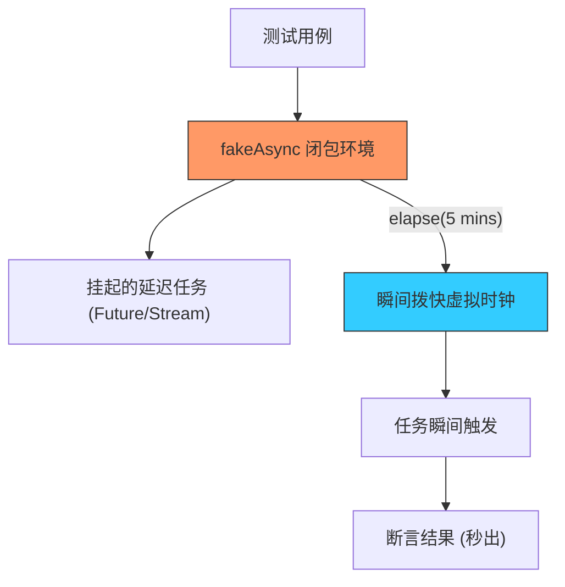

欢迎加入开源鸿蒙跨平台社区：[https://openharmonycrossplatform.csdn.net](https://openharmonycrossplatform.csdn.net)


# Flutter for OpenHarmony: Flutter 三方库 fake_async 掌控时间的魔法，让鸿蒙异步单测快如闪电（单元测试加速神器）

## 前言

在 OpenHarmony 应用的单元测试中，异步逻辑是一个避不开的难点。如果你的代码中有 `Future.delayed(Duration(minutes: 5))`，难道你在跑测试时真的要等上 5 分钟吗？或者如果你在测试一个复杂的动画状态流转，如何精确地模拟时间流逝了 125 毫秒？

**`fake_async`** 是 Dart 测试工具链中的“时间胶囊”。它能在一个受控的环境中虚拟化时钟。你可以瞬间“拨快”时间，让那些原本需要漫长等待的异步操作立即执行，从而让你的鸿蒙单测运行速度提升千倍。

---

## 一、核心虚拟时间原理

它通过接管全局的 `Zone`，拦截了所有基于时间的调度任务。



---

## 二、核心 API 实战

### 2.1 基础用法：瞬间拨快时间

```dart
import 'package:fake_async/fake_async.dart';
import 'package:test/test.dart';

void main() {
  test('模拟耗时 1 小时的同步', () {
    fakeAsync((async) {
      bool isFinished = false;
      
      // 💡 这是一个原本需要等一年的操作
      Future.delayed(Duration(hours: 1)).then((_) => isFinished = true);

      // 💡 魔法时刻：瞬间流逝 1 小时
      async.elapse(Duration(hours: 1));

      expect(isFinished, isTrue); // 瞬间通过测试！
    });
  });
}
```

### 2.2 刷新微任务 (flushMicrotasks)

确保所有由于时间流逝引发的微任务都已经排空。

```dart
async.flushMicrotasks();
```

---

## 三、常见应用场景

### 3.1 鸿蒙倒计时组件测试
测试一个 60 秒的验证码发送倒计时。通过 `elapse(Duration(seconds: 1))` 步进 60 次，可以验证每一秒的 UI 文本变化是否符合预期。

### 3.2 超时逻辑验证
当网络请求超过 5 秒未响应时应显示重试按钮。利用 `fake_async` 拨快 5.1 秒，可以直接进入“超时态”进行逻辑校验。

---

## 四、OpenHarmony 平台适配

### 4.1 提升 CI/CD 效能周期
💡 **技巧**：在鸿蒙项目的流水线自动化测试中，每一秒的等待都是昂贵的资源消耗。通过 `fake_async` 优化掉所有的真实延时，可以让包含数百个异步用例的测试集合在几秒内跑完，极大地加快了鸿蒙应用的迭代节奏。

### 4.2 处理复杂流转逻辑
在鸿蒙跨端流转、接续场景中，往往涉及大量的超时等待逻辑（Wait and Retry）。利用虚拟时间代替真实时间，可以覆盖各种极端的时间点边界值，确保应用在不同算力的鸿蒙设备上表现始终稳健。

---

## 五、完整实战示例：鸿蒙自动登录令牌审计

本示例演示如何测试一个在 24 小时后会自动失效的登录 Token 逻辑。

```dart
import 'package:fake_async/fake_async.dart';

class OhosSessionManager {
  bool isTokenValid = true;

  void startSession() {
    // 24 小时后将令牌设为无效
    Future.delayed(Duration(hours: 24)).then((_) {
      isTokenValid = false;
      print('🛡️ 鸿蒙安全审计：会话已过期');
    });
  }
}

void main() {
  fakeAsync((async) {
    print('🚀 启动鸿蒙虚拟时间测试柜...');
    final manager = OhosSessionManager();
    
    manager.startSession();
    
    // 1. 经过 23 小时，理论上应仍然有效
    async.elapse(Duration(hours: 23));
    print('第 23 小时状态: ${manager.isTokenValid}');
    
    // 2. 拨快最后 1 小时
    async.elapse(Duration(hours: 1));
    print('第 24 小时状态: ${manager.isTokenValid}');
    
    print('✅ 测试成功：异步任务已按虚拟时间轴触发');
  });
}
```

<!-- IMAGE_PLACEHOLDER: 鸿蒙设备（或控制台）展示测试报告，显示异步任务在毫秒级内全部瞬间完成的截图 -->

---

## 六、总结

`fake_async` 软件包是 OpenHarmony 开发者打磨“高质量工程”的制胜秘籍。它通过对时间的绝对支配，消灭了异步测试中最大的随机性因素——真实的时钟流逝。在一个追求极致确定性和超快迭代速度的鸿蒙原生应用生态中，掌握这种“时间静止”与“瞬间移动”的测试艺术，是每一位资深鸿蒙开发者的必备技能。
