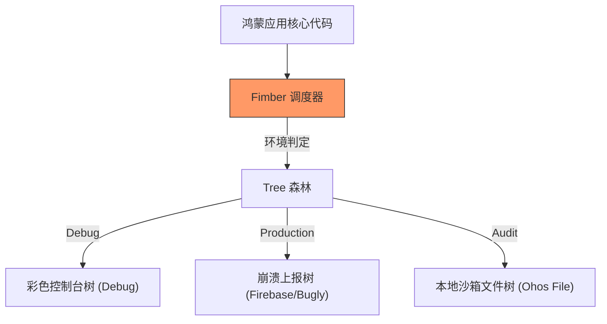

欢迎加入开源鸿蒙跨平台社区：[https://openharmonycrossplatform.csdn.net](https://openharmonycrossplatform.csdn.net)


# Flutter for OpenHarmony: Flutter 三方库 fimber 灵动的树状结构化日志管理（鸿蒙应用调试黑科技）

## 前言

在进行 OpenHarmony 中大型项目开发，特别是涉及多模块协作时，如何管理如洪水般袭来的日志（Logs）是每一位架构师的必修课。传统的日志库往往是全局单例，难以针对不同的业务逻辑块设置不同的输出策略。如果能像树（Tree）一样，为每个模块“播种”专门的日志处理器，调试工作将变得极其优雅。

**`fimber`**（全称 Flutter Timber）是一个由 Android 开发圈极具影响力的 Timber 模式衍生出来的 Dart 库。它引入了“植物学”概念：通过 `Planting`（种植）特定的 `Tree`（处理器），实现对鸿蒙应用日志行为的高度自定义。

---

## 一、核心“播种”架构

`fimber` 允许你在不同的环境下“种植”不同功能的处理器。



---

## 二、核心 API 实战

### 2.1 初始化“种植”记录器

在鸿蒙应用的 `main()` 入口处进行初始化。

```dart
import 'package:fimber/fimber.dart';

void main() {
  if (kDebugMode) {
    // 💡 在开发环境种植一颗控制台彩虹树
    Fimber.plantTree(DebugTree());
  }
}
```

### 2.2 定义“标签 (Tag)”进行精细输出

```dart
// 💡 为特定的支付模块打上标签，方便搜索过滤
final log = FimberLog('PAYMENT_MODULE');

log.i('用户发起支付');
log.e('支付超时', ex: Exception('Socket Timeout'));
```

### 2.3 临时变更日志强度

```dart
Fimber.plantTree(DebugTree(useColors: true));
// 后续所有日志都将带上色彩
```

---

## 三、常见应用场景

### 3.1 鸿蒙发布版本错误截获
在生产环境的鸿蒙 HAP 包中，种植一个名为 `CrashReportingTree` 的自定义树。它不打印控制台日志，而是拦截 `Fimber.e`（错误信息），并自动将其打包发送至你的后台监控系统。

### 3.2 鸿蒙离线日志包（BlackBox）
在鸿蒙文件沙箱中种植一个 `FileTree`，将近期的操作轨迹静默写入 `.log` 文件。当用户反馈问题时，通过系统的文件分享功能快速外传，实现精准的“黑盒”复现。

---

## 四、OpenHarmony 平台适配

### 4.1 适配鸿蒙的 Log 输出级别
💡 **技巧**：鸿蒙控制台（DevEco Studio）支持完整的 ANSI 颜色转义。通过 `DebugTree(useColors: true)` 打印出的彩色日志在鸿蒙 IDE 中辨识度极高。同时，我们可以定制特定的 `OhosLogTree` 来直接对接鸿蒙系统的 `HiLog` 原生接口，记录到系统底层的日志缓冲区。

### 4.2 模块化代码的最佳拍档
鸿蒙应用强推多模块化（HAP/HAR）。在各模块的入口处 `Fimber.plantTree`，可以实现“模块级控制”：例如只打开“地图模块”的详细日志，而让“用户模块”保持背景静默，从而在处理复杂分布式链路问题时，让调试面板清脆爽口。

---

## 五、完整实战示例：鸿蒙工程化日志护航逻辑

本示例演示如何通过扩展 `LogTree` 实现一个自定义的鸿蒙日志处理器。

```dart
import 'package:fimber/fimber.dart';

/// 💡 模拟一个专门对接鸿蒙系统接口的日志树
class OhosProductionTree extends LogTree {
  @override
  List<String> get levels => ["W", "E", "C"]; // 只处理警告和严重错误

  @override
  void log(String level, String msg, {String? tag, dynamic ex, StackTrace? stacktrace}) {
    // 💡 这里可以调用鸿蒙原生的 FFI 或 MethodChannel 接口
    print('📦 [鸿蒙系统底层记录] $level/$tag: $msg');
  }
}

class OhosAppBootstrap {
  static void init() {
    // 1. 开发者模式正常打印
    Fimber.plantTree(DebugTree());
    
    // 2. 生产环境部署特定树
    Fimber.plantTree(OhosProductionTree());
    
    Fimber.i('🚀 鸿蒙日志核心已就绪');
  }
}

void main() {
  OhosAppBootstrap.init();
  Fimber.i('开始业务流程');
}
```

<!-- IMAGE_PLACEHOLDER: 鸿蒙 IDE 中展示彩色层级日志与模块化 Tag 的过滤效果截图 -->

---

## 六、总结

`fimber` 软件包是 OpenHarmony 开发者管理软件内部运行态的“高级监控站”。它将简单的“打印”行为升级为一种可插拔、可扩展的架构模式。在构建大规模、高复杂度的鸿蒙原生应用时，良好的日志审计能力是保证交付质量、快速解决线上故障的最后一道防线。
