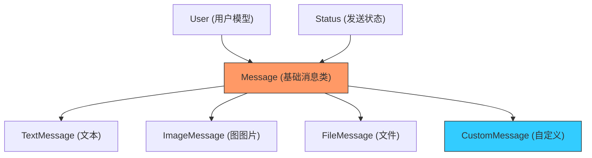

欢迎加入开源鸿蒙跨平台社区：[https://openharmonycrossplatform.csdn.net](https://openharmonycrossplatform.csdn.net)


# Flutter for OpenHarmony: Flutter 三方库 flutter_chat_types 构建鸿蒙端标准化即时通讯数据模型（IM 开发基石）

## 前言

在开发 OpenHarmony 的即时通讯（IM）应用时，如何定义一套稳定、可扩展的消息模型（Message Schema）是所有业务的起点。如果每个开发者都从零开始定义 `Text`, `Image`, `File` 等消息类型，不仅浪费时间，还难以兼容社区中丰富的 IM UI 组件库（如 `flutter_chat_ui`）。

**`flutter_chat_types`** 提供了这一问题的终极标准答案。它定义了一套纯粹、强类型且符合行业通向规范的消息对象模型，让你的鸿蒙应用能以最快速度搭建起专业的聊天协议底层。

---

## 一、核心消息体系结构

`flutter_chat_types` 定义了一个分层明确、高度解耦的消息树。



---

## 二、核心 API 实战

### 2.1 创建标准用户与消息

```dart
import 'package:flutter_chat_types/flutter_chat_types.dart' as types;

void createBasicChat() {
  // 1. 创建用户对象
  final user = types.User(
    id: 'ohos-user-001',
    firstName: '鸿蒙',
    lastName: '开发者',
    imageUrl: 'https://xxx.png',
  );

  // 2. 创建文本消息
  final textMessage = types.TextMessage(
    author: user,
    createdAt: DateTime.now().millisecondsSinceEpoch,
    id: 'msg-001',
    text: '你好，欢迎使用 OpenHarmony！',
  );
  
  print('消息内容: ${textMessage.text}');
}
```

### 2.2 消息状态流转

```dart
// 💡 定义消息的发送、送达、已读状态
final updatedMessage = textMessage.copyWith(
  status: types.Status.seen, // 已读
);
```

### 2.3 序列化与反序列化 (JSON)

它完美支持 JSON 转换，非常适合与鸿蒙后端 API 直接对接。

```dart
// 转 JSON 字符串，发送给 WebSocket
final jsonMap = textMessage.toJson(); 
```

---

## 三、常见应用场景

### 3.1 鸿蒙原生 IM 社交软件
利用该库预定义的 `ImageMessage`, `VideoMessage` 和 `AudioMessage` 快速适配多媒体交互，直接对接鸿蒙系统的多媒体采集接口。

### 3.2 鸿蒙企业协同工具（OA）
在处理复杂的富文本消息或带有特定业务 ID 的自定义消息时，利用 `CustomMessage` 进行零侵入式扩展。

---

## 四、OpenHarmony 平台适配

### 4.1 适配鸿蒙多设备接续（流转）
💡 **技巧**：在鸿蒙的分布式跨端协同场景下，如果你正在将一个聊天页面从手机流转到电视。由于 `flutter_chat_types` 对象内置了完善的 `toJson` 和 `fromJson` 逻辑，你可以极速地将当前消息快照序列化，通过鸿蒙的分布式数据通道发送给对端，实现近乎零延迟的 UI 重建与接续。

### 4.2 零 UI 耦合，专注逻辑
该库不包含任何 UI 绘制逻辑，仅为纯粹的 POJO（Plain Old Java Object，此处为 Dart 版）。这使得它在鸿蒙 AOT 环境下运行异常轻快，是构建高吞吐量、低延迟即时通讯架构的不二选基石。

---

## 五、完整实战示例：鸿蒙模拟聊天管理器

本示例展示如何管理一组消息列表。

```dart
import 'package:flutter_chat_types/flutter_chat_types.dart' as types;

class OhosChatManager {
  final List<types.Message> _messages = [];

  void receiveText(String content, String senderId) {
    print('📥 鸿蒙 IM 中枢收到新消息...');
    
    final msg = types.TextMessage(
      author: types.User(id: senderId),
      id: DateTime.now().toIso8601String(),
      text: content,
      createdAt: DateTime.now().millisecondsSinceEpoch,
    );

    _messages.insert(0, msg);
    print('✅ 当前本地缓存消息总数: ${_messages.length}');
  }

  /// 模拟获取第一条消息的 ID 以便进行已读回执
  String? getLatestMessageId() => _messages.isNotEmpty ? _messages.first.id : null;
}

void main() {
  final manager = OhosChatManager();
  manager.receiveText("咱们的鸿蒙应用上线啦！", "boss_id");
  manager.receiveText("太棒了，庆祝一下！", "me_id");
}
```

<!-- IMAGE_PLACEHOLDER: 鸿蒙设备展示标准化的消息对象转换为各种不同风格 IM UI 的效果对比截图 -->

---

## 六、总结

`flutter_chat_types` 软件包是 OpenHarmony 开发者在即时通讯赛道上的“入场券”。它通过对复杂通讯协议的标准化建模，让原本需要数周才能理清的业务模型在几分钟内即可就绪。在追求极致交付效率和跨端架构一致性的鸿蒙研发体系中，引入这样一套经过全球开发者验证的“通讯契约”，是构建专业级社交应用的必经之路。
