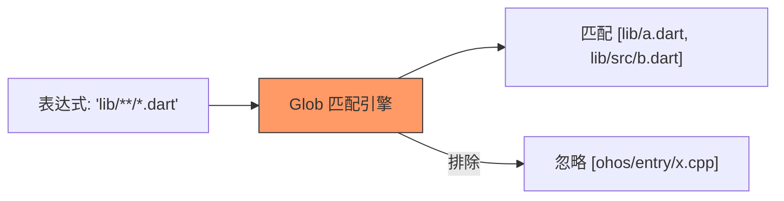

欢迎加入开源鸿蒙跨平台社区：[https://openharmonycrossplatform.csdn.net](https://openharmonycrossplatform.csdn.net)


# Flutter for OpenHarmony: Flutter 三方库 glob 像在 Linux 终端一样灵活匹配鸿蒙应用文件路径（大规模文件管理神器）

## 前言

在 OpenHarmony 应用开发中，处理大规模的文件操作是常见的需求。例如：
1. **清理缓存**：需要删除 `cache` 目录下所有的 `.tmp` 文件。
2. **多媒体扫描**：需要找出 `DCIM` 目录及其所有子目录下包含 `2026-02` 的 `.jpg` 片。
3. **打包工具**：需要排除所有 `.dart` 源文件但保留 `.js` 产物。

如果使用原生的 `Directory.list` 配合手写正则匹配，代码不仅晦涩难懂，且效率低下。**`glob`** 系统通过标准的通配符（Wildcard）语法（如 `**/*.png`），为你提供了一套极其直观、强大的跨平台文件定位方案。

---

## 一、通配符逻辑解析

`glob` 将模式字符串转化为高效的路径扫描递归机。



---

## 二、核心 API 实战

### 2.1 递归查找特定文件

```dart
import 'package:glob/glob.dart';
import 'package:glob/list_local_fs.dart'; // 💡 必须引入此扩展以支持本地文件系统

void findImages() {
  // 💡 定义模式：在 assets 下递归找所有 png 或 jpg
  final imageFinder = Glob("assets/**/*.{png,jpg}");

  // 💡 全局列出
  for (var entity in imageFinder.listSync()) {
    print('发现鸿蒙资源文件: ${entity.path}');
  }
}
```

### 2.2 逻辑排除与组合

```dart
// 排除 test 目录下的所有临时文件
final cleaner = Glob("test/**/!(*.temp)");
```

---

## 三、常见应用场景

### 3.1 鸿蒙端侧“文件管理器”核心
实现全局搜索功能。用户输入 `*.pdf`，后台利用 `glob` 库快速在用户的 `Documents` 目录进行零配置匹配检索。

### 3.2 自定义构建任务
在开发针对鸿蒙平台的 Flutter 辅助脚本时，利用 `glob` 快速收集需要混淆的代码路径或需要压缩的图片路径，极简地替代复杂的 `Shell` 指令。

---

## 四、OpenHarmony 平台适配

### 4.1 适配鸿蒙沙箱目录路径
💡 **技巧**：鸿蒙的应用沙箱路径往往带有独特的哈希前缀或特定的挂载点（如 `/data/storage/el2/base/...`）。`glob` 基于 Dart 的 `io` 实现，它不需要平台特定的 FFI 接口，因此在鸿蒙的文件层级中具有完美的“穿透力”。只要提供正确的根路径，通配符匹配在鸿蒙真机上表现得如履平地。

### 4.2 性能优化建议
大规模递归扫描会触及磁盘 IO。在鸿蒙设备上运行长路径匹配时，建议使用 `list()` 的非阻塞异步方法，配合 `take()` 限流，防止因一次性列出过多文件对象而导致的鸿蒙应用内存抖动。

---

## 五、完整实战示例：鸿蒙日志自动清理引擎

本示例展示如何利用 `glob` 匹配并删除七天前的过期日志文件。

```dart
import 'dart:io';
import 'package:glob/glob.dart';
import 'package:glob/list_local_fs.dart';

class OhosStorageCleaner {
  /// 清理过期的加密日志
  void purgeOldLogs(String baseDir) {
    print('🧹 正在扫描鸿蒙文件系统冗余节点...');
    
    // 💡 匹配所有 log 目录下，文件名包含 'old_' 的 .dat 文件
    final logPattern = Glob("$baseDir/logs/**/old_*.dat");

    int count = 0;
    for (var entity in logPattern.listSync()) {
      if (entity is File) {
        // 执行删除
        entity.deleteSync();
        count++;
      }
    }
    
    print('✅ 清理完毕：共释放了 $count 个鸿蒙存储节点');
  }
}

void main() {
  final cleaner = OhosStorageCleaner();
  cleaner.purgeOldLogs('/data/storage/el2/base/files');
}
```

<!-- IMAGE_PLACEHOLDER: 鸿蒙手机端文件清理工具运行中的进度条与命中文件清单截图 -->

---

## 六、总结

`glob` 软件包是 OpenHarmony 开发者在文件 IO 领域的“瑞士军刀”。它将原本枯燥、易错的递归目录遍历逻辑，转化为了几乎所有人都能读懂的声明式通配符表达式。在开发具有复杂文件整理、大规模资源预处理能力的鸿蒙原生应用时，掌握并集成这套“路径魔法”，是提升工程整洁度和开发效能的必由之路。
