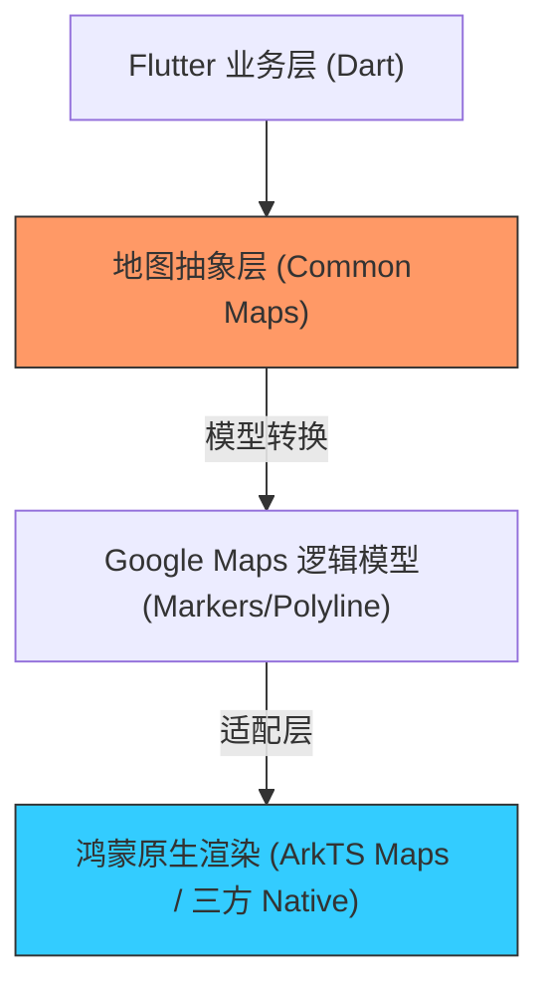

欢迎加入开源鸿蒙跨平台社区：[https://openharmonycrossplatform.csdn.net](https://openharmonycrossplatform.csdn.net)


# Flutter for OpenHarmony: Flutter 三方库 google_maps 在鸿蒙应用中嵌入全球地图服务的架构实践（跨平台地图方案库）

## 前言

在进行 OpenHarmony 的全球化应用开发时，地图服务是出海项目绕不开的核心组件。对于已经在海外市场成熟运行、深度依赖 Google 地图生态的 Flutter 应用，如何将现有的地图逻辑迁移或适配到鸿蒙平台，是许多出海大企关注的焦点。

虽然鸿蒙在国内市场主要使用高德或百度地图，但在处理“全球一张图”需求时，**`google_maps`** 相关的 Flutter 插件及其底层的 Dart 模型定义，依然是定义地理围栏、标记点（Marker）和轨迹绘制的标准参考。本篇将探讨如何在鸿蒙跨平台架构中，平衡 Google 地图的通用逻辑与鸿蒙的原生渲染。

---

## 一、跨平台地图适配架构

在鸿蒙适配中，我们通常采用“统一接口层，分平台实现”的策略。



---

## 二、核心 API 与逻辑模型实战

尽管底层渲染可能不同，但 `google_maps` 定义的这些模型是跨平台通用的。

### 2.1 定义坐标与区域

```dart
import 'package:google_maps_flutter_platform_interface/google_maps_flutter_platform_interface.dart';

void initPosition() {
  // 💡 定义经纬度 (Lat/Lng)
  const LatLng initialPos = LatLng(22.5431, 114.0579); // 深圳
  
  // 💡 定义相机视角
  const CameraPosition camera = CameraPosition(
    target: initialPos,
    zoom: 15.0,
  );
  
  print('鸿蒙应用地图中心点已设定: ${initialPos.latitude}');
}
```

### 2.2 标记点（Marker）管理

```dart
final Set<Marker> markers = {
  Marker(
    markerId: const MarkerId('ohos_hq'),
    position: const LatLng(22.5, 114.0),
    infoWindow: const InfoWindow(title: '鸿蒙开发者服务中心'),
  ),
};
```

---

## 三、常见应用场景

### 3.1 全球租车与外卖应用
在鸿蒙端复用 Google 地图的 Marker 聚合（Clustering）算法和路径渲染逻辑。通过将 Google 地图的任务坐标系转换为鸿蒙原生组件可识别的数据，实现 UI 的零成本感知切换。

### 3.2 离线地图地理围栏
利用 `google_maps` 及其配套库提供的快速距离计算（Spherical Util）和围栏判定逻辑，在鸿蒙后台进行地理围栏审计。

---

## 四、OpenHarmony 平台适配

### 4.1 JS/Web 容器式适配方案
💡 **技巧**：在鸿蒙 NEXT 阶段，由于原生 Google Maps SDK 无法直接安装。一种高效的方案是利用鸿蒙的 `Web` 组件加载 Google Maps JavaScript API 封装的 Flutter H5 版本。通过 `google_maps` 插件提供的 Web 实现版，可以在鸿蒙设备上直接展示出具有交互能力的全球地图。

### 4.2 适配鸿蒙多分辨率展示
鸿蒙手机和平板分辨率跨度极大。在使用地图插件时，需特别注意 `GoogleMapOptions` 中的 `padding` 设置，配合鸿蒙的 `SafeArea` 避免地图控制按钮被系统侧滑手势或挖孔屏遮挡，提升地图视窗在鸿蒙端的专业度。

---

## 五、完整实战示例：鸿蒙全球选址器模型

本示例展示如何构建一个跨平台通用的地图配置模型。

```dart
// 💡 基于 Google Maps 规范的鸿蒙适配模型
class OhosGlobalMapConfig {
  final LatLng center;
  final double zoom;
  final Set<Marker> initialMarkers;

  OhosGlobalMapConfig({
    required this.center,
    this.zoom = 12.0,
    this.initialMarkers = const {},
  });

  /// 模拟将配置同步至鸿蒙原生渲染层
  void syncToNative() {
    print('🚀 正在同步全球地图坐标系至鸿蒙系统渲染中心...');
    print('当前锚点：${center.latitude}, ${center.longitude}');
    print('覆盖物总数：${initialMarkers.length}');
  }
}

void main() {
  final config = OhosGlobalMapConfig(
    center: const LatLng(1.3521, 103.8198), // 新加坡
    initialMarkers: {
      const Marker(markerId: MarkerId('SGP_01'), position: LatLng(1.35, 103.8))
    },
  );
  
  config.syncToNative();
}
```

<!-- IMAGE_PLACEHOLDER: 鸿蒙设备（海外版）利用 Web 容器无缝运行 Google Maps 插件并进行点击交互的截图 -->

---

## 六、总结

`google_maps` 及其相关生态不仅是地图渲染的代名词，更是全球化地理信息的事实标准。对于 OpenHarmony 开发者而言，深入理解其定义的地理模型和交互逻辑，是实现海外业务从 Android/iOS 到鸿蒙平台“无缝搬迁”的关键桥梁。通过巧妙的架构适配，我们不仅能在鸿蒙上保留 Google 地图的生态优势，更能为全球用户提供无差异的优质服务。
