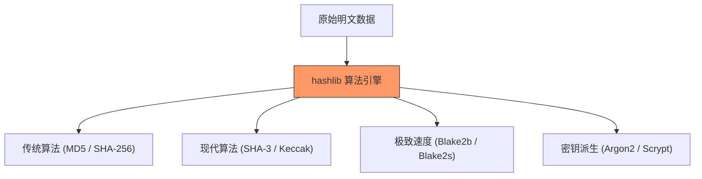

欢迎加入开源鸿蒙跨平台社区：[https://openharmonycrossplatform.csdn.net](https://openharmonycrossplatform.csdn.net)


# Flutter for OpenHarmony: Flutter 三方库 hashlib 为鸿蒙应用提供军用级加密哈希算法支持（安全数据完整性卫士）

## 前言

在 OpenHarmony 应用开发中，涉及到本地存储加密、用户密码脱敏、大文件完整性校验或区块链应用时，一套算法完备、执行高效的哈希（Hash）库是必不可少的。虽然 Dart 原生也提供了一些简单的加密方法，但在算法多样性（如 Argon2、SHA-3, Blake2b 等高级算法）和性能表现方面，往往无法满足高安全等级项目的需求。

**`hashlib`** 正是专门为高性能数据加解密与完整性校验打造的库。它纯代码实现且经过了极致的循环优化，是鸿蒙平台上保护敏感数据的数字堡垒。

---

## 一、核心加密算法矩阵

`hashlib` 支持极其广泛且先进的加密标准。



---

## 二、核心 API 实战

### 2.1 简单 SHA-256 签名

处理简单的文件校验。

```dart
import 'package:hashlib/hashlib.dart';

void basicHash() {
  String text = "HarmonyOS NEXT";
  
  // 💡 直接计算 SHA256
  var hash = sha256.string(text);
  
  print('Hex 摘要: ${hash.hex()}');
  print('二进制数据: ${hash.bytes}');
}
```

### 2.2 使用军用级 Argon2 派生密钥

Argon2 是目前最安全的密码哈希方案之一，能有效抵挡彩虹表和硬件加速攻击。

```dart
// 💡 设置强度参数
var argon2 = Argon2id(
  memory: 65536, // 64 MB
  iterations: 3,
  parallelism: 4,
);

var hash = argon2.hash("user_password_123", salt: "random_salt");
```

### 2.3 支持 HMAC (基于哈希的报文鉴权)

```dart
// 使用密钥对数据进行 HMAC-SHA512 签名
var hmac = hmacSha512.withKey("ohos_secret_key");
var token = hmac.string("api_payload");
```

---

## 三、常见应用场景

### 3.1 鸿蒙应用文件防篡改
当从云端下载 HAP 更新包或离线素材时，实时计算文件的 Blake2b 哈希并与服务端比对，保证文件未被中途替换。

### 3.2 离线敏感数据加密存储
在将用户本地首选项（Preferences）存入加密磁盘前，利用 `hashlib` 的 PBKDF2 派生出坚固的加密 Key，大幅提升暴力破解的门槛。

---

## 四、OpenHarmony 平台适配

### 4.1 适配鸿蒙多核并行加速
💡 **技巧**：在鸿蒙高性能芯片上，对于像 `Argon2` 这种计算密集型的算法，`hashlib` 允许配置 `parallelism`（并行度）。通过配合 Dart 的 `compute` 方法将其放入独立的鸿蒙后台隔离区执行，可以在不阻塞 UI 主线程的情况下，快速完成高强度的密码校验。

### 4.2 AOT 极致性能
由于该库高度优化了按位运算和字节数组处理，完全避开了反射调用。在鸿蒙真机的 AOT 环境中，其哈希执行速度远高于未经优化的泛用型加密库，是构建“工业级”应用安全底盘的首选。

---

## 五、完整实战示例：鸿蒙密码银行验证核心

本示例展示如何利用安全等级极高的算法进行密码存储管理。

```dart
import 'package:hashlib/hashlib.dart';

class OhosSecurityCore {
  /// 生成安全的密码摘要
  String secureRegister(String password, String salt) {
    print('🛡️ 正在为鸿蒙应用派生高强度密钥...');
    
    // 💡 使用 Blake2b 结合 Salt 进行高效率哈希
    final hasher = blake2b512.withKey(salt);
    final digest = hasher.string(password);
    
    return digest.hex();
  }

  /// 校验大快文件完整性
  void verifyFileIntegral(List<int> fileData) {
    final watch = Stopwatch()..start();
    // 💡 快速流水线式哈希
    final result = sha3_256.data(fileData);
    print('✅ 文件校验摘要: ${result.hex()}');
    print('⏱️ 鸿蒙处理器耗时: ${watch.elapsedMilliseconds}ms');
  }
}

void main() {
  final security = OhosSecurityCore();
  final hash = security.secureRegister("password123", "ohos_dynamic_salt");
  print('派生后的安全存储摘要：$hash');
}
```

<!-- IMAGE_PLACEHOLDER: 鸿蒙设备运行加密算法耗时测试，在高算力芯片上秒级完成高强度哈希的对比截图 -->

---

## 六、总结

`hashlib` 软件包是 OpenHarmony 开发者打磨应用“硬核安全”的利刃。它通过提供完整、标准、极致优化的加密套件，让鸿蒙开发者在面对各种各样安全协议挑战时显得游刃有余。在信息安全至上的万物互联时代，夯实底层的数据安全堤坝，是每个专业鸿蒙工程师的基础修养。
