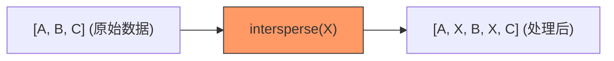

欢迎加入开源鸿蒙跨平台社区：[https://openharmonycrossplatform.csdn.net](https://openharmonycrossplatform.csdn.net)


# Flutter for OpenHarmony: Flutter 三方库 intersperse 优雅在鸿蒙列表项间插入间隔或装饰（UI 细节处理助手）

## 前言

在 OpenHarmony 应用的 UI 设计中，我们经常需要在列表（List）或一排组件（Column/Row）之间插入特定的元素，例如：
1. 在一排按钮中间插入分隔线。
2. 在列表数据项之间插入间隙（Spacing）。
3. 为每个组件之间添加逗号或其他符号。

常见的做法是手写 `for` 循环并通过索引判断。但这种方式不仅代码丑陋，且在处理动态列表时极其容易出错（例如忘记最后一个元素不加分隔符）。

**`intersperse`** 是一个极简的扩展库。它通过为 `Iterable` 增加一个极其直观的方法，彻底解决了“元素间插入”这一烦人的小问题。

---

## 一、核心操作图解

`intersperse` 提供了一种“无感插入”的流式处理方式。



---

## 二、核心 API 实战

### 2.1 基础用法

```dart
import 'package:intersperse/intersperse.dart';

void basicUsage() {
  var list = ["鸿蒙", "Flutter", "开发"];
  
  // 💡 在每个元素之间插入一条分隔线文本
  var result = list.intersperse("|");
  
  print(result.toList()); // ["鸿蒙", "|", "Flutter", "|", "开发"]
}
```

### 2.2 在 UI 组件中应用

这是鸿蒙开发者最受用的场景。

```dart
Column(
  children: <Widget>[
    Text("菜单1"),
    Text("菜单2"),
    Text("菜单3"),
  ].intersperse(Divider()).toList(), // 💡 自动在文本间插入分隔线
)
```

### 2.3 极致精简：只在中间插入

该库非常聪明，它绝不会在序列的第一个元素之前或最后一个元素之后多塞入一个分隔符，避免了布局溢出的尴尬。

---

## 三、常见应用场景

### 3.1 鸿蒙底部导航或工具栏
当你在构建一排横向排列的图标（Row）时，利用 `intersperse(SizedBox(width: 10))` 可以在不编写复杂 `margin` 逻辑的情况下，快速实现间距自适应。

### 3.2 动态标签云展示
处理来自后端的关键词列表，通过 `intersperse(Text(" · "))` 快速生成带有间隔符的标签流，代码逻辑极其清爽。

---

## 四、OpenHarmony 平台适配

### 4.1 性能与渲染效率
💡 **技巧**：`intersperse` 采用的是 Dart 的惰性迭代器（Lazy Iterator）。这意味着即使你的鸿蒙列表有几千项，它并不会在内存中瞬间创建出一倍的占位对象，而是在渲染器真正滚动到相应位置时才动态产生。这完美契合了鸿蒙系统对滚动流畅度和低内存损耗的追求。

### 4.2 适配鸿蒙各种容器
无论是 `Column`、`Row` 还是 `ListView`，只要涉及到 `List<Widget>` 的地方，`intersperse` 都能通过一行代码点亮你的布局逻辑，让你的鸿蒙 UI 代码更加声明式（Declarative）。

---

## 五、完整实战示例：鸿蒙精美筛选菜单

本示例演示如何构建一个各选项之间带有装饰点的菜单栏。

```dart
import 'package:flutter/material.dart';
import 'package:intersperse/intersperse.dart';

class OhosFilterBar extends StatelessWidget {
  final List<String> categories = ["全部", "鸿蒙版", "折叠屏", "平板优化"];

  @override
  Widget build(BuildContext context) {
    return Row(
      mainAxisAlignment: MainAxisAlignment.center,
      children: categories.map((cat) {
        return Text(cat, style: TextStyle(color: Colors.blue));
      }).intersperse(
        // 💡 仅在文字之间插入一个小圆点
        Padding(
          padding: const EdgeInsets.symmetric(horizontal: 8.0),
          child: Icon(Icons.circle, size: 4, color: Colors.grey),
        )
      ).toList(),
    );
  }
}

void main() {
  runApp(MaterialApp(home: Scaffold(body: Center(child: OhosFilterBar()))));
}
```

<!-- IMAGE_PLACEHOLDER: 鸿蒙设备展示一排文字，其间带有灰度圆点分隔符的优雅布局截图 -->

---

## 六、总结

`intersperse` 软件包虽然功能单一，但它是典型的“小而美”工具。它消灭了 UI 代码中那些难以阅读的、充满 `if` 判断的垃圾循环逻辑。对于每一个注重代码整洁度和 UI 细节的 OpenHarmony 开发者来说，将这种原子化的扩展工具纳入你的工具箱，是你迈向高效开发的微小一步，也是提升代码可维护性的一大步。
