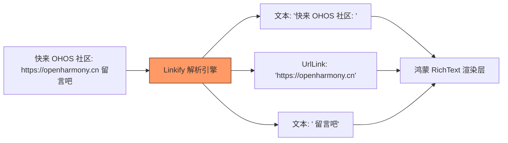

欢迎加入开源鸿蒙跨平台社区：[https://openharmonycrossplatform.csdn.net](https://openharmonycrossplatform.csdn.net)


# Flutter for OpenHarmony: Flutter 三方库 linkify 让鸿蒙应用中的文本 URL 和邮箱秒变可点击链接（文本交互增强神器）

## 前言

在 OpenHarmony 社交、工具或内容类应用中，展示文本（Text）是最基础的需求。然而，普通的 `Text` 组件无法自动识别出用户输入中的 URL、Email 或手机号，并将它们转化为可点击的蓝色超链接。如果每条消息都需要正则匹配并分段渲染，对开发者而言工作量大且性能难以保证。

**`linkify`** 是一个专注于“文本链接化”的轻量级 Dart 库。它不仅能精准识别文本中的各种实体，还能将其拆解为一个个具有语义化的片段，让你的鸿蒙应用瞬间具备强大的文本辅助交互能力。

---

## 一、核心解析引擎

`linkify` 通过一系列高度优化的正则解析器，将一串死板的字符串转化为一个“语义片段流”。



---

## 二、核心 API 实战

### 2.1 简单解析流程

```dart
import 'package:linkify/linkify.dart';

void basicUsage() {
  final text = "我的主页 https://blog.csdn.net/ohos 反馈: dev@harmony.com";
  
  // 💡 执行解析
  final elements = linkify(text, options: LinkifyOptions(humanize: true));

  for (var element in elements) {
    if (element is UrlElement) {
      print('发现合法网址: ${element.url}');
    } else if (element is EmailElement) {
      print('发现联系邮箱: ${element.email}');
    }
  }
}
```

### 2.2 深度过滤选项

```dart
// 💡 只识别 URL，不识别 Email
linkify(raw, options: LinkifyOptions(excludeLinks: const ['email']));
```

---

## 三、常见应用场景

### 3.1 鸿蒙即时通讯（IM）详情页
在聊天对话框内，将用户发送的链接、邮箱等自动变色并支持点击。

### 3.2 鸿蒙应用反馈系统
当用户输入包含邮箱或特定问题的 URL 时，自动呈现高亮，让用户一键即可跳转至相应的鸿蒙原生邮件 App。

---

## 四、OpenHarmony 平台适配

### 4.1 配合 `url_launcher` 实现跳转
💡 **技巧**：`linkify` 本身只负责“识别”并提取信息，并不负责 UI 渲染。在鸿蒙设备上，通常配合渲染库（如 `flutter_linkify`）集成该库的解析逻辑，并在点击回调中调用 `url_launcher` 发起鸿蒙系统的 Intent 跳转。

### 4.2 适配大文本解析性能
对于成千上万字的鸿蒙长博文，`linkify` 的纯 Dart 实现经过了高度优化。在鸿蒙设备的渲染主线程中进行毫秒级的文本扫描，能极大地保持滑动的流畅性，避免长列表加载时的卡顿感。

---

## 五、完整实战示例：鸿蒙智能动态贴识别系统

本示例演示如何通过 `linkify` 提取动态正文中的所有可点击资源。

```dart
import 'package:linkify/linkify.dart';

class OhosTextAnalyzer {
  /// 分析鸿蒙动态正文中的链接资源
  void analyzeMoment(String content) {
    print('🧐 正在基于鸿蒙语义库审计文本...');
    
    final elements = linkify(
      content,
      linkifiers: [const UrlLinkifier(), const EmailLinkifier()],
    );

    for (var element in elements) {
      if (element is UrlElement) {
        // 💡 模拟输出到鸿蒙通知栏或 UI 层
        print('🔗 发现可访问资源：${element.url}');
      } else if (element is TextElement) {
        // 普通文字忽略
      }
    }
    
    print('✅ 解析审计完毕');
  }
}

void main() {
  final analyzer = OhosTextAnalyzer();
  analyzer.analyzeMoment("加入鸿蒙跨平台社区：https://openharmonycrossplatform.csdn.net 合作联系：admin@csdn.net");
}
```

<!-- IMAGE_PLACEHOLDER: 鸿蒙设备展示一段包含蓝色链接和蓝色邮箱的可点击富文本截图 -->

---

## 六、总结

`linkify` 软件包是 OpenHarmony 开发者打磨细节体验的必备工具。它将零散的文本节点转化为具有高度交互价值的数字化入口。在一个万物互联、信息高效触达的鸿蒙生态系统中，通过这种智能识别逻辑，让用户的每一次点击都能精准落地，是构建现代应用辅助体验的重要闭环。
