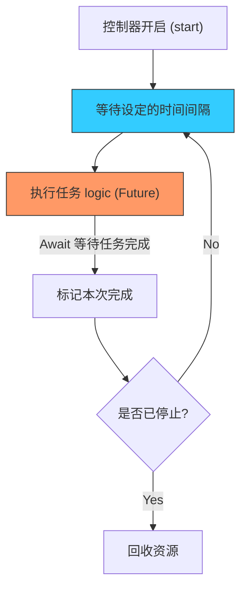

欢迎加入开源鸿蒙跨平台社区：[https://openharmonycrossplatform.csdn.net](https://openharmonycrossplatform.csdn.net)


# Flutter for OpenHarmony: Flutter 三方库 neat_periodic_task 优雅管理鸿蒙应用中的周期性后台任务（定时器增强方案）

## 前言

在 OpenHarmony 应用中，我们经常需要执行一些周期性的背景任务：
1. 每隔 1 小时同步一次最新的业务数据。
2. 每隔 5 分钟刷新一次股票或天气信息。
3. 或者是定期清理本地的临时缓存文件。

虽然 Dart 内置了 `Timer.periodic`，但在真实的工程实践中，由于其缺乏对异步操作（Future）的深度集成，且难以手动停止、重启或处理任务重叠问题，往往会让代码变得杂乱。

**`neat_periodic_task`** 提供了一套更整洁、更具扩展性的周期性任务管理框架，让你能在鸿蒙应用中像管理“定时闹钟”一样管理复杂的后台作业。

---

## 一、核心执行流程图

`neat_periodic_task` 提供了对任务生命周期的完整抽象。



---

## 二、核心 API 实战

### 2.1 创建周期性任务执行器

```dart
import 'package:neat_periodic_task/neat_periodic_task.dart';

final syncTask = NeatPeriodicTaskExecutor(
  interval: Duration(seconds: 10), // 💡 任务间隔
  name: 'OhosDataSync',           // 💡 调试名称
  task: () async {
    print('正在执行鸿蒙数据同步...');
    await Future.delayed(Duration(seconds: 2));
  },
);
```

### 2.2 控制任务启停

```dart
// 💡 启动
syncTask.start();

// 💡 停止（并在结束后自动释放相关资源）
await syncTask.stop();

// 💡 检查状态
print('运行状态: ${syncTask.status}');
```

---

## 三、常见应用场景

### 3.1 鸿蒙消息轮询器
在没有长连接推送的应用中，利用该库每隔 30 秒轮询一次后端服务器，获取最新的未读通知数目。

### 3.2 离线传感器数据上报
在带有传感器的鸿蒙穿戴设备中，每隔 1 分钟将采集到的步数或心率数据批量上报给服务端，通过 `NeatPeriodicTaskExecutor` 可以极简地实现这一闭环。

---

## 四、OpenHarmony 平台适配

### 4.1 适配鸿蒙的后台能效约束
💡 **技巧**：鸿蒙系统对后台任务的电量控制非常严格。建议在应用进入后台时（通过 `WidgetsBindingObserver` 监听），调用 `task.stop()` 暂停不必要的周期性请求，在回到前台时再 `start()` 恢复。这能有效避免因后台活动频繁而导致的鸿蒙应用能效评测降分。

### 4.2 处理任务重叠（Overlap）
默认情况下，`neat_periodic_task` 会等待上一次 `task` 的 Future 彻底完成后，再开始下一轮的间隔计时。这对于网络不稳定的鸿蒙环境至关重要：它能防止由于网络卡顿导致的多个“同步请求”在同一瞬间堆积，保障了鸿蒙应用的运行稳定性。

---

## 五、完整实战示例：鸿蒙缓存自动清理助手

本示例展示如何优雅地定义一个长效运行的清理服务。

```dart
import 'package:neat_periodic_task/neat_periodic_task.dart';

class OhosMaintenanceService {
  late NeatPeriodicTaskExecutor _cleaner;

  void startMaintenance() {
    print('🚀 鸿蒙自动维护系统上线...');
    
    _cleaner = NeatPeriodicTaskExecutor(
      interval: Duration(hours: 4), // 每 4 小时清理一次
      name: 'CacheCleaner',
      task: () async {
        print('♻️ 正在清理鸿蒙 `/temp` 沙箱目录...');
        // 模拟文件操作耗时
        await Future.delayed(Duration(seconds: 3));
      },
      // 💡 可选：立即执行第一次
      runImmediately: true,
    );

    _cleaner.start();
  }

  void stop() => _cleaner.stop();
}

void main() async {
  final service = OhosMaintenanceService();
  service.startMaintenance();
}
```

<!-- IMAGE_PLACEHOLDER: 鸿蒙手机端的系统监控通知（模拟效果），显示后台任务正在按规律执行的截图 -->

---

## 六、总结

`neat_periodic_task` 软件包是 OpenHarmony 开发者打理“长跑型”任务的得力助手。它将原本琐碎、难以控制的定时器逻辑封装成了可观测、可管理的任务对象。在构建追求极致稳定性和能效平衡的鸿蒙原生应用时，使用这种成熟的封装方案，能让你的系统架构更加清晰，运维调度更加从容。
