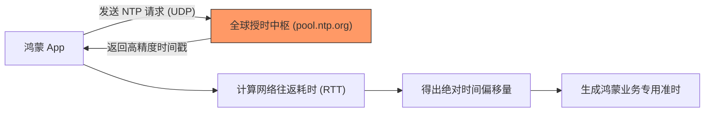

欢迎加入开源鸿蒙跨平台社区：[https://openharmonycrossplatform.csdn.net](https://openharmonycrossplatform.csdn.net)


# Flutter for OpenHarmony: Flutter 三方库 ntp 精准同步鸿蒙设备系统时间（分布式协同授时利器）

## 前言

在进行 OpenHarmony 分布式开发、金融交易或具有严格时效性的业务（如：秒杀倒计时、双因素认证 OTP）时，开发者不能完全信任设备本地的系统时间。用户可能为了某种目的手动篡改时间，或者由于网络同步问题导致时间存在偏差。

**`ntp`** 软件包提供了一种直接与互联网授时中心（NTP 服务器）通信的能力。它能绕过本地系统时钟，获取绝对精准的 UTC 时间，并计算出本地时间与真实时间的“偏移量（Offset）”。

---

## 一、核心授时原理

`ntp` 通过测量往返网络延迟来消除误差。



---

## 二、核心 API 实战

### 2.1 获取绝对精确的当前时间

```dart
import 'package:ntp/ntp.dart';

void fetchPreciseTime() async {
  // 💡 异步获取网络精准时间
  DateTime now = await NTP.now();
  
  print('本地系统时间: ${DateTime.now()}');
  print('NTP 网络准时: $now');
}
```

### 2.2 计算本地时钟偏差

```dart
// 💡 获取本地时钟与标准时间的毫秒差值
int offset = await NTP.getNtpOffset(localTime: DateTime.now());

if (offset.abs() > 2000) {
  print('⚠️ 告警：鸿蒙设备本地时间偏差已超过 2 秒！');
}
```

---

## 三、常见应用场景

### 3.1 鸿蒙分布式设备任务同步
在多台鸿蒙设备执行协同任务（如：多机联奏、矩阵灯光控制）时，必须以同一份 NTP 时间为准，才能保证各设备执行动作的绝对同步。

### 3.2 金融支付安全审计
在发起交易请求时，由于服务端会校验请求的时间戳，利用 `ntp` 库确保客户端发送的时间戳是真实且未经过篡改的，从而提高支付链条的安全等级。

---

## 四、OpenHarmony 平台适配

### 4.1 网络权限配置
💡 **技巧**：NTP 协议通常基于 UDP 的 123 端口。在鸿蒙设备上运行前，请确保 `module.json5` 中不仅开启了 `ohos.permission.INTERNET`，且所处的网络环境未拦截 UDP 通讯。

### 4.2 性能与电池建议
频繁的 NTP 请求会唤醒射频模块并增加电量损耗。在鸿蒙应用中，较佳的实践是：仅在应用启动时或特定业务发起前执行一次 `NTP.getNtpOffset`，然后将该偏移量保存在全局状态中，后续通过 `DateTime.now().add(Duration(milliseconds: offset))` 快速推算出准时。

---

## 五、完整实战示例：鸿蒙秒杀倒计时校验器

本示例展示如何防止用户通过修改系统时间来“提前”进入秒杀环节。

```dart
import 'package:ntp/ntp.dart';

class OhosTimeAuditor {
  static int _cachedOffset = 0;

  /// 初始化同步
  Future<void> syncGlobalTime() async {
    print('⏳ 正在同步鸿蒙全球标准授时中心...');
    try {
      _cachedOffset = await NTP.getNtpOffset(timeout: Duration(seconds: 5));
      print('✅ 同步成功，当前偏移量：$_cachedOffset 毫秒');
    } catch (e) {
      print('❌ 同步失败，将使用本地不可靠时间');
    }
  }

  /// 获取经过校验的当前时间
  DateTime get auditedNow {
    return DateTime.now().add(Duration(milliseconds: _cachedOffset));
  }
}

void main() async {
  final auditor = OhosTimeAuditor();
  await auditor.syncGlobalTime();
  
  print('--- 鸿蒙安全审计报告 ---');
  print('本地时间: ${DateTime.now()}');
  print('审计时间: ${auditor.auditedNow}');
}
```

<!-- IMAGE_PLACEHOLDER: 鸿蒙设备展示本地时间与 NTP 时间存在巨大偏差（由于手动修改）的对比提醒截图 -->

---

## 六、总结

`ntp` 软件包是 OpenHarmony 开发者在构建“时间敏感型”应用时的最后一道防线。它通过对抗本地环境的不确定性，为应用逻辑提供了唯一的真实尺度。在万物互联的鸿蒙生态下，确保时间的绝对对齐是实现复杂分布式协作的基础，而 `ntp` 库正是这一基础的稳健支点。
