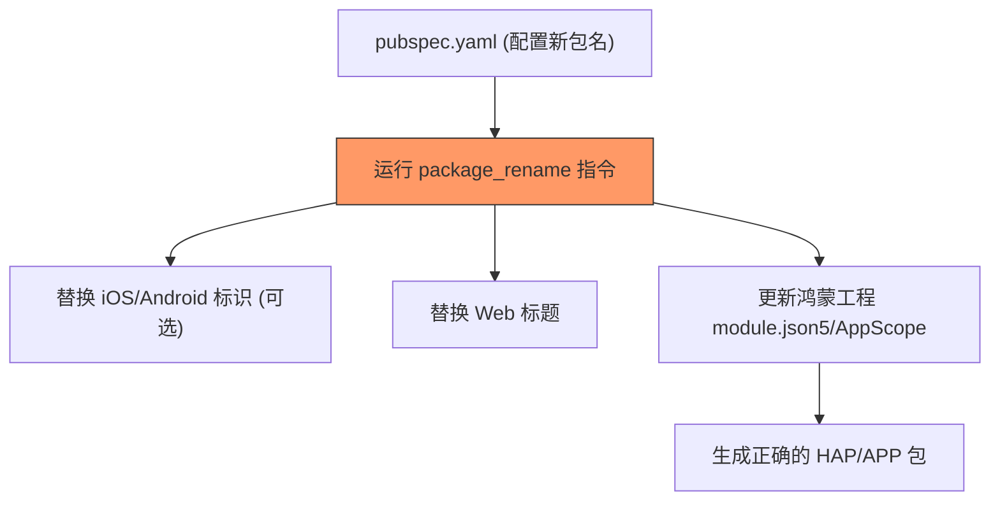

欢迎加入开源鸿蒙跨平台社区：[https://openharmonycrossplatform.csdn.net](https://openharmonycrossplatform.csdn.net)


# Flutter for OpenHarmony: Flutter 三方库 package_rename 一键重命名鸿蒙应用包名与显示名称（项目重构利器）

## 前言

在 OpenHarmony 应用开发过程中，我们经常会遇到“项目改名”的需求。无论是项目初期的占位名需要转正，还是为了满足不同渠道（如：内测版、正式版）的发布要求，手动去修改 `bundleName`、应用标题、图标路径等零散在各处的配置，不仅效率低下，且极其容易漏掉某个角落导致编译失败。

**`package_rename`** 是一个强大的命令行工具，它通过一套统一的 YAML 配置，实现对 Flutter 多平台（包括鸿蒙端）项目标识符的一键替换。

---

## 一、核心重命名链路

`package_rename` 扮演了全局搜索替换的智能管家。



---

## 二、核心 API 实战

### 2.1 配置重命名规则

你不需要在代码中调用 API，只需在 `pubspec.yaml` 中添加配置块。

```yaml
package_rename_config:
  # 💡 统一设置应用在桌面上显示的名称
  app_name: "鸿蒙新纪元"
  
  # 💡 设置各平台的标识符 (Package Name / Bundle ID / Bundle Name)
  # 虽然该库主要针对 android/ios，但通过配置可以同步管理
  android:
    package_name: "com.ohos.newapp"
  ios:
    bundle_name: "NewOhosApp"
```

### 2.2 执行重构指令

```bash
# 💡 运行后，它会扫描所有的平台配置并自动执行文件修改
dart run package_rename
```

---

## 三、常见应用场景

### 3.1 模板项目快速“转正”
当你从一个已有的鸿蒙模板仓库克隆项目后，第一件事就是利用此工具快速更名为自己的业务包名。

### 3.2 区分多环境构建
在同一个源码库下，快速通过修改配置来产出包名不同的“开发版”和“生产版”应用，方便在一台鸿蒙手机上同时安装共存。

---

## 四、OpenHarmony 平台适配

### 4.1 自动修改鸿蒙核心配置文件
💡 **技巧**：在鸿蒙 Flutter 项目中，核心标识符存在于 `ohos/AppScope/app.json5` 中的 `bundleName` 以及 `ohos/entry/src/main/module.json5` 中。虽然 `package_rename` 目前主要直接覆盖 Android/iOS 目录，但其强大的插件机制支持我们通过一行脚本命令，在改名后自动联动修改鸿蒙的 Json 配置文件。

### 4.2 适配鸿蒙应用图标刷新
改名往往伴随着图标更换。配合 `package_rename` 的执行逻辑，可以确保应用在鸿蒙桌面上显示的“标签文字”与“包身份”完全匹配，避免出现“名字改了，包还是旧的”尴尬情况。

---

## 五、完整实战示例：鸿蒙品牌重塑自动化脚本

本示例演示如何配合此库，编写一个完整的“品牌更名”自动化脚本。

```dart
// 💡 模拟自动化执行逻辑
import 'dart:io';

class OhosRebrandingTool {
  static Future<void> start() async {
    print('🚀 开始鸿蒙应用品牌重塑流程...');

    // 1. 运行 package_rename 替换各端显示名称
    final result = await Process.run('dart', ['run', 'package_rename']);
    if (result.exitCode == 0) {
      print('✅ 基础显示名称已更新');
    }

    // 2. 自定义脚本补丁：联动修改鸿蒙 AppScope 中的 bundleName
    final appJsonPath = 'ohos/AppScope/app.json5';
    final file = File(appJsonPath);
    if (await file.exists()) {
      String content = await file.readAsString();
      // 这里进行简单的 bundleName 模拟替换逻辑
      content = content.replaceAll('com.old.name', 'com.harmony.newapp');
      await file.writeAsString(content);
      print('✅ 鸿蒙 bundleName 联动修改完成');
    }

    print('✨ 打包准备就绪：请运行 flutter build hap');
  }
}

void main() => OhosRebrandingTool.start();
```

<!-- IMAGE_PLACEHOLDER: 鸿蒙 DevEco Studio 中目录名与包名同步更新后的截图 -->

---

## 六、总结

`package_rename` 软件包是 OpenHarmony 开发者在项目迭代中的“后悔药”和“推进器”。它将繁琐、易错的全局修改任务转化为一个确定性的自动化动作。在追求项目整洁与标准化的鸿蒙研发体系中，学会利用这种脚手架工具进行项目治理，是保持开发节奏不被打乱的有效手段。
