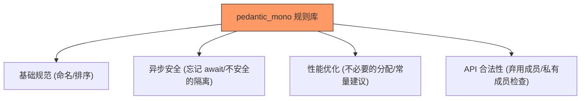

欢迎加入开源鸿蒙跨平台社区：[https://openharmonycrossplatform.csdn.net](https://openharmonycrossplatform.csdn.net)


# Flutter for OpenHarmony: Flutter 三方库 pedantic_mono 引入最严格的代码静态审计规范（鸿蒙项目代码质量卫士）

## 前言

在进行 OpenHarmony 项目开发，尤其是多人协作的大型工程时，“代码风格不统一”和“潜在逻辑风险”是性能和维护的双重杀手。虽然 Dart 官方提供了 `lints` 包，但其约束力往往较弱。

**`pedantic_mono`** 是一套极度严格、由社区资深开发者维护的统计审计（Lint）规则集。它不仅包含了基础的排版规范，更深入到了异步安全（Async Safely）、集合操作性能以及代码健壮性等多个维度。引入它，就像是为你的鸿蒙项目请来了一位 24 小时待命的“代码审计专家”。

---

## 一、核心审计范围图

`pedantic_mono` 覆盖了从变量命名到高阶逻辑的每个角落。



---

## 二、核心 API 实战

### 2.1 引入配置 (analysis_options.yaml)

该库不需要在 Dart 代码中直接引用。你只需修改项目的配置文件。

```yaml
# 💡 替换原来的 flutter_lints
include: package:pedantic_mono/analysis_options.yaml

analyzer:
  # 可以在此基础上进一步微调
  exclude:
    - "**/*.g.dart"
    - "**/*.freezed.dart"
```

### 2.2 触发实时审计

当你保存代码时，IDE（如 DevEco Studio）会立即标红或弹出警告：

- **反例 ❌**：在循环中使用 `+=` 拼接大量字符串。
- **正例 ✅**：审计系统会建议你使用 `StringBuffer` 提升鸿蒙设备的运行效率。

---

## 三、常见审计场景

### 3.1 鸿蒙异步泄露预警
如果你在鸿蒙的 `Widget` 销毁后仍执行异常的回调，`pedantic_mono` 中的某些规则会提醒你使用 `if (mounted)` 进行守卫，防止应用在真机上崩溃。

### 3.2 鸿蒙性能深度优化
规则集会通过极具攻击性的方式强迫你使用 `const` 构造函数。在鸿蒙这种极致追求帧率的应用场景中，减少不必要的背景重绘非常关键。

---

## 四、OpenHarmony 平台适配

### 4.1 适配鸿蒙多团队开发规范
💡 **技巧**：鸿蒙生态正处于爆发期，许多新加入的开发者对 Dart 特性理解深度不一。通过在 CI 中强制集成 `pedantic_mono`，可以确保无论是谁提交的代码，其安全性、可读性和性能表现都处于同一高基准线上。

### 4.2 提升编译产物纯净度
因为静态审计在代码层就已经消灭了大量的无效逻辑和冗余变量，这间接优化了鸿蒙 AOT 编译的输入，使得最终产出的 HAP 包体积更紧凑，运行时的类加载开销更低。

---

## 五、完整实战示例：鸿蒙工程化质量检测报告

本示例演示一套典型代码在 `pedantic_mono` 眼中的“纠偏”过程。

```dart
// 💡 修改前 (可能有 10+ 个 Lint 警告)
void processData(data) { // ❌ 缺少类型注解
  var list = [];         // ❌ 类型推断不明确
  for (var i = 0; i < data.length; i++) {
    print(data[i]);
  }
}

// 💡 修改后 (满足严格审计)
/**
 * 满足 pedantic_mono 的鸿蒙标准函数
 */
void processData(List<String> data) {
  // ✅ 此时代码不仅可读，且具备最强的类型健壮性
  for (final item in data) {
    print(item);
  }
}
```

<!-- IMAGE_PLACEHOLDER: 鸿蒙开发环境下编辑器显示 pedantic_mono 警告信息的截图 -->

---

## 六、总结

`pedantic_mono` 软件包是每个成熟 OpenHarmony 团队的必选项。它将“代码审计”这一繁琐的任务自动化，让开发者在潜移默化中养成最高规格的编程习惯。在追求卓越性能和极速迭代的鸿蒙开发者社区中，拥有这样一位“严师”，是你通往高级软件架构师之路的重要支撑。
