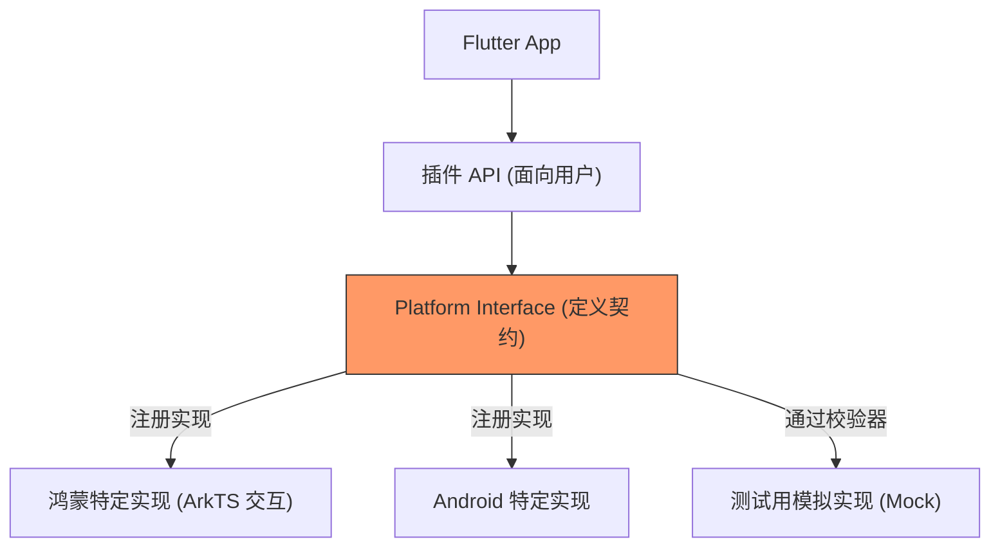

欢迎加入开源鸿蒙跨平台社区：[https://openharmonycrossplatform.csdn.net](https://openharmonycrossplatform.csdn.net)


# Flutter for OpenHarmony: Flutter 三方库 plugin_platform_interface 规范鸿蒙插件跨端接口契约（插件开发标准指南）

## 前言

在进行 OpenHarmony 插件开发时，一个核心挑战是如何确保你的插件在 Android、iOS 和鸿蒙等多端表现一致。为了保证扩展的可测试性和规范性，Flutter 团队提出了一套“基于接口”的插件架构规范。

**`plugin_platform_interface`** 正是实现这一架构的官方基石。它通过强行校验开发者是否继承了特定的基类，确保任何三方开发者（或你自己在进行鸿蒙适配时）在模拟或重写平台库时，都能遵循严格的协议契约，防止因漏写方法而导致的运行时崩溃。

---

## 一、标准分层插件架构

该库致力于定义中间的“平台接口层（Platform Interface）”。



---

## 二、核心 API 实战

### 2.1 定义平台基类

```dart
import 'package:plugin_platform_interface/plugin_platform_interface.dart';

abstract class OhosMyPluginPlatform extends PlatformInterface {
  /// 💡 构造函数必须调用超类构造，确保 token 唯一性
  OhosMyPluginPlatform() : super(token: _token);

  static final Object _token = Object();

  // ... 更多方法定义
}
```

### 2.2 强化继承验证

在插件入口处，使用该库提供的机制防止非法替换。

```dart
static set instance(OhosMyPluginPlatform instance) {
  // 💡 核心：确保传入的实例是真正继承自 OhosMyPluginPlatform 的
  PlatformInterface.verifyToken(instance, _token);
  _instance = instance;
}
```

---

## 三、常见应用场景

### 3.1 鸿蒙插件多版本适配
当你的插件需要支持不同的鸿蒙 SDK 版本，或者在鸿蒙平板和手表上有不同实现时，通过定义统一的接口契约，可以让调用方完全无感。

### 3.2 插件单元测试
利用 `plugin_platform_interface` 允许轻松地在测试环境中注入一个 `Mock` 实例，由于其强化的校验机制，编译器会强迫你完成所有接口的 Mock，保证测试的覆盖度和严谨性。

---

## 四、OpenHarmony 平台适配

### 4.1 确保分布式架构的一致性
💡 **技巧**：在鸿蒙的“分布式设备协同”开发中。如果你定义了一个传感器插件，通过该库约束接口，可以保证在手机主设备和鸿蒙车机副设备上，即使底层实现完全不同，上层的业务代码也能跑在同一套逻辑契约之上。

### 4.2 零性能损耗
该库仅仅是提供了一套契约验证逻辑，几乎都是在编译期或单例初始化时执行一次。对于资源极其珍贵的鸿蒙嵌入式场景，它所带来的架构规范收益远高于极小的内存开销。

---

## 五、完整实战示例：鸿蒙电量监测插件契约

本示例展示如何为一个虚构的鸿蒙电量库构建标准、稳健的基础。

```dart
import 'package:plugin_platform_interface/plugin_platform_interface.dart';

/// 1. 定义鸿蒙平台契约
abstract class BatteryPlatform extends PlatformInterface {
  BatteryPlatform() : super(token: _token);

  static final Object _token = Object();
  static BatteryPlatform _instance = MethodChannelBattery();

  static BatteryPlatform get instance => _instance;

  static set instance(BatteryPlatform instance) {
    PlatformInterface.verifyToken(instance, _token);
    _instance = instance;
  }

  /// 💡 定义各个平台必须实现的方法
  Future<int> getBatteryLevel() {
    throw UnimplementedError('getBatteryLevel() 在该鸿蒙版本中未实现');
  }
}

/// 2. 模拟具体的鸿蒙 MethodChannel 实现
class MethodChannelBattery extends BatteryPlatform {
  @override
  Future<int> getBatteryLevel() async {
    // 调用鸿蒙底层交互代码...
    return 100;
  }
}

void main() async {
  print('🔋 正在通过鸿蒙标准契约获取电量...');
  final level = await BatteryPlatform.instance.getBatteryLevel();
  print('当前电量: $level%');
}
```

<!-- IMAGE_PLACEHOLDER: 鸿蒙工程结构中包含 platform_interface 目录的清晰分层截图 -->

---

## 六、总结

`plugin_platform_interface` 软件包是 OpenHarmony 开发者从“写脚本”进阶为“写工业级插件”的阶梯。它通过引入强制性的架构契约，消灭了多平台适配中最隐秘的“方法冲突”和“丢失实现”漏洞。在立志建设高质量、标准化的鸿蒙跨平台生态时，这款官方推荐的基石类库，是你每一个复杂插件重构的守护神。
