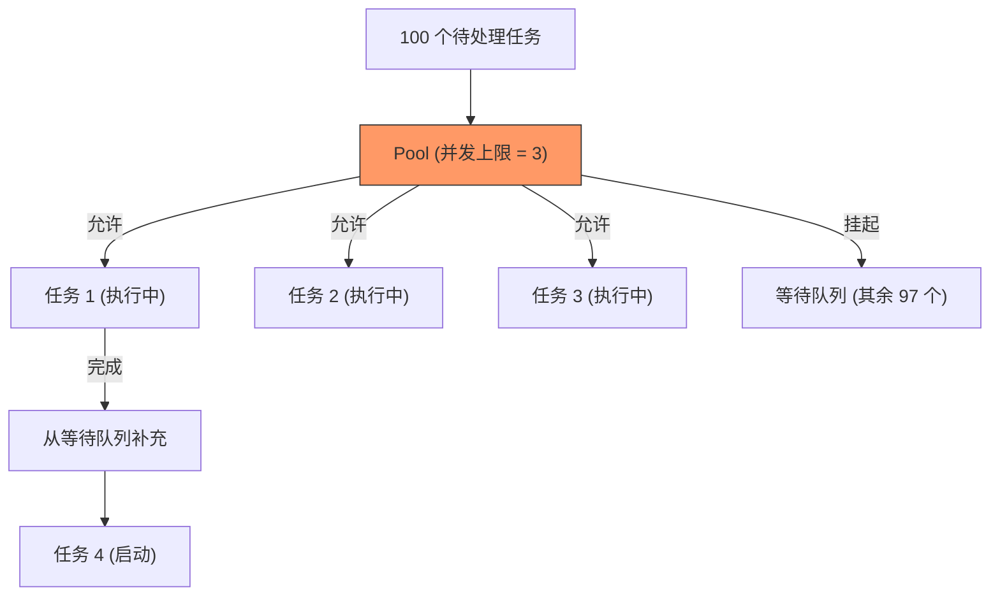

欢迎加入开源鸿蒙跨平台社区：[https://openharmonycrossplatform.csdn.net](https://openharmonycrossplatform.csdn.net)


# Flutter for OpenHarmony: Flutter 三方库 pool 优雅管理鸿蒙应用中的有限资源竞态（并发资源池管理神器）

## 前言

在建立高性能的 OpenHarmony 应用时，我们经常需要处理并发任务。然而，某些资源在系统或业务层面是有“并发上限”的。例如：
1. **网络连接数**：为了避免触发服务器风控，我们可能希望同一时刻最多只有 5 个下载请求。
2. **文件系统句柄**：同时写入过多的文件可能会导致系统资源枯竭。
3. **隔离池（Isolate Pool）**：过多的并发计算会挤占鸿蒙 UI 主线程的资源。

**`pool`** 是一个极简而强大的同步控制库。它类似于“排队叫号系统”，能帮你非常优雅地限制同一时间内运行的异步操作数量，防止资源溢出。

---

## 一、核心排队机制解析

`pool` 充当了开发者与并发任务之间的“流量闸门”。



---

## 二、核心 API 实战

### 2.1 初始化资源池

```dart
import 'package:pool/pool.dart';

// 💡 创建一个最大并发数为 5 的资源池
final pool = Pool(5, timeout: Duration(seconds: 30));
```

### 2.2 使用 `withResource` (最推荐用法)

这是最安全的方式，它能确保任务完成后，资源坑位会被自动释放。

```dart
Future<void> downloadFile(String url) async {
  // 💡 只有拿到坑位后，代码块才会执行
  await pool.withResource(() async {
    print('🚀 拿到坑位，开始下载: $url');
    await doRealDownload(url);
    print('✅ 下载完成，归还坑位');
  });
}
```

### 2.3 手动请求与释放资源

```dart
final resource = await pool.request();
try {
  // 处理业务...
} finally {
  resource.release(); // 💡 必须释放，否则其他任务会卡死
}
```

---

## 三、常见应用场景

### 3.1 鸿蒙相册缩略图批量生成
当用户打开相册，需要为 100 张图片生成缩略图时。通过 `Pool(3)` 限制并发，可以确保鸿蒙设备不会因为 CPU 瞬间满载而导致 UI 卡顿。

### 3.2 局域网设备大规模同步
向鸿蒙分布式网络中的 20 个节点同步数据，但由于硬件限制，每次只能同时给 2 个节点发送包，利用 `pool` 可以完美管理这一逻辑。

---

## 四、OpenHarmony 平台适配

### 4.1 避开鸿蒙系统的资源限制
💡 **技巧**：鸿蒙系统的 `HttpClient` 虽然在底层处理了连接池，但在处理大量文件 IO 或自定义 Socket 连接时，仍需在 Dart 层手动介入。使用 `pool` 可以主动规避因并发过高引起的 `TOO_MANY_OPEN_FILES` 等系统级底层错误。

### 4.2 性能保护
在鸿蒙低能耗设备上，过多的并发会导致调度频率变高。通过 `pool` 将任务“削峰填谷”，能有效降低电池消耗，延长鸿蒙真机在高负载场景下的续航表现。

---

## 五、完整实战示例：鸿蒙多任务排队下载器

本示例模拟了一个包含 10 个下载任务，但限制最大并发为 2 的场景。

```dart
import 'package:pool/pool.dart';

class OhosDownloadManager {
  // 💡 允许同时下载 2 个文件
  final _pool = Pool(2);

  Future<void> runBatchDownloads() async {
    List<String> urls = List.generate(10, (i) => "https://ohos.cdn/file_$i.zip");

    print('📦 准备通过鸿蒙下载中枢处理 ${urls.length} 个任务...');

    // 同时启动所有任务
    final futures = urls.map((url) => _processSingleTask(url));
    
    await Future.wait(futures);
    print('✨ 所有任务已队列化执行完毕');
  }

  Future<void> _processSingleTask(String url) async {
    // 💡 核心保护层
    await _pool.withResource(() async {
      print('>>> [执行中] 处理 $url');
      // 模拟耗时 1 秒的异步操作
      await Future.delayed(Duration(seconds: 1));
    });
  }
}

void main() async {
  final manager = OhosDownloadManager();
  await manager.runBatchDownloads();
}
```

<!-- IMAGE_PLACEHOLDER: 鸿蒙设备控制台显示任务按顺序每 2 个一组并发滚动的截图 -->

---

## 六、总结

`pool` 软件包是 OpenHarmony 开发者管理异步复杂性的“指挥棒”。它将杂乱无章的并发请求转变为井然有序的任务队列。在追求系统级稳定性和用户级丝滑体验的鸿蒙生态下，学会合理地控制并发密度（Concurrency Control），是构建健壮健壮大型软件的必修课。
