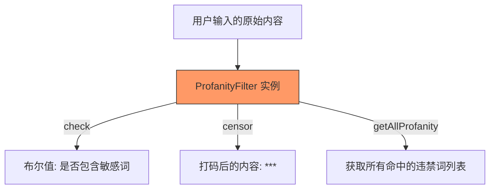

欢迎加入开源鸿蒙跨平台社区：[https://openharmonycrossplatform.csdn.net](https://openharmonycrossplatform.csdn.net)


# Flutter for OpenHarmony: Flutter 三方库 profanity_filter 打造更纯净的鸿蒙应用社交环境（违禁词过滤神器）

## 前言

在 OpenHarmony 社交、评论、直播等涉及用户内容产出（UGC）的应用中，违禁词过滤（Profanity Filtering）是满足合规性、提升社区氛围的刚需。如果让开发者手动去维护成千上万个敏感词的正则是极其不理智的。

**`profanity_filter`** 提供了一个极其轻量、高效且易于扩展的过滤引擎。它不仅能快速检测字符串中是否存在违禁内容，还能一键完成内容的净化与打码。

---

## 一、核心过滤逻辑解析

`profanity_filter` 核心在于通过预编译的词库匹配算法进行全文扫描。



---

## 二、核心 API 实战

### 2.1 简单检测与过滤

```dart
import 'package:profanity_filter/profanity_filter.dart';

void basicUsage() {
  final filter = ProfanityFilter(); // 💡 默认加载基础词库
  
  String input = "这是一个带违禁词的句子"; 
  
  // 1. 检查是否存在违禁词
  bool hasProfanity = filter.hasProfanity(input);
  print('是否违规: $hasProfanity');

  // 2. 将违禁词替换为指定符号
  String cleanString = filter.censor(input);
  print('净化后: $cleanString');
}
```

### 2.2 自定义词库

默认库可能无法涵盖鸿蒙特定业务场景。

```dart
// 💡 创建时传入白名单和黑名单
final filter = ProfanityFilter.filter([
  '自定义违禁词1',
  '自定义违禁词2',
]);
```

### 2.3 全球化语言检测支持

虽然 `profanity_filter` 默认内置了强大的英文词库，但由于其高度可扩展的 API 设计，我们可以轻松实现对多国语言（尤其是中文）的检测。

1. **英文扫描**：直接利用原生引擎的 `getAllProfanity(text)`，它能识别单词变体并避免误伤。
2. **多语言扩展**：通过将外部语种（如中、日、韩等）的 `.txt` 词库文件注入 `filterOnly` 列表，即可实现全球化内容扫描。

```dart
// 💡 示例：构建一个中英双语过滤器
final dualFilter = ProfanityFilter.filterOnly([
  ...ProfanityFilter().checkList, // 注入原生英文列表
  '这是中文违禁词',                // 注入本地语种词库
]);

// 获取文本中命中的所有语种违禁词
List<String> allHits = dualFilter.getAllProfanity(userInput);
```

---

## 三、常见应用场景

### 3.1 鸿蒙即时通讯（IM）敏感词拦截
在用户发送消息前，本地先进行一次初步过滤。

```dart
void sendMessage(String message) {
  if (filter.hasProfanity(message)) {
    print('🚨 提醒：您的消息包含敏感内容，请文明用语');
    return;
  }
  // 发送逻辑...
}
```

### 3.2 鸿蒙应用评论系统展示
当从后端获取海量评论数据时，利用该库对内容进行“静默”打码，提升视觉舒适度。

---

### 4.1 适配中文语境（避坑指南）
💡 **核心警示**：`profanity_filter` 原生库是为英文设计的，它在检测时会执行“单词边界”检测（必须是完整单词）。由于中文句子不使用空格分隔，原生库往往会认为整个句子是一个词，从而导致中间的敏感词匹配失效。

**解决方案**：建议通过“包装器模式”自定义一个服务类，针对英文继续调用原生库（保留其单词边界特性），针对中文则使用字符串的 `contains` 方法进行子串扫描。

### 4.2 离线审核能力
在某些网络不稳定的鸿蒙应用场景中，直接在客户端进行离线过滤，可以极大减轻后端服务器的压力，并提供毫秒级的交互反馈，完美契合鸿蒙系统“流畅”的设计理念。

### 4.3 集成工业级词库（Sensitive-lexicon）
对于生产环境，手动维护词库是不现实的。推荐将开源项目 `Sensitive-lexicon` 提供的词库文件克隆到工程的 `assets` 目录下，在应用启动时动态加载入内存。这种方式可以让词库独立于代码逻辑进行更新。

---

---

## 五、完整实战示例：鸿蒙中英混合内核卫士

该示例演示如何利用原生库的英文处理能力，结合本地 Asset 词库实现工业级的中文过滤。**本示例采用开源项目 `Sensitive-lexicon` 提供的 17 类专业敏感词典作为底层数据支撑。**

```dart
import 'package:flutter/services.dart';
import 'package:profanity_filter/profanity_filter.dart';

class ChineseProfanityService {
  final ProfanityFilter _engFilter = ProfanityFilter();
  final List<String> _cnBlacklist = [];

  /// 💡 全量加载 Sensitive-lexicon 词库（17 个分类全覆盖）
  Future<void> init() async {
    const lexiconFiles = [
      'COVID-19词库.txt', 'GFW补充词库.txt', '其他词库.txt', '反动词库.txt', 
      '广告类型.txt', '政治类型.txt', '新思想启蒙.txt', '暴恐词库.txt',
      '民生词库.txt', '涉枪涉爆.txt', '网易前端过滤敏感词库.txt', 
      '色情类型.txt', '色情词库.txt', '补充词库.txt', 
      '贪腐词库.txt', '零时-Tencent.txt', '非法网址.txt'
    ];
    
    for (final file in lexiconFiles) {
      final data = await rootBundle.loadString('assets/Sensitive-lexicon/Vocabulary/$file');
      _cnBlacklist.addAll(data.split('\n')
          .map((s) => s.trim())
          .where((s) => s.length > 1)); // 过滤单字，减少误伤
    }
    
    // 整体去重平衡性能
    final unique = _cnBlacklist.toSet().toList();
    _cnBlacklist.clear();
    _cnBlacklist.addAll(unique);
    print('✅ 混合引擎就绪，已加载中文词条: ${_cnBlacklist.length}');
  }

  /// 综合检测逻辑
  bool isSafe(String input) {
    if (input.isEmpty) return true;
    
    // A. 委托原生库处理英文（单词边界检测防止误伤）
    if (_engFilter.hasProfanity(input)) return false;

    // B. 自定义扫描处理中文子串
    for (final word in _cnBlacklist) {
      if (input.contains(word)) return false;
    }
    return true;
  }

  /// 综合净化逻辑
  String purify(String input) {
    // 先由原生库处理英文变体
    String output = _engFilter.censor(input);
    // 再循环处理中文替换
    for (final word in _cnBlacklist) {
      output = output.replaceAll(word, '*' * word.length);
    }
    return output;
  }
}

// UI 调用层示例
void onPublish(String text) async {
  final service = ChineseProfanityService();
  await service.init(); // 建议在 App 载入时全局执行一次
  
  if (!service.isSafe(text)) {
    print('🚨 发现不当内容，建议使用净化版本：${service.purify(text)}');
  }
}
```

<!-- IMAGE_PLACEHOLDER: 鸿蒙设备运行内容审计系统的截图 -->

---

## 六、总结

`profanity_filter` 软件包是 OpenHarmony 开发者维护应用环境的一把清风利剑。它以极简的 API 设计解决了复杂的文本审计问题。在鸿蒙生态日益繁盛的今天，通过引入这种离线审核机制，不仅能让你的应用更加合规，更能为用户提供一个纯净、文明的鸿蒙应用交互空间。
