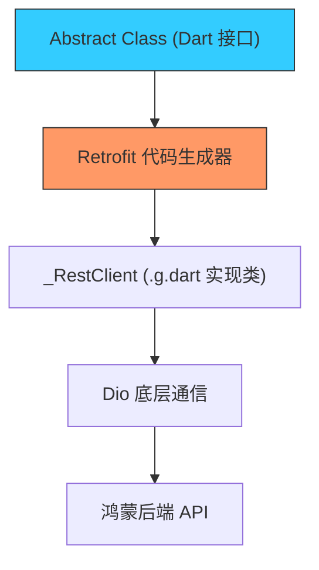

欢迎加入开源鸿蒙跨平台社区：[https://openharmonycrossplatform.csdn.net](https://openharmonycrossplatform.csdn.net)


# Flutter for OpenHarmony: Flutter 三方库 retrofit 以类型安全的方式优雅定义鸿蒙应用网络请求（Dio 增强利器）

## 前言

在 OpenHarmony 业务逻辑开发中，网络请求的编写占据了极大比例。常用的 `Dio` 库虽然强大，但在处理几十个 API 接口时，手动编写解析逻辑、拼凑 URL、管理参数往往会导致冗长且易错。如果能在 Dart 中体验到像 Java/Kotlin 平台 `Retrofit` 一样简单的声明式网络层，开发效率将会有质的飞跃。

**`retrofit`** 正是这样一个基于代码生成的工具包。它通过强类型的接口定义，将 Dio 的异步操作封装得极致优雅，是构建中大型鸿蒙应用网络层的首选方案。

---

## 一、核心生成机制示意

`retrofit` 充当了接口定义与具体实现之间的代码生成代理。



---

## 二、核心 API 实战

### 2.1 定义接口服务

通过注解定义 API 指向和参数。

```dart
import 'package:retrofit/retrofit.dart';
import 'package:dio/dio.dart';

part 'api_service.g.dart'; // 💡 必须指向生成的 .g 文件

@RestApi(baseUrl: "https://api.harmony.com/v1")
abstract class ApiService {
  factory ApiService(Dio dio, {String baseUrl}) = _ApiService;

  // 💡 声明一个 GET 请求
  @GET("/users/{id}")
  Future<UserResponse> getUserInfo(@Path("id") String id);

  // 💡 声明一个 POST 请求并带上请求体
  @POST("/posts")
  Future<void> createPost(@Body() Map<String, dynamic> body);
}
```

### 2.2 实例化与调用

```dart
final dio = Dio();
final apiService = ApiService(dio);

// 💡 像调用系统函数一样进行网络请求，自带类型提示
final user = await apiService.getUserInfo("ohos_expert_01");
```

---

## 三、常见应用场景

### 3.1 鸿蒙企业级统一网关封装
在复杂的鸿蒙项目中，通过 `retrofit` 将不同业务领域的 API 分散到不同的 Service 类中，配合 `Dio` 的拦截器实现全局的 Token 注入和统一错误处理。

### 3.2 自动化的 JSON 转模型
结合 `json_serializable`，`retrofit` 可以让你直接在接口返回类型中写 `Future<MyModel>`，它会自动完成从 JSON 到对象的转换，无需手动调用 `fromJson`。

---

## 三、OpenHarmony 平台适配

### 4.1 代码生成的稳定性
💡 **技巧**：`retrofit` 生成的代码是标准的 Dart。在鸿蒙 AOT 编译环境下，这种“先编译、不反射”的特性确保了网络层极高的初始化速度和运行时可靠性，完全符合鸿蒙系统对极致流畅性的追求。

### 4.2 适配鸿蒙多网络环境
在鸿蒙设备切换 WiFi 或蜂窝网时，底层 `Dio` 的 `baseUrl` 可能会动态变化。通过 `ApiService` 的 `factory` 构造函数，可以在运行时灵活传入不同的 `Dio` 实例或基础路径，确保请求在复杂的鸿蒙网络拓扑中始终准确到达。

---

## 五、完整实战示例：鸿蒙云端工作台请求中心

本示例演示如何构建一个完整的 Rest API 客服端。

```dart
import 'package:dio/dio.dart';
import 'package:retrofit/retrofit.dart';

class OhosApiClient {
  late ApiService _service;

  OhosApiClient() {
    final dio = Dio();
    // 💡 可以在此添加鸿蒙特有的网络拦截器
    _service = ApiService(dio);
  }

  Future<void> syncData() async {
    print('📦 正在启动鸿蒙模型同步引擎...');
    try {
      final response = await _service.getUserInfo("999");
      print('✅ 远程同步成功：${response.name}');
    } catch (obj) {
      // 这里的 obj 通常是 DioError，可以根据鸿蒙网络状态进行差异化提示
      print('❌ 网络链路异常');
    }
  }
}

// 模拟返回对象
class UserResponse {
  final String name;
  UserResponse({required this.name});
}

void main() async {
  final client = OhosApiClient();
  await client.syncData();
}
```

<!-- IMAGE_PLACEHOLDER: 鸿蒙设备运行 Retrofit 网络请求监控并打印结果的截图 -->

---

## 六、总结

`retrofit` 软件包是 OpenHarmony 开发者编写“优雅”代码的助推器。它将繁琐、肮脏的网络层样板代码彻底隐藏，让开发者能全身心投入到业务逻辑的构建中。对于任何追求代码美感、强类型安全以及高性能的鸿蒙 App 来说，`retrofit` 都是构建现代网络通信层的不二方案。
