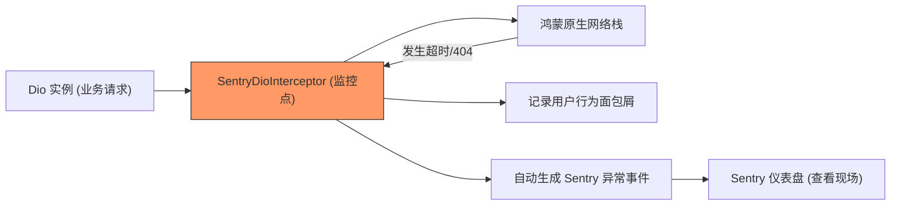

欢迎加入开源鸿蒙跨平台社区：[https://openharmonycrossplatform.csdn.net](https://openharmonycrossplatform.csdn.net)


# Flutter for OpenHarmony: Flutter 三方库 sentry_dio 深度追踪鸿蒙应用网络请求异常与性能瓶颈（全链路监控利器）

## 前言

在 OpenHarmony 应用上线后，网络请求的稳定性是衡量应用质量的核心指标。当用户反馈“图片打不开”或“登录转圈”时，开发者往往难以在真实、复杂的网络环境下复现问题。如果能在故障发生的瞬间，自动采集到请求的 URL、响应状态码、耗时甚至是具体的网络错误栈，排查效率将会有质的飞跃。

**`sentry_dio`** 是 Sentry SDK 的专属扩展。它通过对 `Dio` 库的无缝注入，让你的鸿蒙应用具备了全链路网络监控能力，每一笔异常请求都会伴随着详细的上下文信息自动上报至监控平台。

---

## 一、全链路监控链路图

`sentry_dio` 扮演了网络层“黑匣子”的角色。



---

## 二、核心 API 实战

### 2.1 极简注入

你只需在创建 `Dio` 后添加一个拦截器。

```dart
import 'package:dio/dio.dart';
import 'package:sentry_dio/sentry_dio.dart';

void initNetworkMonitor() {
  final dio = Dio();
  
  // 💡 仅需一行，开启全量网络记录
  dio.addSentry(); 
  
  print('✅ 鸿蒙网络安全哨兵已上线');
}
```

### 2.2 配置采样与数据脱敏

```dart
dio.addSentry(
  captureFailedRequests: true, // 💡 仅采集失败的请求
  networkTracing: true,       // 💡 开启分布式性能追踪
);
```

---

## 三、常见应用场景

### 3.1 鸿蒙应用接口成功率波动分析
通过 Sentry 控制台，实时观察在不同的鸿蒙设备型号（如：华为 Mate 60 vs Pura 70）上的 API 成功率。如果某一型号请求 502 的比例偏高，可能暗示着该机型的网络协议适配有问题。

### 3.2 冷启动性能优化
分析应用启动后的第一批网络请求耗时。利用 `sentry_dio` 提供的 Span 数据，揪出那些在鸿蒙系统加载阶段拖后腿的耗时接口。

---

## 四、OpenHarmony 平台适配

### 4.1 适配鸿蒙的权限与连接性
💡 **技巧**：在鸿蒙 NEXT 平台上，网络请求受到严格的权限管控。`sentry_dio` 记录下的错误中，能精准区分出是由于“无网络权限（Permission Denied）”导致的失败，还是真实的“服务器宕机”。这为鸿蒙应用上架前的权限审计提供了第一手证据。

### 4.2 流量消耗的可观测性
考虑到鸿蒙设备在移动蜂窝网络下的流量成本。通过 Sentry 的日志聚合，可以统计各业务模块在后台的流量数据包大小（Payload Size），帮助开发者针对性地进行鸿蒙端的协议压缩优化（如改用 Protobuf 或全量 Gzip）。

---

## 五、完整实战示例：鸿蒙全天候网络链路卫士

本示例展示如何配置一个具备详细错误还原能力的监控层。

```dart
import 'package:dio/dio.dart';
import 'package:sentry_dio/sentry_dio.dart';

class OhosNetSentinel {
  late Dio _dio;

  OhosNetSentinel() {
    _dio = Dio(BaseOptions(
      connectTimeout: const Duration(seconds: 10),
    ));

    // 💡 针对鸿蒙环境进行深度拦截配置
    _dio.addSentry(
      // 捕获包括 401, 403, 500 在内的所有异常
      failedRequestStatusCodes: [
        SentryStatusCode.range(400, 599),
      ],
    );
  }

  Future<void> requestSafety() async {
    print('📦 正在监控鸿蒙端请求逻辑...');
    try {
      // 如果此请求由于鸿蒙手机断网失败，Sentry 会捕获并上报
      await _dio.get('https://api.harmony.com/v1/health');
      print('✅ 物理链路正常');
    } catch (e) {
      print('❌ 链路已熔断，哨兵已自动记录异常现场');
    }
  }
}

void main() async {
  final sentinel = OhosNetSentinel();
  await sentinel.requestSafety();
}
```

<!-- IMAGE_PLACEHOLDER: Sentry 仪表盘展示鸿蒙端异常请求的详细属性（包含设备型号、网络类型、错误码等）的截图 -->

---

## 六、总结

`sentry_dio` 软件包是 OpenHarmony 开发者在正式发布应用前的“标配挂载点”。它将不可见的网络流量转化成了可视化的运营数据报告。在万物互联、服务高并发叠加的鸿蒙应用场景中，拥有这种“上帝视角”的全链路监控方案，是你快速闭环线上 Bug、保障鸿蒙用户口碑的核心底牌。
