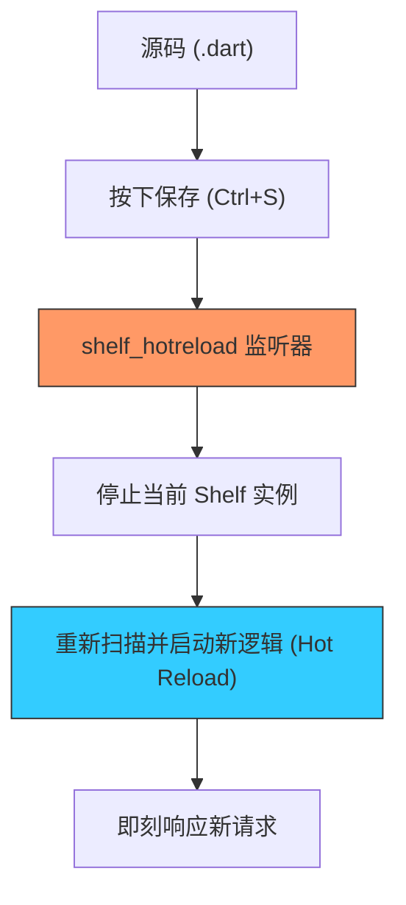

欢迎加入开源鸿蒙跨平台社区：[https://openharmonycrossplatform.csdn.net](https://openharmonycrossplatform.csdn.net)


# Flutter for OpenHarmony: Flutter 三方库 shelf_hotreload 为鸿蒙端侧服务端开发引入极速热重载体验（服务端开发利器）

## 前言

随着 OpenHarmony 设备性能的增强，不少开发者开始尝试在鸿蒙设备上运行轻量级的 Web 服务（接入 `shelf` 框架）。然而，在开发后端逻辑或 API 路由时，最痛苦的莫过于：为了看一眼代码修改后的效果，必须手动杀掉进程再重新启动服务。

**`shelf_hotreload`** 解决了这一痛点。它为 Dart 服务端开发带来了类似于 Flutter UI 开发的“热重载”体验。只要你保存代码，正在运行的鸿蒙端服务器就会在几百毫秒内自动重启并应用最新的逻辑，极大提升了鸿蒙全栈开发的调试效率。

---

## 一、核心监听重载机制

该库通过监听文件系统的特定变动（Watch）来触发服务进程的重启。



---

## 二、核心 API 实战

### 2.1 基础配置与启动

```dart
import 'package:shelf/shelf.dart';
import 'package:shelf/shelf_io.dart' as io;
import 'package:shelf_hotreload/shelf_hotreload.dart';

// 💡 必须在一个全局函数中定义你的服务
void main() {
  // 调用 withHotreload，它会包裹你的启动逻辑
  withHotreload(() => _createHandler());
}

Future<HttpServer> _createHandler() async {
  var handler = const Pipeline().addHandler((request) {
    return Response.ok('你好，这是来自鸿蒙的热重载服务！');
  });
  
  return io.serve(handler, '0.0.0.0', 8080);
}
```

### 2.2 定义监听路径

```dart
withHotreload(
  () => _createHandler(),
  onReloaded: () => print('✅ 鸿蒙服务已完成热更新'),
);
```

---

## 三、常见应用场景

### 3.1 鸿蒙端侧“本地服务”开发
如果你正在开发一个鸿蒙版的文件中转站或局域网协作工具，利用 `shelf_hotreload` 可以一边修改 HTML 模板或路由逻辑，一边在浏览器刷新即刻看到结果，无需中断鸿蒙调试进程。

### 3.2 自动化测试 Mock 服务
在进行鸿蒙 UI 自动化测试时，快速调整 Mock Server 的返回内容，实现各种边界情况的极速验证。

---

## 四、OpenHarmony 平台适配

### 4.1 适配鸿蒙文件系统监听
💡 **技巧**：鸿蒙系统的底层文件访问受限于沙箱策略。在开发阶段，如果你的代码运行在鸿蒙模拟器或真机通过 IDE 部署的环境下，`shelf_hotreload` 通过 `watcher` 库能直接捕获到源码文件的变更。在真机环境中部署时，请确保开启了工程的“动态热重载”编译选项。

### 4.2 内存泄漏防御
频繁的热重载如果处理不当，会残留旧的句柄。`shelf_hotreload` 做得非常专业，它会确保在加载新代码前，彻底释放上一个 `HttpServer` 持有的鸿蒙系统端口和内存资源，保障了鸿蒙设备在长达数小时开发周期内的稳定性。

---

## 五、完整实战示例：鸿蒙快速开发网关

本示例演示如何构建一个可实时修改返回值的鸿蒙微型服务。

```dart
import 'package:shelf/shelf.dart';
import 'package:shelf/shelf_io.dart' as io;
import 'package:shelf_hotreload/shelf_hotreload.dart';

void main() async {
  print('♨️ 正在启动鸿蒙热重载开发环境...');
  
  // 💡 直接开启监控，只需修改 handlerFunc 里的代码并保存即可生效
  withHotreload(() async {
    final handler = _myRouter;
    return io.serve(handler, 'any', 9999);
  });
}

Response _myRouter(Request request) {
  // 💡 这里可以随意修改，保存即刷新
  return Response.ok(
    '<h1>鸿蒙热更新控制台</h1><p>当前系统时间: ${DateTime.now()}</p>',
    headers: {'content-type': 'text/html; charset=utf-8'},
  );
}
```

<!-- IMAGE_PLACEHOLDER: 鸿蒙 DevEco Studio 的侧边预览窗口（网页）随代码保存瞬间刷新的截图 -->

---

## 六、总结

`shelf_hotreload` 软件包是 OpenHarmony 全栈开发者（End-to-End）的“加速踏板”。它将原本沉重、碎片化的“修改-重启-验证”循环缩减到了极致的一秒之内。在追求快速迭代、小步快跑的鸿蒙开发初期，这样一套具备顺滑体验的开发辅助工具，是提升编码热情的关键催化剂。
