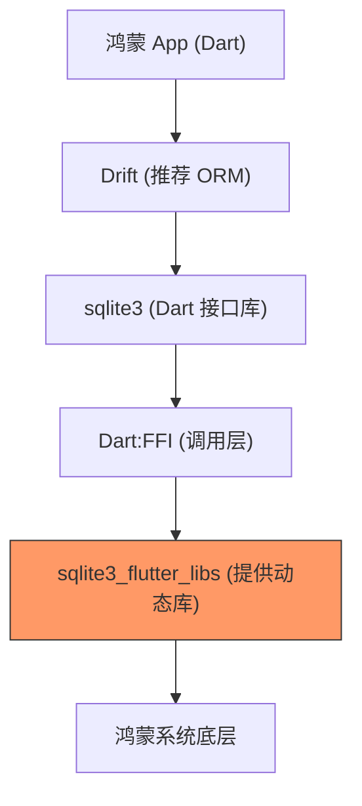

欢迎加入开源鸿蒙跨平台社区：[https://openharmonycrossplatform.csdn.net](https://openharmonycrossplatform.csdn.net)


# Flutter for OpenHarmony: Flutter 三方库 sqlite3_flutter_libs 为鸿蒙应用提供高性能嵌入式数据库底层支持（数据持久化基石）

## 前言

在 OpenHarmony 应用开发中，当我们需要处理复杂的本地数据关系（如：聊天记录、离线地图、内容索引）时，简单的 `Preferences`（首选项）已经无法满足需求。虽然 Flutter 官方有 `sqflite` 等库，但在追求极致性能和底层掌控力时，直接使用 SQLite 的 FFI（外部函数接口）绑定是最佳平衡点。

**`sqlite3_flutter_libs`** 是一个关键的桥接库。它的核心作用并不是提供 Dart 层的 API，而是为 OpenHarmony 平台打包进一份高优化的、编译好的 SQLite 二进制共享库（`.so` 文件），确保你在鸿蒙平台上调用 `sqlite3` 库时能“开箱即用”。

---

## 一、核心依赖架构

它是数据持久化层的“基石”，支撑起上层繁荣的 ORM 体系。



---

## 二、核心工作原理实战

### 2.1 依赖引入

```yaml
dependencies:
  # 💡 接口库
  sqlite3: ^2.4.0
  # 💡 针对 Flutter 平台的二进制实现（鸿蒙适配关键）
  sqlite3_flutter_libs: ^0.5.21
```

### 2.2 在鸿蒙上初始化数据库

你不需要直接调用 `sqlite3_flutter_libs` 的方法，只需确保它在你的依赖清单中，底层就会自动根据鸿蒙平台加载正确的库文件。

```dart
import 'dart:io';
import 'package:sqlite3/sqlite3.dart';
import 'package:path_provider/path_provider.dart';
import 'package:path/path.dart' as p;

void initDatabase() async {
  // 1. 获取鸿蒙应用的私有沙箱目录
  final dir = await getApplicationDocumentsDirectory();
  final path = p.join(dir.path, 'ohos_store.db');

  // 2. 打开（或创建）数据库
  final db = sqlite3.open(path);

  // 3. 执行 SQL 初始化
  db.execute('''
    CREATE TABLE IF NOT EXISTS users (
      id INTEGER PRIMARY KEY,
      name TEXT NOT NULL
    );
  ''');

  print('✅ 鸿蒙本地数据库已建立：$path');
}
```

### 2.3 事务性隔离操作

在金融、记账等场景，保证数据的原子性至关重要。`sqlite3` 库通过标准的 SQL 语句支持完整的事务机制。

```dart
void transferMoney(Database db, String from, String to, int amount) {
  // 💡 1. 启动事务
  db.execute('BEGIN TRANSACTION');

  try {
    // 💡 2. 执行原子操作（如：扣钱与加钱）
    db.execute("UPDATE balance SET amount = amount - $amount WHERE name = '$from'");
    
    // 模拟中间可能的业务校验失败
    // if(checkFail) throw Exception();

    db.execute("UPDATE balance SET amount = amount + $amount WHERE name = '$to'");

    // 💡 3. 提交事务（数据持久化）
    db.execute('COMMIT');
    print('✅ 转账事务成功提交');
  } catch (e) {
    // 💡 4. 出现任何异常，立即回滚，确保 A 的钱不会凭空消失
    db.execute('ROLLBACK');
    print('🚨 事务异常已回滚：$e');
  }
}
```

---

## 三、常见应用场景

### 3.1 鸿蒙端海量数据离线缓存
对于新闻 App 或电商 App，在无网络状态下，利用 SQLite 的高效索引能力，让用户可以瞬间秒开之前浏览过的商品列表。

### 3.2 下拉联想关键词索引
将成千上万个联想词放入本地 SQLite 表中，利用 FFI 的高吞吐特性实现毫秒级的输入快速联想。

---

## 四、OpenHarmony 平台适配

### 4.1 FFI 动态库路径适配
💡 **技巧**：在鸿蒙系统中，应用启动时会从 HAP 包的 `libs/` 目录加载本地库。`sqlite3_flutter_libs` 能够自动处理好这一映射关系。如果遇到库找不到的错误，通常是因为没有正确安装 `ohos` 对应的 native 构建组件。

### 4.2 适配鸿蒙多实例并发
SQLite 虽然支持并发读取，但在多线程（多个 Isolate）访问时仍需注意写锁。建议配合 `sqlite3` 的 `sqlite3.open(path, vfs: 'unix-none')` 或者使用 `Drift` 框架封装好的并发处理器，来榨干鸿蒙芯片的多核性能。

### 4.3 💡 特别警示：Bytecode HAR 兼容性配置
在较新版本的 OpenHarmony SDK 环境下，由于 `sqlite3-native-library` 依赖包通常以 **Bytecode HAR** 形式提供，直接运行构建可能会遇到以下错误：
> `hvigor ERROR: 00306046 Specification Limit Violation` 
> `Error Message: Bytecode HARs: [sqlite3-native-library] not supported when useNormalizedOHMUrl is not true.`

**解决方案：**
你需要修改鸿蒙工程根目录下的 `ohos/build-profile.json5` 文件，在 `products` 配置中启用“归一化包名路径”（Normalized OHM URL）：

```json5
{
  "app": {
    "products": [
      {
        "name": "default",
        "buildOption": {
          "strictMode": {
            "useNormalizedOHMUrl": true // 💡 必须设置为 true 以支持字节码 HAR
          }
        }
      }
    ]
  }
}
```
*注：如果该配置项放置层级不对（例如直接放在 product 根部），会导致 Schema 校验失败，请务必确认层级为 `buildOption.strictMode`。*

---

## 五、完整实战示例：鸿蒙记账本高性能存储中心

本示例展示如何利用底层 SQLite 开发一个简单的交易记录存取系统。

```dart
import 'package:sqlite3/sqlite3.dart';

class OhosDatabaseManager {
  late Database _db;

  OhosDatabaseManager(String dbPath) {
    // 💡 核心：sqlite3_flutter_libs 确保了这里的 open 能在鸿蒙真机上找到本地 so 库
    _db = sqlite3.open(dbPath);
    _initSchema();
  }

  void _initSchema() {
    _db.execute('CREATE TABLE IF NOT EXISTS logs (val TEXT)');
  }

  /// 插入一条加密交易日志
  void logTransaction(String data) {
    print('🚀 正在进行鸿蒙本地安全写入...');
    final stmt = _db.prepare('INSERT INTO logs (val) VALUES (?)');
    stmt.execute([data]);
    stmt.dispose();
  }

  /// 统计记录数
  int getCount() {
    final ResultSet results = _db.select('SELECT COUNT(*) as c FROM logs');
    return results.first['c'] as int;
  }

  void dispose() => _db.dispose();
}

void main() {
  // 假设已通过 path_provider 获得了位置
  final manager = OhosDatabaseManager('/data/storage/el2/base/files/test.db');
  manager.logTransaction("购买 HarmonyOS 开发教程");
  print('当前记录总数: ${manager.getCount()}');
}
```

<!-- IMAGE_PLACEHOLDER: 鸿蒙设备运行数据库操作、通过 SQLite 工具核对 .db 文件的截图 -->

---

## 六、总结

`sqlite3_flutter_libs` 软件包是 OpenHarmony 数据治理的底层“守门员”。它通过将标准的 SQL 计算能力引入鸿蒙生态，让跨平台开发不再受限于简单的 Key-Value 存储。对于任何严肃的、需要处理结构化数据的鸿蒙企业级项目，这款库都是构建稳定、高性能持久化方案的基石性建设。
