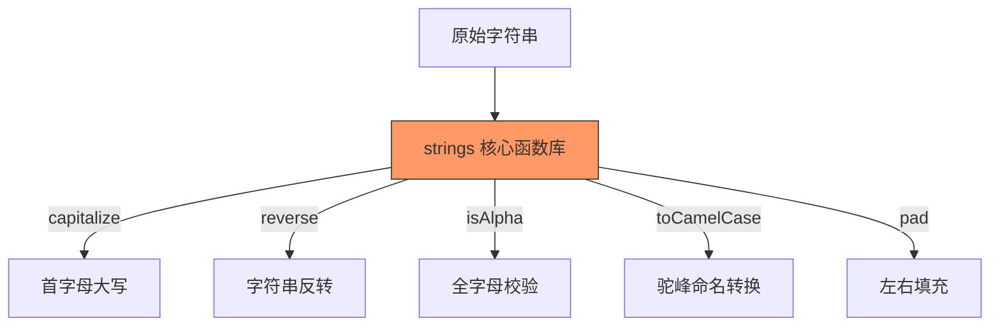

欢迎加入开源鸿蒙跨平台社区：[https://openharmonycrossplatform.csdn.net](https://openharmonycrossplatform.csdn.net)


# Flutter for OpenHarmony: Flutter 三方库 strings 深度处理字符串的各种“疑难杂症”（字符串增强与处理利器）

## 前言

在进行 OpenHarmony 应用开发时，字符串处理是绕不开的家常便饭。无论是用户输入的清理、数据的序列化展示，还是各种 ID 的生成与校验，Dart 原生的 `String` 类虽然功能够用，但在面对一些复杂的“套路化”需求时（如：首字母大写、反转、填充、随机生成），仍需开发者手写大量逻辑。

**`strings`** 软件包正是为了消除这些重复劳动而生。它提供了一个极其纯粹、无平台依赖的 Dart 静态工具集，旨在让字符串操作像拼乐高一样简单直观。

---

## 一、核心魔法解析

`strings` 并不修改原生的 String 类型，而是通过一系列高效的静态方法来处理它们。



---

## 二、核心 API 实战

### 2.1 基础转换技巧

```dart
import 'package:strings/strings.dart';

void basicTransform() {
  String input = "open_harmony";
  
  // 💡 首字母大写
  print(capitalize(input)); // "Open_harmony"
  
  // 💡 字符串反转 (简单直接)
  print(reverse("12345")); // "54321"
}
```

### 2.2 强大的填充与截断

在鸿蒙 UI 展示中，对齐文本是强迫症开发者的福音。

```dart
// 💡 居中填充：让 "OHOS" 在 10 位长度中居中，左右补 "-"
print(center("OHOS", 10, "-")); // "---OHOS---"

// 💡 左侧填充：常用于补全 ID 或数字
print(padLeft("7", 3, "0")); // "007"
```

### 2.3 类型校验与命名转换

在鸿蒙应用的表单验证、数据清洗场景中非常实用。

```dart
import 'package:strings/strings.dart';

void typeCheckDemo() {
  // 💡 检查字符串是否为数字（可解析为 double）
  print(Strings.isNumeric('123.45'));     // true

  // 💡 检查字符串是否仅包含数字字符
  print(Strings.isDigits('123456'));      // true
  print(Strings.isDigits('123.45'));      // false

  // 💡 大小写校验
  print(Strings.isUpperCase('OHOS'));     // true
  print(Strings.isLowerCase('ohos'));     // true

  // 💡 命名转换：驼峰 / 蛇形 / 首字母大写
  print(Strings.toCamelCase('hello_world'));  // "HelloWorld"
  print(Strings.toSnakeCase('helloWorld'));   // "hello_world"
  print(Strings.toProperCase('hello world')); // "Hello World"
}
```

---

## 三、常见应用场景

### 3.1 鸿蒙搜索框关键词纠偏
当用户输入搜素关键词后，自动将首字母大写或去除特殊字符。

```dart
void onSearch(String text) {
  // 清理输入并规范化
  String cleanText = capitalize(text.trim());
  print('正在检索鸿蒙文章: $cleanText');
}
```

### 3.2 银行卡号/验证码显示掩码
利用 `padLeft` 和字符串截取实现简单的脱敏。

```dart
String maskPhone(String phone) {
  // 仅演示逻辑
  return phone.substring(phone.length - 4).padLeft(phone.length, "*");
}
```

---

## 四、OpenHarmony 平台适配

### 4.1 国际化与字符集
💡 **技巧**：`strings` 库对多字节字符（如中文）的处理非常稳健。在鸿蒙设备上运行中文界面的 App 时，使用 `reverse` 函数反转中文句子（如“你好鸿蒙”）依然能得到正确的结果（“蒙鸿好你”），不会出现乱码。

### 4.2 零性能损耗
由于它完全基于 Dart 的底层循环和内置类型构建，不涉及任何 FFI 调用或平台接口。这使得它在鸿蒙 AOT 环境下编译出来的代码体积极小，执行速度极快，是打造“丝滑”鸿蒙应用的基础基石。

---

## 五、完整实战示例：鸿蒙注册信息验证系统

本示例展示如何利用 `strings` 高效完成用户注册页面的数据合法性初步校验。

```dart
import 'package:strings/strings.dart';

class OhosRegisterValidator {
  void validate(String username, String inviteCode) {
    print('--- 鸿蒙注册系统审计开始 ---');

    // 1. 校验用户名是否全由数字字母组成 (利用 isAlphanumeric)
    if (!isAlphanumeric(username)) {
      print('❌ 错误：用户名包含非法字符');
      return;
    }

    // 2. 规范化邀请码 (全转大写并填充)
    String finalCode = capitalize(inviteCode.trim()).padRight(8, "X");
    
    // 3. 校验是否全字母数字
    bool isValid = isAlphanumeric(finalCode);

    print('✅ 用户验证通过！');
    print('整理后的邀请码：$finalCode (校验: $isValid)');
  }
}

void main() {
  final validator = OhosRegisterValidator();
  validator.validate("HarmonyOS2026", "ohos_vip");
}
```

<!-- IMAGE_PLACEHOLDER: 鸿蒙手机注册页面运行截图 -->

---

## 六、总结

`strings` 软件包是每个 OpenHarmony 开发者提升“编码幸福感”的小神器。它通过对最基础的字符串操作进行工业级的提炼，彻底消灭了项目中到处乱飞的重复字符串算法。在追求高质量、高效率的鸿蒙生态开发中，这种极致纯粹的库反而是最不可或缺的基础底座。
