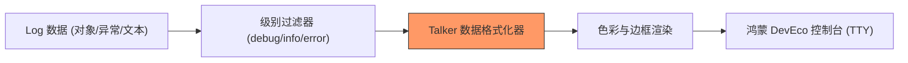

欢迎加入开源鸿蒙跨平台社区：[https://openharmonycrossplatform.csdn.net](https://openharmonycrossplatform.csdn.net)


# Flutter for OpenHarmony: Flutter 三方库 talker_logger 让鸿蒙应用日志不仅能看懂，更具视觉美感（专业日志调试利器）

## 前言

在 OpenHarmony 应用开发的调试阶段，面对成千上万行的控制台输出，开发者往往会陷入“日志迷雾”。原生的 `print()` 只能输出黑白文字，难以快速区分错误、警告和普通信息。即使是一些基础的 Logger 库，也往往缺乏足够的美感。

**`talker_logger`** 是一个专注于“颜值”与“功能”并重的日志记录库。它不仅支持带颜色的控制台输出，还能通过各种边框样式将日志格式化，让你的鸿蒙开发控制台瞬间变得赏心悦目、条理分明。

---

## 一、核心呈现链路图

`talker_logger` 通过装饰器模式将原始数据转化为可读性极强的视觉信息。



---

## 二、核心 API 实战

### 2.1 基础配置与实例化

```dart
import 'package:talker_logger/talker_logger.dart';

// 💡 创建 logger 实例，可自定义日志级别和颜色方案
final logger = TalkerLogger(
  settings: TalkerLoggerSettings(
    level: LogLevel.debug,
    maxLineWidth: 80,
  ),
);
```

### 2.2 打印不同级别的日志

```dart
// 💡 Info 级别（通常是蓝色或绿色）
logger.info('鸿蒙应用已启动');

// 💡 Warning 级别（通常是黄色背景）
logger.warning('用户权限可能不足');

// 💡 Error 级别（醒目的红色）
logger.error('API 请求失败：网络超时');
```

### 2.3 自定义高亮颜色

```dart
// 💡 为特定的业务模块设置专属颜色
logger.log('支付模块', pen: AnsiPen()..magenta());
```

---

## 三、常见应用场景

### 3.1 鸿蒙网络请求深度审计
通过 `talker_logger` 打印出带有边框的 HTTP 请求详情，包括 URL、Header 和 Body，让问题无处遁形。

### 3.2 鸿蒙应用生命周期追踪
在页面的 `initState` 和 `dispose` 中加入精美的日志，观察业务流转是否符合预期。

---

## 四、OpenHarmony 平台适配

### 4.1 终端颜色支持说明
💡 **技巧**：鸿蒙的开发工具（DevEco Studio）内置控制台对 ANSI 颜色转义字符支持非常完美。这意味着你在 `talker_logger` 中设置的所有颜色、粗体、背景色，在 IDE 的底部日志栏中都能原汁原味地呈现出来，极大提升了调试时的视觉定位速度。

### 4.2 性能开销控制
在生产环境下的鸿蒙应用中，频繁的字符串拼接和格式化会有一定的性能损耗。建议结合 `TalkerLoggerSettings` 中的 `level: LogLevel.critical`（或者在打包生产环境 HAP 时，通过预处理器指令彻底禁用 Logger）来确保应用的极致流畅度。

---

## 五、完整实战示例：鸿蒙业务模块监控系统

本示例展示如何利用 `talker_logger` 构建一个结构化的业务反馈系统。

```dart
import 'package:talker_logger/talker_logger.dart';

class OhosSystemMonitor {
  final _logger = TalkerLogger();

  void trackUserAction(String action, {bool success = true}) {
    print('--- 启动鸿蒙用户行为审计 ---');

    if (success) {
      _logger.info('✅ 动作成功: $action');
    } else {
      // 💡 错误日志自动带有详细的格式，非常醒目
      _logger.critical('🚨 严重告警：用户无法完成 $action，请技术人员介入！');
    }
  }

  void logCustomData(Map<String, dynamic> data) {
    // 💡 打印带缩进的结构化 JSON 数据
    _logger.debug('当前鸿蒙内存状态数据：\n$data');
  }
}

void main() {
  final monitor = OhosSystemMonitor();
  
  monitor.trackUserAction("点击登录");
  monitor.trackUserAction("支付流程", success: false);
  
  monitor.logCustomData({
    'ohos_sdk_version': '5.0.0',
    'device_type': 'Foldable',
    'memory_usage': '158MB'
  });
}
```

<!-- IMAGE_PLACEHOLDER: 鸿蒙 DevEco Studio 日志控制台呈现出的彩色边框日志截图 -->

---

## 六、总结

`talker_logger` 软件包是 OpenHarmony 开发者提升调试效率的“视觉核武器”。它通过对控制台日志的彻底重构，将枯燥的字符变成了具有语义化颜色的信息流。在追求极致细节和规范化的鸿蒙开发团队中，引入这种高质量的日志记录方案，能显著降低开发沟通成本，让代码的运行状态一目了然。
