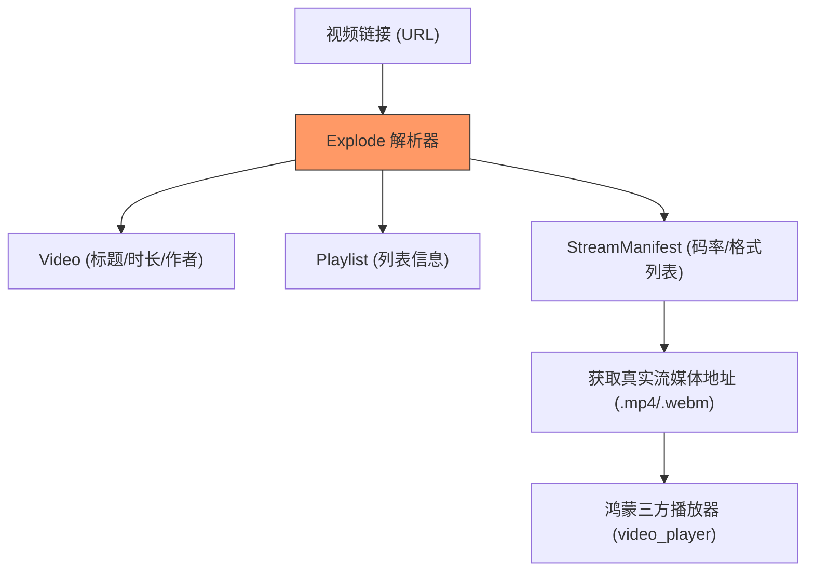

欢迎加入开源鸿蒙跨平台社区：[https://openharmonycrossplatform.csdn.net](https://openharmonycrossplatform.csdn.net)


# Flutter for OpenHarmony: Flutter 三方库 youtube_explode_dart 深度解析在线视频元数据与流地址（多媒体处理利器）

## 前言

在 OpenHarmony 多媒体应用开发中，有时我们需要直接获取在线视频的各种信息，例如标题、封面、播放时长，甚至是视频流的真实 URL。由于在线视频平台的 API 往往非常复杂且有各种配额限制，一个轻量级、免 API Key 的解析库就显得弥足珍贵。

**`youtube_explode_dart`** 是一个强大的 Dart 原生库。它通过模拟客户端请求，能够稳定地提取公开视频的结构化数据，是构建鸿蒙端流媒体播放器或下载工具的核心引擎。

---

## 一、核心解析流程图

该库通过多层级爬取和协议模拟，将杂乱的网页数据转化为强类型的 Dart 对象。



---

## 二、核心 API 实战

### 2.1 初始化客户端

```dart
import 'package:youtube_explode_dart/youtube_explode_dart.dart';

// 💡 注意：使用完后建议调用 close() 释放资源
final yt = YoutubeExplode();
```

### 2.2 获取视频基础信息

```dart
void fetchMetadata(String url) async {
  // 1. 获取视频对象
  var video = await yt.videos.get(url);

  print('标题: ${video.title}');
  print('作者: ${video.author}');
  print('时长: ${video.duration}');
  print('封面图: ${video.thumbnails.highResUrl}');
}
```

### 2.3 获取可播放的流地址

这是该库最核心的功能，能帮你找到不同分辨率的真实文件路径。

```dart
void getStreamUrl(String videoId) async {
  // 1. 获取视频的全部流清单
  var manifest = await yt.videos.streamsClient.getManifest(videoId);

  // 2. 获取最高质量的 MP4 混合流（包含音频和视频）
  var streamInfo = manifest.muxed.withHighestVideoQuality();
  
  if (streamInfo != null) {
    print('真实流地址: ${streamInfo.url}');
    print('视频格式: ${streamInfo.container}');
    print('文件大小: ${streamInfo.size}');
  }
}
```

---

## 三、常见应用场景

### 3.1 鸿蒙端第三方视频客户端
利用解析出的元数据构建精美的视频列表，点击后将流地址传给 `video_player` 进行播放。

### 3.2 视频素材预览
在应用中只需要粘贴一个链接，就能自动拉取封面和标题进行卡片式展示，无需后端预处理。

---

## 四、OpenHarmony 平台适配

### 4.1 网络性能优化
💡 **技巧**：解析过程涉及多次 HTTP 请求。在鸿蒙设备上，建议利用 `Future.wait` 并行获取视频信息和流清单，以减少用户的等待感。同时，请确保已在 `module.json5` 中声明 `ohos.permission.INTERNET`。

### 4.2 视频播放适配
鸿蒙系统原生的解码器对 H.264/MP4 的支持极佳。通过 `youtube_explode_dart` 提取的 `muxed` 流通常可以直接被鸿蒙的硬件加速器识别并渲染，能显著降低播放时的 CPU 负载与发热。

---

## 五、完整实战示例：鸿蒙全能视频解析器

本示例展示如何从一个链接出发，直接获取可以直接播放的地址。

```dart
import 'package:youtube_explode_dart/youtube_explode_dart.dart';

class OhosVideoService {
  final _yt = YoutubeExplode();

  Future<void> fastResolve(String videoUrl) async {
    print('🚀 正在启动鸿蒙高性能解析引擎...');
    
    try {
      // 1. 获取元数据
      final video = await _yt.videos.get(videoUrl);
      print('📺 目标视频：${video.title}');

      // 2. 获取流信息
      final manifest = await _yt.videos.streamsClient.getManifest(video.id);
      
      // 3. 选择最优的 720p 或更低以便快速缓冲
      final stream = manifest.muxed.bestQuality;

      print('✅ 解析成功！');
      print('建议播放链接：${stream.url}');
      print('预计缓冲流量：${stream.size.megaBytes.toStringAsFixed(2)} MB');
      
    } catch (e) {
      print('❌ 解析失败，请检查鸿蒙设备联网状态');
    } finally {
      _yt.close(); // 💡 必须关闭，否则会导致内存泄漏
    }
  }
}

void main() async {
  final service = OhosVideoService();
  await service.fastResolve("https://www.youtube.com/watch?v=xxxxxxxx");
}
```

<!-- IMAGE_PLACEHOLDER: 鸿蒙手机端运行视频解析并将结果展示在 UI 上的截图 -->

---

## 六、总结

`youtube_explode_dart` 软件包为 OpenHarmony 开发者处理在线多媒体内容提供了一条“高速公路”。它避开了高昂的 API 调用成本，通过底层协议解析实现了对丰富视频资源的直接触达。在构建具有强大媒体展示与播放能力的鸿蒙应用时，这款库无疑是开发者工具箱中极具威力的重型武器。
