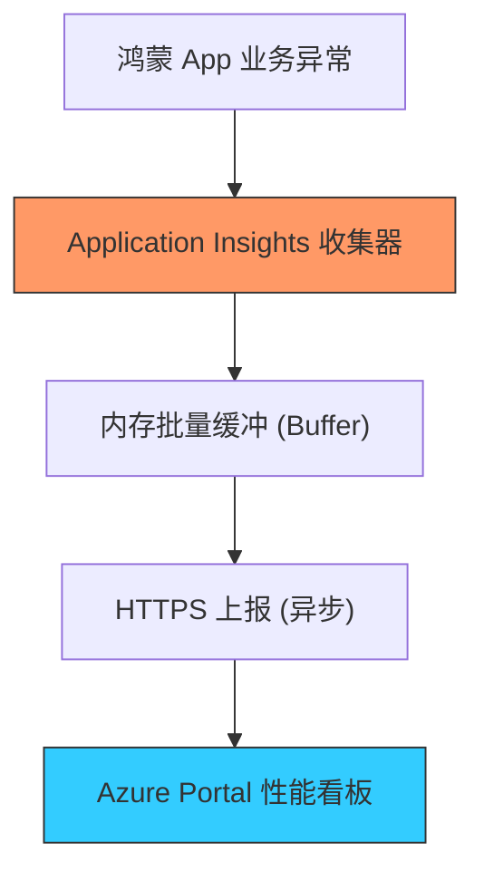

欢迎加入开源鸿蒙跨平台社区：[https://openharmonycrossplatform.csdn.net](https://openharmonycrossplatform.csdn.net)


# Flutter for OpenHarmony: Flutter 三方库 azure_application_insights 为鸿蒙应用提供企业级性能监控与异常洞察（APM 监控必备）

## 前言

在进行 OpenHarmony 的全球化或企业级应用交付时，上线后的维护是极其关键的：
1. **线上错误**：哪个鸿蒙机型出现了高频崩溃？
2. **性能瓶颈**：某个鸿蒙页面的 API 加载时长为何突然飙升？
3. **用户路径**：用户在鸿蒙应用中点击“购买”前做了哪些操作？

**`azure_application_insights`** 软件包是 Microsoft Azure 专业监控服务的 Flutter 客户端。它能将鸿蒙应用内的所有追踪（Trace）、事件（Event）、异常（Exception）和请求耗时无缝上报至 Azure 服务器，提供工业级的性能看板与预警能力。

---

## 一、监控数据上报管道模型

该库通过异步批处理机制，将鸿蒙端的指标数据流式上报到云端。



---

## 二、核心 API 实战

### 2.1 初始化监控实例

```dart
import 'package:azure_application_insights/azure_application_insights.dart';

void initApm() {
  // 💡 定义处理引擎并注入连接字符串
  final telemetryClient = TelemetryClient(
    processor: BufferedTelemetryProcessor(
      next: HttpTelemetryProcessor(
        connectionString: 'InstrumentationKey=your_key_xxx;IngestionEndpoint=...',
        httpClient: http.Client(),
      ),
    ),
  );
  
  print('✅ 鸿蒙-Azure 监控链路已连接');
}
```

### 2.2 上报自定义事件与指标

```dart
void trackAction() {
  // 💡 记录一次鸿蒙页面的 PV 浏览
  telemetryClient.trackEvent(
    name: 'OpenHarmony_Page_View',
    properties: {'page': 'Home', 'system': 'Ohos NEXT'},
  );

  // 💡 记录具体的耗时指标
  telemetryClient.trackMetric(name: 'Api_Latency', value: 125.0);
}
```

---

## 三、常见应用场景

### 3.1 鸿蒙应用全量 Crashlytics 代替品
当你在鸿蒙出海应用中无法稳定使用 Google 的 Firebase Crashlytics 时，Azure 提供了一个极佳的替代方案。利用 `telemetryClient.trackException` 捕获 Dart 层的全局异常，自动采集鸿蒙设备的品牌、系统版本和堆栈信息，帮助你远程精准定位 Bug。

### 3.2 鸿蒙应用深度转化漏斗分析
通过对“点击注册”、“填写验证码”、“实名认证成功”等关键步骤进行埋点（Events），在 Azure 后端生成转化漏斗视图。这能让鸿蒙开发者清晰地看到用户在哪个环节流失，从而针对性地优化鸿蒙版应用的交互流程。

---

## 四、OpenHarmony 平台适配

### 4.1 适配鸿蒙的网络节流策略
💡 **技巧**：频繁的网络上报会消耗鸿蒙设备的电量和流量。建议使用 `BufferedTelemetryProcessor`，并配置合理的 `flush` 阈值（如集满 30 条数据或每隔 60 秒上报一次）。通过在鸿蒙应用进入后台（App LifeCycle）时执行强制 `flush`，可以确保关键的错误日志在应用进程被切断前安全到达云端。

### 4.2 适配鸿蒙隐私合规扫描
鸿蒙系统对敏感数据上报有严格限制。在使用 `azure_application_insights` 时，切记过滤掉用户手机号、MAC 地址等隐私信息。该库支持通过 `properties` 自定义元数据，建议仅上报经过脱敏处理（Masking）的设备 ID，以符合鸿蒙生态对应用隐私保护的最高级别合规要求。

---

## 五、完整实战示例：鸿蒙工程“异常审计”守卫

本示例展示如何自动将 Flutter 框架未捕获的错误上报到云端。

```dart
import 'package:azure_application_insights/azure_application_insights.dart';

class OhosApmGuard {
  static final client = TelemetryClient(processor: ...);

  /// 💡 接管鸿蒙应用的所有未捕获异常
  static void initialize() {
    FlutterError.onError = (details) {
      print('🕵️ 鸿蒙 APM 哨兵捕捉到严重错误，正在上报...');
      
      client.trackException(
        severity: Severity.critical,
        error: details.exception,
        stackTrace: details.stack,
        properties: {'ohos_version': '12.0', 'flavor': 'Global'},
      );
    };
  }
}

void main() {
  OhosApmGuard.initialize();
  // 业务逻辑...
}
```

<!-- IMAGE_PLACEHOLDER: Azure Portal 后端看板展示鸿蒙应用实时请求成功率折线图、响应时间热力图以及错误堆栈树状图对比截图 -->

---

## 六、总结

`azure_application_insights` 软件包是 OpenHarmony 开发者打磨“工业级”质量的眼睛。它将盲目的“发布即听天由命”转化为了充满科学依据的“数据化驱动运维”。在构建追求极致稳定性、追求极致用户体验反馈的鸿蒙原生应用生态中，引入这样一套成熟的监控体系，能让您的应用在面对全球海量用户的复杂环境时，拥有前所未有的确定性。
