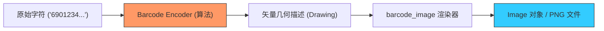

欢迎加入开源鸿蒙跨平台社区：[https://openharmonycrossplatform.csdn.net](https://openharmonycrossplatform.csdn.net)


# Flutter for OpenHarmony: Flutter 三方库 barcode_image 为鸿蒙应用提供全场景条形码与二维码绘制生成方案（识别码专家）

## 前言

在进行 OpenHarmony 的物流、商超支付、凭证分享或资产管理应用开发时，生成可视化的条形码（Barcode）和二维码（QR Code）是一项基础技能。
1. **会员卡演示**：如何为用户展示一个清晰的 Code 128 条码？
2. **离线分享**：如何生成一个带自定义色彩的二维码以便用户扫码？
3. **资产审计**：如何将成千上万个资产编号快速生成为可打印的 EAN-13 码图？

**`barcode_image`** 软件包基于强大的 `barcode` 引擎，专门解决了在 Flutter 环境下如何将这些抽象的代码逻辑“渲染（Rendering）”为精美图像的问题。

---

## 一、可视化生成架构模型

该库实现了从“原始数据串”到“位图/矢量图”的像素级映射。



---

## 二、核心 API 实战

### 2.1 将数据生成为 Image 对象

这非常适合直接在鸿蒙页面的 `Canvas` 上绘制。

```dart
import 'package:barcode_image/barcode_image.dart';
import 'package:image/image.dart' as img;

void generateBarcode() {
  // 1. 创建一个空白的绘图板 (300x100 像素)
  final image = img.Image(width: 300, height: 100);
  
  // 💡 用纯白色填充背景
  img.fill(image, color: img.ColorRgb8(255, 255, 255));

  // 2. 绘制条形码 (Code 128 标准)
  drawBarcode(image, Barcode.code128(), 'OHOS-2024-PRO');
  
  print('✅ 鸿蒙资产条码已生成到内存');
}
```

### 2.2 保存为本地图片文件

```dart
void saveToFile(img.Image image) {
  // 💡 将位图编码为 PNG 并保存到鸿蒙沙箱目录
  final png = img.encodePng(image);
  // file.writeAsBytesSync(png);
}
```

---

## 三、常见应用场景

### 3.1 鸿蒙智慧零售“动态券码”展示
在鸿蒙手机的收银页展示用户的优惠券。利用 `barcode_image` 可以实现极高清晰度的条码生成，确保超市现有的各种型号激光扫码枪都能在第一时间内精准识别，减少用户的排队等待焦虑。

### 3.2 鸿蒙工控现场的设备标识打印
在维护鸿蒙分布式硬件时，利用该库动态生成包含设备底层元数据（如 UUID）的二维码图片。技术人员只需使用华为手机的“智慧扫描”一扫，即可立即在鸿蒙协同视图中打开对应设备的实时健康看板。

---

## 四、OpenHarmony 平台适配

### 4.1 适配鸿蒙的屏幕亮度策略
💡 **技巧**：在展示生成的条码/二维码时，扫码设备的成功率很大程度上取决于屏幕对比度。建议在展示 `barcode_image` 生成的结果页面时，通过鸿蒙插件自动调节系统亮度至最高。同时，利用该库提供的 `drawBarcode` 参数，将前景色设为纯黑，背景色设为纯白，以确保在鸿蒙 OLED 屏幕上获得最锐利的显示素质。

### 4.2 处理大规模生成时的功耗表现
在鸿蒙后端的自动化工具链中，如果需要批量生成数万张条码标签图，建议利用 `dart:isolate`。由于 `barcode_image` 的渲染过程是纯算法、纯图像操作，不涉及 UI 组件，它能完美运行在鸿蒙处理器的并行核心中。这种离屏渲染（Off-screen Rendering）方案能有效避免 UI 线程忙碌，保障鸿蒙系统即便在高负载导出时依然能响应其他用户操作。

---

## 五、完整实战示例：鸿蒙工程“资产标签”生成器

本示例展示如何生成一个符合标准的二维码标签图。

```dart
import 'package:barcode_image/barcode_image.dart';
import 'package:image/image.dart' as img;

class OhosLabelMaker {
  /// 💡 为鸿蒙集群资产生成高清二维码标记
  img.Image createAssetQr(String assetId) {
    print('🎨 正在通过鸿蒙绘图引擎渲染资产二维码...');
    
    // 1. 准备画布
    final image = img.Image(width: 200, height: 200);
    img.fill(image, color: img.ColorRgb8(255, 255, 255));

    // 2. 调用算法绘制二维码，带有一定的四边留白 (Margin)
    drawBarcode(
      image, 
      Barcode.qrCode(), 
      assetId,
      width: 180,
      height: 180,
      x: 10,
      y: 10,
    );

    return image;
  }
}

void main() {
  final maker = OhosLabelMaker();
  final imgAsset = maker.createAssetQr('OHOS-DEVICE-001');
  print('二维码渲染完成，像素总数: ${imgAsset.length}');
}
```

<!-- IMAGE_PLACEHOLDER: 鸿蒙手机展示精美的电子登机牌，包含清晰的 PDF417 码和 QR 二维码，以及在不同背景色下自动适配对比度的截图 -->

---

## 六、总结

`barcode_image` 软件包是 OpenHarmony 开发者打理“视觉契约”的数字笔刷。它将枯燥的字符串逻辑转化为了极具辨识度的图像语言。在构建万物智联、强调软硬高效闭环的鸿蒙原生应用生态中，引入这样一套功能完备、渲染精准的识别码生成方案，能让您的业务流在现实与数字世界之间穿梭得更加自由而稳健。
