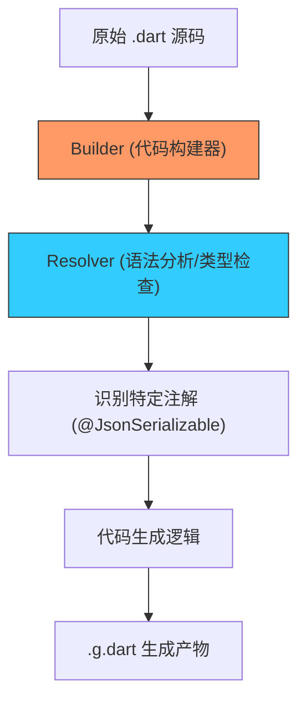

欢迎加入开源鸿蒙跨平台社区：[https://openharmonycrossplatform.csdn.net](https://openharmonycrossplatform.csdn.net)


# Flutter for OpenHarmony: Flutter 三方库 build 深入理解 Dart 代码生成的元编程基石（自动化工具开发底座）

## 前言

在 OpenHarmony 的大规模 Flutter 项目开发中，我们习惯了使用 `json_serializable`、`freezed` 或 `moor` 来替代手写枯燥的样板代码。而支撑这些强大工具的底层框架，正是 **`build`** 软件包。

`build` 并不是一个普通的工具，它定义了一套完整的 **Dart 代码生成协议**。它让开发者能以“插件化”的方式接入 Dart 的编译流程，在不修改编译器源码的前提下，实现对源码的分析、转换和新文件的生成。

---

## 一、核心生成架构解析

`build` 通过定义 `Builder` 接口，将复杂的增量构建逻辑抽象为简单的“输入-输出”模型。



---

## 二、核心 API 实战

### 2.1 定义一个简单的 Builder

```dart
import 'package:build/build.dart';

/// 💡 一个简单的 Builder：为每个 .txt 文件生成对应的 .info 文件
class InfoBuilder implements Builder {
  @override
  final buildExtensions = const {
    '.txt': ['.info']
  };

  @override
  Future<void> build(BuildStep buildStep) async {
    // 1. 读取输入文件内容
    final inputId = buildStep.inputId;
    final contents = await buildStep.readAsString(inputId);

    // 2. 准备输出路径
    final outputId = inputId.changeExtension('.info');

    // 3. 写入生成内容
    await buildStep.writeAsString(outputId, '内容长度: ${contents.length} 字节');
  }
}
```

### 2.2 使用 Resolver 获取类型信息

在鸿蒙适配插件中，我们经常需要分析类结构。

```dart
Future<void> analyzeClass(BuildStep buildStep) async {
  // 💡 获取当前库的完整语义信息
  final library = await buildStep.resolver.libraryFor(buildStep.inputId);
  
  // 遍历类、方法、属性
  for (var element in library.topLevelElements) {
    print('发现顶级元素: ${element.name}');
  }
}
```

---

## 三、常见应用场景

### 3.1 鸿蒙自定义协议生成器
如果你在开发鸿蒙原生的分布式协议，可以定义一个 `@OhosService` 注解，利用 `build` 自动生成 Dart 调用 ArkTS 的桥接样板代码，彻底消灭手动维护 MethodChannel 的痛苦。

### 3.2 自动化资源清单
在鸿蒙应用打包前，自动扫描 `assets` 目录并生成一个包含所有资源路径的静态常量类，避免手动输入文件名导致的拼写错误（Typo）。

---

## 四、OpenHarmony 平台适配

### 4.1 增量构建性能
💡 **技巧**：鸿蒙项目的代码量通常快速增长。`build` 框架支持极致的增量构建，它能精准感知哪些文件发生了变化。在鸿蒙 DevEco Studio 的开发环境中，配合 `build_runner watch`，可以实现代码“保存即更新桥接”，这对于频繁调整跨端接口的鸿蒙开发者来说效率提升巨大。

### 4.2 统一生成规范
通过在鸿蒙工程根目录的 `build.yaml` 中配置 `build` 选项，可以统一团队内所有生成代码的目录结构（如统一输出到 `.dart_tool/build/generated`），保持鸿蒙工程目录的整洁性，这符合鸿蒙专业级工程化的质量要求。

---

## 五、完整实战示例：鸿蒙版本号自动注入器

本示例展示如何创建一个 Builder，在构建时自动将 `pubspec.yaml` 中的版本信息注入到代码中。

```dart
import 'package:build/build.dart';

class OhosVersionBuilder implements Builder {
  @override
  final buildExtensions = const {
    'pubspec.yaml': ['lib/ohos_version.g.dart']
  };

  @override
  Future<void> build(BuildStep buildStep) async {
    // 1. 读取 pubspec 文件的文本
    final content = await buildStep.readAsString(buildStep.inputId);
    
    // 💡 简单正则匹配版本号 (实际建议用 yaml 库解析)
    final versionMatch = RegExp(r'version: ([\d\.\+]+)').firstMatch(content);
    final version = versionMatch?.group(1) ?? '1.0.0';

    // 2. 生成 Dart 代码
    final output = """
// 🛡️ 鸿蒙构建系统自动生成，请勿手动修改
const String OHOS_APP_VERSION = '$version';
const String OHOS_BUILD_TIME = '${DateTime.now()}';
""";

    // 3. 写入 lib 目录
    await buildStep.writeAsString(
      AssetId(buildStep.inputId.package, 'lib/ohos_version.g.dart'),
      output,
    );
    
    print('✅ 已为鸿蒙工程更新版本常量: $version');
  }
}
```

<!-- IMAGE_PLACEHOLDER: 鸿蒙 DevEco Studio 中展示通过 build 框架自动生成的 .g.dart 文件与源码关联的截图 -->

---

## 六、总结

`build` 软件包是 OpenHarmony 开发者从“搬砖工”进化为“架构师”的阶梯。它不提供具体的业务逻辑，却为所有自动化、智能化的 Dart 工具提供了标准的底层协议。在鸿蒙跨平台生态日益复杂的今天，掌握这套元编程底座，是你能够定义自己的开发范式、打造专属鸿蒙生产力工具的核心能力。
