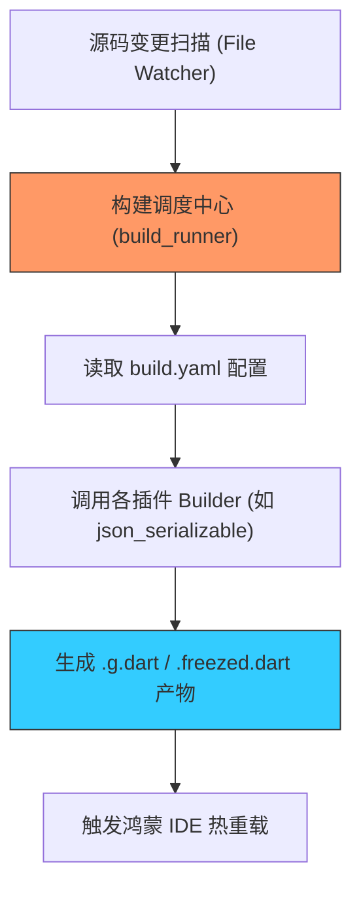

欢迎加入开源鸿蒙跨平台社区：[https://openharmonycrossplatform.csdn.net](https://openharmonycrossplatform.csdn.net)


# Flutter for OpenHarmony: Flutter 三方库 build_runner 掌控鸿蒙应用代码生成的自动化引擎（工程提效核心）

## 前言

在进行 OpenHarmony 的 Flutter 应用开发时，我们经常会用到各种“自动生成”工具：
1. **JSON 解析**：使用 `json_serializable` 自动生成 `fromJson`。
2. **状态管理**：使用 `freezed` 生成不可变模型和联合体。
3. **数据库**：使用 `drift` 自动生成繁琐的 SQL 映射代码。

支撑所有这些“自动魔法”背后的核心驱动力，正是 **`build_runner`**。它不是一个普通的 Library，而是 Dart 生态中的“工业级构建入口”。它负责协调所有的生成器、维护文件的依赖关系图，并确保你的鸿蒙工程目录中不会出现冗余或过时的中间产物。

---

## 一、自动化构建管道模型

`build_runner` 建立了一套标准的“监控-分析-产出”循环。



---

## 二、核心命令实战

### 2.1 一次性全量构建

这是最常用的命令，用于在鸿蒙项目发布前同步所有生成代码。

```bash
# 💡 强制覆盖已存在的生成文件
dart run build_runner build --delete-conflicting-outputs
```

### 2.2 响应式持续监视 (Watch)

在鸿蒙开发阶段，开启此模式可实现“代码保存即生成”。

```bash
# 💡 保持后台运行，实时感知代码修改并更新 .g.dart
dart run build_runner watch
```

---

## 三、常见应用场景

### 3.1 鸿蒙工程“零手动”JSON 维护
当你调整了鸿蒙后端返回的数据结构字段时，只需修改 Dart 类属性并保存。`build_runner` 会在后台同步更新对应的序列化逻辑，彻底杜绝了由于手动更新 `Map` 键值对导致的拼写错误风险。

### 3.2 鸿蒙-ArkTS 协议样板代码生成
如果你正在开发一套鸿蒙原生的分布式通讯框架，利用 `build_runner` 配合自定义的 `Builder` 扩展，可以在构建过程中自动将 Dart 的接口定义生成对应的 ArkTS 接口契约，实现两端通讯代码的“同源同步”。

---

## 四、OpenHarmony 平台适配

### 4.1 适配鸿蒙的构建性能调优
💡 **技巧**：在大型鸿蒙项目中，代码生成过程可能需要耗费数分钟。利用 `build_runner` 的 **Incremental Build（增量构建）** 特性，它能精准识别哪一个文件夹发生了变动。通过在 `build.yaml` 中配置 `exclude` 规则（如排除不包含生成代码的资源目录），可以显著缩短鸿蒙应用在开发过程中的等待时长。

### 4.2 适配鸿蒙 CI/CD 流水线构建策略
在鸿蒙应用的自动化发布流程（如 AtomGit Actions）中，建议将 `build_runner` 作为第一道构建工序。通过 `--release` 标记运行，它会执行更彻底的优化，并确保产出的生成文件具有最高级别的 AOT 编译兼容性，从而保证了鸿蒙正式包的运行稳健性。

---

## 五、完整实战示例：鸿蒙工程“自修复”构建脚本

本示例演示如何通过配置文件控制生成器的行为。

```yaml
# 💡 文件位置：ohos_project/build.yaml
targets:
  $default:
    builders:
      # 配置特定的生成器行为
      json_serializable:
        enabled: true
        options:
          # 在鸿蒙工程中，强制生成带有 explicit_to_json 的代码
          explicit_to_json: true
          checked: true
      
      # 💡 排除非必要目录，加速鸿蒙构建速度
      auto_route_generator:
        enabled: true
        generate_for:
          - lib/routes/**
```

<!-- IMAGE_PLACEHOLDER: 终端展示 build_runner 运行时的彩色进度条、文件变动捕获日志、以及成功解决冲突后的审计报告截图 -->

---

## 六、总结

`build_runner` 软件包是 OpenHarmony 开发者打磨“工业级项目”的自动化底座。它将原本充斥着人力损耗的“体力活”转变成了极其严密的“工业流水线”。在构建追求极致标准化、追求极致交付节奏的鸿蒙原生应用生态中，熟练掌握 build_runner 的调优与配置，是每一位高级鸿蒙工程师迈向工程化专家之路的必修功课。
