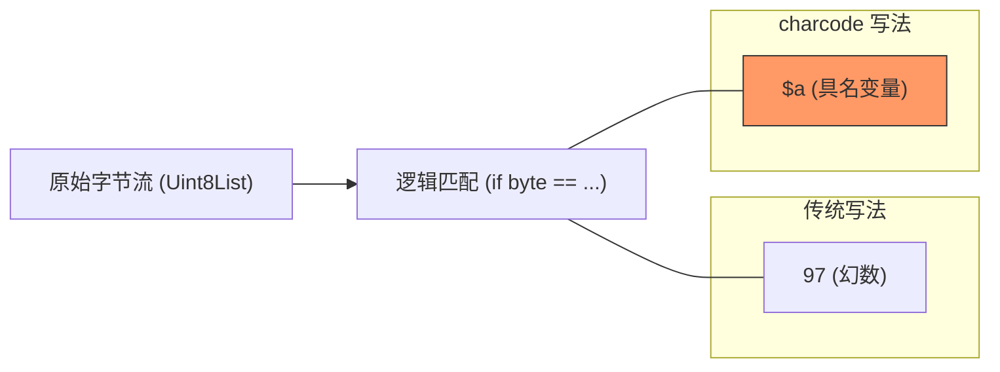

欢迎加入开源鸿蒙跨平台社区：[https://openharmonycrossplatform.csdn.net](https://openharmonycrossplatform.csdn.net)


# Flutter for OpenHarmony: Flutter 三方库 charcode 让鸿蒙底层的字符处理告别“幻数”噩梦（可读性优化基石）

## 前言

在进行 OpenHarmony 的底层通讯协议开发、字节数组解析（Byte Arrays）或自定义解析器（Parser）编写时，我们经常需要处理各种字符代码。
* 你是否还在写 `if (byte == 10)`？（10 其实代表换行符 `\n`）
* 你是否还在写 `if (char == 36)`？（36 代表美元符号 `$`）

这种充满了“幻数（Magic Numbers）”的代码不仅难以阅读，还极度容易写错。**`charcode`** 软件包提供了一个及其轻量、只有常量的库，它为所有的 ASCII 字符定义了人类可读的名称。

---

## 一、字符编码映射模型

`charcode` 将二进制的字符代码转化为具名的 Dart 常量。



---

## 二、核心 API 实战

### 2.1 极简常量引用

```dart
import 'package:charcode/charcode.dart';

void parseData(int code) {
  // 💡 相比于 33，使用 $exclamation 更加直观
  if (code == $exclamation) {
    print('发现感叹号！');
  }

  // 💡 相比于 13 和 10，识别回车换行逻辑清晰
  if (code == $cr || code == $lf) {
    print('正在处理鸿蒙系统报文换行');
  }
}
```

### 2.2 构造特殊字符串

```dart
// 💡 利用常量构造包含特殊字符的字符串，避免转义符的混乱
final String label = String.fromCharCodes([$O, $H, $O, $S, $space, $v, $1]);
print(label); // 输出: OHOS v1
```

---

## 三、常见应用场景

### 3.1 鸿蒙串口（UART）协议解析
在开发鸿蒙嵌入式设备的控制 App 时，通过串口读取的往往是原始字节。利用 `charcode` 定义包头和包尾（如 `$lt` 代表 `<`），可以让原本晦涩的解析函数变得像读散文一样简单。

### 3.2 自定义 Markdown 或轻量级模板解析
当你需要为鸿蒙应用编写一个高性能的模板引擎时，通过判断 `$lbrace` (`{`) 或 `$rbrace` (`}`) 来定位标记点。这种方式不仅比正则表达式快得多，而且维护成本极低。

---

## 四、OpenHarmony 平台适配

### 4.1 适配鸿蒙的性能审计
💡 **技巧**：在鸿蒙的高频率循环处理中（如处理传感器高频字节流），使用整型常量进行 `==` 比较是最极致的性能表现。`charcode` 的所有变量在编译期都会被直接内联（Inlined）为原始数字。这意味着你在享受高级语言可读性的同时，完全不会给鸿蒙设备增加哪怕 1 字节的额外内存开销，这符合鸿蒙全场景硬件的高效调优理念。

### 4.2 跨编码集的安全性
虽然鸿蒙主要使用 UTF-8，但在与旧式物联网硬件通讯时，经常涉及单字节 ASCII。使用 `charcode` 库定义的常量（如 `$ht` 代表水平制表符），能确保你的逻辑符合标准的 ISO/IEC 8859-1 定义，避免了由于对“控制字符”理解不统一导致的鸿蒙通讯协议解析漂移（Drift）。

---

## 五、完整实战示例：鸿蒙工程“纯净报文”守卫

本示例展示如何利用该库清洗一个带有特殊控制序列的字节流。

```dart
import 'package:charcode/charcode.dart';

class OhosProtocolSanitizer {
  /// 💡 清理鸿蒙底层硬件返回的脏数据，只保留字母和数字
  List<int> sanitize(List<int> rawBytes) {
    print('🧐 正在审计鸿蒙硬件底层报文...');
    
    return rawBytes.where((code) {
      // 💡 利用 charcode 常量直观地定义过滤范围
      final isDigit = code >= $0 && code <= $9;
      final isAlphaLower = code >= $a && code <= $z;
      final isAlphaUpper = code >= $A && code <= $Z;
      
      return isDigit || isAlphaLower || isAlphaUpper || code == $space;
    }).toList();
  }
}

void main() {
  final sanitizer = OhosProtocolSanitizer();
  // 模拟带有一些奇怪控制符的字节
  final cleaned = sanitizer.sanitize([$O, $H, 7, $S, 13, $space, $1]); 
  print('清洗后的报文: ${String.fromCharCodes(cleaned)}');
}
```

<!-- IMAGE_PLACEHOLDER: 鸿蒙 DevEco Studio 编辑器中，展示原本带有大量魔术数字的代码在引入 charcode 后变得由于语义化的清晰对比截图 -->

---

## 六、总结

`charcode` 软件包是 OpenHarmony 开发者职业素养的“温度计”。它不解决大规模的业务难题，却在代码的最微观处消灭了混乱。在构建追求极致精致、追求极致可维护性的鸿蒙原生应用时，拒绝硬编码的数字，拥抱具名的语义常量，是你写出“工业级”稳健代码的第一步。
