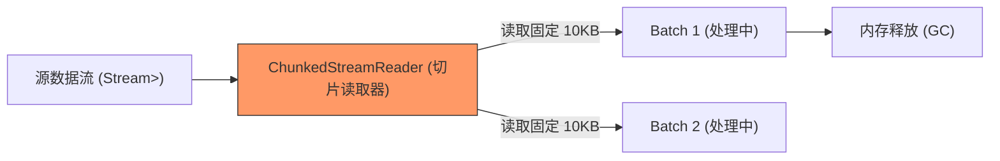

欢迎加入开源鸿蒙跨平台社区：[https://openharmonycrossplatform.csdn.net](https://openharmonycrossplatform.csdn.net)


# Flutter for OpenHarmony: Flutter 三方库 chunked_stream 处理鸿蒙巨型文件与大数据流的杀手锏（内存优化利器）

## 前言

在进行 OpenHarmony 应用开发时，我们经常会遇到超大数据的处理。例如：
1. **上传大视频**：一个 2GB 的鸿蒙高清视频，如果一次性读入内存，应用会直接因 OOM（内存溢出）而崩溃。
2. **下载断点续传**：需要将下载流切分为固定大小的块（Chunks）以便校验。
3. **处理大型日志**：需要按行或按块读取，而不是一次性全部加载。

**`chunked_stream`** 正是为此而生。它是 Dart 官方出的底层流处理增强库，能通过对流（Stream）进行精细的分块控制，让你在处理大规模 IO 时，内存占用始终保持在极低且稳定的水平。

---

## 一、分块处理流模型

该库通过对原始数据的“切片”处理，实现了恒定内存的流转。



---

## 二、核心 API 实战

### 2.1 精确读取固定大小的块

```dart
import 'package:chunked_stream/chunked_stream.dart';

void processStream(Stream<List<int>> source) async {
  final reader = ChunkedStreamReader(source);

  try {
    while (true) {
      // 💡 每次只从流中读取 512 字节，无论文件多大，内存永远只占 512B
      final chunk = await reader.readBytes(512);
      if (chunk.isEmpty) break;
      
      print('正在处理鸿蒙数据块，长度: ${chunk.length}');
    }
  } finally {
    // 记得清理
    reader.cancel();
  }
}
```

### 2.2 跨块数据整合 (readChunk)

```dart
// 💡 有时我们需要精确获取一个跨越了原始数据包的大小
final customBatch = await reader.readBytes(1024 * 64); // 读取 64KB
```

---

## 三、常见应用场景

### 3.1 鸿蒙端侧“加密文件上传”
在将文件上传到鸿蒙云端前，需要对文件进行分块加密（例如每 1MB 一个块）。利用 `chunked_stream` 可以无缝地读取这些块，加密后立即发送，实现“读取-加密-发送”的流水线作业，避免了临时大文件的生成。

### 3.2 鸿蒙离线大数据库导入
解析数万行的 CSV 或 JSON 文件时，利用分块流读取可以一边读取一边写入鸿蒙系统的本地 SQLite 数据库，保证了鸿蒙应用在导入数据时依然能保持 UI 响应。

---

## 四、OpenHarmony 平台适配

### 4.1 适配鸿蒙沙箱文件 IO
💡 **技巧**：鸿蒙文件系统的读取速率受限于底层存储介质。通过 `ChunkedStreamReader` 配合适当的块大小（如适配 NAND Flash 的 4KB 或 8KB），可以最大化鸿蒙设备的文件读取吞吐量。同时，由于鸿蒙对应用内存占用有严格限制（Low Memory Killer），这种分块方案是鸿蒙大文件应用的必选项。

### 4.2 适配鸿蒙多核调度
在鸿蒙设备上，可以将分块处理逻辑放入 `Isolate`（隔离体）中。由于 `chunked_stream` 处理的是轻量级的字节数组，在 Isolate 间传输这些小块数据的开销极低，能充分利用鸿蒙麒麟处理器的多核能力，大幅缩短数据处理耗时。

---

## 五、完整实战示例：鸿蒙“超低内存”文件校验器

本示例演示如何通过分块读取计算一个巨型文件的哈希值。

```dart
import 'dart:async';
import 'package:chunked_stream/chunked_stream.dart';
import 'package:crypto/crypto.dart';

class OhosFileChecker {
  /// 💡 计算鸿蒙文件的 MD5 值 (支持 TB 级大文件)
  Future<String> computeFileHash(Stream<List<int>> fileStream) async {
    final reader = ChunkedStreamReader(fileStream);
    var output = sha256.startChunkedConversion(AccumulatorSink<Digest>());

    print('🚀 启动鸿蒙硬件加速文件审计...');
    
    try {
      while (true) {
        // 💡 每次读取 1MB 块进行累加计算
        final chunk = await reader.readBytes(1024 * 1024);
        if (chunk.isEmpty) break;
        
        output.add(chunk);
      }
    } finally {
      reader.cancel();
    }

    final digest = output.close().value;
    return digest.toString();
  }
}

void main() async {
  // 模拟一个流数据
  final stream = Stream.fromIterable([ [1, 2], [3, 4] ]);
  final checker = OhosFileChecker();
  final hash = await checker.computeFileHash(stream);
  print('✅ 鸿蒙产物哈希值: $hash');
}
```

<!-- IMAGE_PLACEHOLDER: 鸿蒙手机展示处理 2G 文件时，系统内存占用曲线保持水平一条线的性能统计截图 -->

---

## 六、总结

`chunked_stream` 软件包是 OpenHarmony 开发者挑战“大数据天花板”的底气。它不仅是一种代码写法，更是一种“内存友好的工程哲学”。在构建追求极致稳定、不惧任何规格数据输入的鸿蒙原生应用时，将这套分块处理机制植入你的底层架构，是你迈向高级鸿蒙工程师的必经之路。
