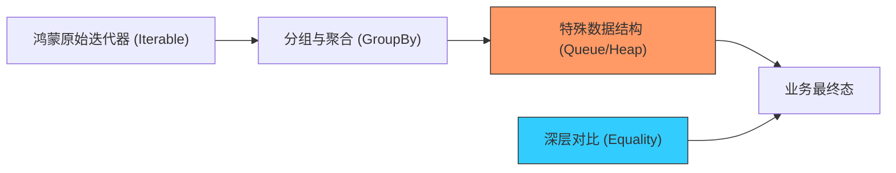

欢迎加入开源鸿蒙跨平台社区：[https://openharmonycrossplatform.csdn.net](https://openharmonycrossplatform.csdn.net)


# Flutter for OpenHarmony: Flutter 三方库 collection 为鸿蒙端处理海量业务数据提供算法级的集合操作支持（数据处理瑞士军刀）

## 前言

在进行 OpenHarmony 的复杂业务逻辑开发时，我们经常需要处理各种 Lists、Sets 和 Maps：
1. **数据分组**：如何将成百上千条鸿蒙日志按日期自动归类（GroupBy）？
2. **集合对比**：如何判断两个鸿蒙节点的状态列表是否内容一致（无视顺序）？
3. **优先级队列**：如何在鸿蒙任务调度中自动让高优先级的任务插队排在第一位？

**`collection`** 软件包是 Dart 官方团队维护的“集合增强包”。它补齐了原生态集合操作在算法层面的短板，为鸿蒙开发者提供了一套工业级、高性能的数据处理函数库。

---

## 一、高级数据处理模型

`collection` 在基础 List/Map 之上增加了丰富的算法维度。



---

## 二、核心 API 实战

### 2.1 强大的分组功能 (groupBy)

```dart
import 'package:collection/collection.dart';

void groupData() {
  final tasks = [
    {'name': 'Bug 修复', 'tag': '开发'},
    {'name': '鸿蒙适配', 'tag': '开发'},
    {'name': 'UI 评审', 'tag': '设计'},
  ];

  // 💡 一行代码按 tag 分类
  final grouped = groupBy(tasks, (Map t) => t['tag']);
  
  print('分组后的鸿蒙任务: $grouped');
}
```

### 2.2 深度内容相等判断 (Equality)

```dart
// 💡 原生 [1,2] == [1,2] 为 false (引用不同)
// 💡 利用 collection 实现内容深度对比
final eq = const ListEquality().equals([1, 2], [1, 2]);
print('数组内容是否相等: $eq'); // true
```

---

## 三、常见应用场景

### 3.1 鸿蒙系统应用列表的“首字母”分拣
在鸿蒙的应用管理界面，获取所有 HAP 应用名称后，利用 `groupBy` 配合自定义的提取逻辑，可以秒级完成按拼音或英文首字母的聚类，为用户生成整齐划一的字母索引侧边栏，提升系统的交互效率。

### 3.2 鸿蒙分布式软总线的拓扑节点优先级管理
利用 `PriorityQueue` 管理当前发现的所有鸿蒙分布式设备。将信号强度或延迟作为排序因子，确保应用在请求万物互联时，永远优先连接那个最稳定、最高效的鸿蒙节点，保证分布式协同的体验下限。

---

## 四、OpenHarmony 平台适配

### 4.1 适配鸿蒙的大规模内存操作优化
💡 **技巧**：在鸿蒙设备上处理万级以上数据记录时，传统的 `for` 循环后接 `List.add` 性能极低且由于 List 扩容会触发频繁的 GC（垃圾回收）。利用 `collection` 提供的 `DelegatingList` 或高效的聚合算子，能以更少的中间变量完成转换，大幅降低磁盘 I/O 后反序列化时的内存抖动，保障鸿蒙应用在处理大型数据表时的流畅度。

### 4.2 处理鸿蒙 JSON 数据的一致性审计
在接收来自鸿蒙后台的动态配置 JSON 时，经常需要对比新旧配置是否发生实质变化。利用 `MapEquality` 或 `DeepCollectionEquality` 可以在不关心 Map 键值顺序的情况下，精准审计配置的变动点。这能有效避免因不必要的 UI 重绘导致的鸿蒙应用首屏顿挫，实现了渲染性能的智能节约。

---

## 五、完整实战示例：鸿蒙工程“开发进度”穿透分析器

本示例展示如何利用集合工具统计各等级 Bug 的分布情况。

```dart
import 'package:collection/collection.dart';

class OhosDataAuditor {
  /// 💡 深度分析鸿蒙插件的代码审计结果
  void analyzeIssues(List<Map<String, dynamic>> issues) {
    print('🧐 正在启动鸿蒙集合分析中枢...');
    
    // 1. 查找数组中的最大值（基于特定字段）
    final worst = issues.maxBy((e) => e['severity'] as int);
    
    // 2. 统计各类型的总数
    final counts = issues.groupFoldBy<String, int>(
      (e) => e['type'],
      (previous, _) => (previous ?? 0) + 1,
    );

    print('--- 审计摘要 ---');
    print('最高危 Bug: ${worst?['title']}');
    print('问题分布: $counts');
  }
}

void main() {
  final auditor = OhosDataAuditor();
  auditor.analyzeIssues([
    {'title': 'Null Crash', 'type': '代码', 'severity': 10},
    {'title': '图标偏移', 'type': 'UI', 'severity': 2},
    {'title': '逻辑冗余', 'type': '代码', 'severity': 5},
  ]);
}
```

<!-- IMAGE_PLACEHOLDER: 鸿蒙手机端展示按时间轴聚合后的支付账单列表、以及按信号强度动态重排的分布式设备列表截图 -->

---

## 六、总结

`collection` 软件包是 OpenHarmony 开发者打理“数据逻辑”的基础底座。它将原本繁琐的命令式代码提炼成了极其优雅的函数式算子。在构建追求极致数据吞吐量、追求极致业务逻辑严密性的鸿蒙原生应用生态中，熟练应用这套官方级的算法库，能让您的数据处理代码像鸿蒙设计语言一样简洁而富有张力。
