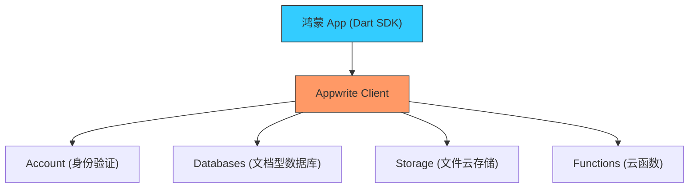

欢迎加入开源鸿蒙跨平台社区：[https://openharmonycrossplatform.csdn.net](https://openharmonycrossplatform.csdn.net)


# Flutter for OpenHarmony: Flutter 三方库 dart_appwrite 将鸿蒙应用极速接入强大的开源后端即服务（BaaS 最佳实践）

## 前言

在进行 OpenHarmony 应用开发时，后端基础设施往往是中小型开发者或初创团队的拦路虎。购买服务器、部署数据库、集成 OAuth 登录、管理文件云存储……这一系列工作不仅耗时，还容易在安全性上出现漏洞。

**`dart_appwrite`** 是连接 OpenHarmony 应用与 Appwrite（类似于 Firebase 的开源替代品）的官方桥梁。它为鸿蒙开发者提供了全套的后端 API，让你在短短几分钟内就能为鸿蒙应用增加账号系统、实时数据库和云存储功能，彻底实现“一人完成全栈开发”。

---

## 一、鸿蒙-Appwrite 云端架构图

该库作为桥梁，将鸿蒙设备的请求安全分发到后端各个功能模块。



---

## 二、核心 API 实战

### 2.1 初始化连接

```dart
import 'package:dart_appwrite/dart_appwrite.dart';

void initAppwrite() {
  Client client = Client()
      .setEndpoint('https://cloud.appwrite.io/v1') // 💡 后端服务地址
      .setProject('ohos-app-001')                 // 💡 项目 ID
      .setSelfSigned(status: true);               // 仅在本地开发环境开启
  
  print('✅ 鸿蒙 App 成功连接至云端中枢');
}
```

### 2.2 实现鸿蒙端账号注册

```dart
Future<void> register(Client client) async {
  Account account = Account(client);

  try {
    final response = await account.create(
      userId: ID.unique(),
      email: 'dev@harmonyos.com',
      password: 'password123',
    );
    print('注册成功: ${response.name}');
  } catch (e) {
    print('注册异常: $e');
  }
}
```

### 2.3 数据的 CRUD 操作

```dart
final databases = Databases(client);

// 💡 插入一条鸿蒙设备运行日志
await databases.createDocument(
  databaseId: 'main-db',
  collectionId: 'logs',
  documentId: ID.unique(),
  data: {'device': 'Ohos-Phone', 'status': 'Online'},
);
```

---

## 三、常见应用场景

### 3.1 鸿蒙原生社交阅读应用
利用 Appwrite 的 `Databases` 存储文章内容，配合 `Storage` 管理用户头像，通过 `Account` 几行代码实现邮箱或三方登录，快速构建出高性能的鸿蒙原生社交应用。

### 3.2 鸿蒙智能家居状态看板
利用 Appwrite 的 **Realtime** 功能，在鸿蒙端的 UI 上实现实时的数据推送（如：温度传感器的实时变化），无需手写复杂的 WebSocket 逻辑。

---

## 四、OpenHarmony 平台适配

### 4.1 适配鸿蒙的安全策略（SSL/TLS）
💡 **技巧**：鸿蒙 NEXT 为了保证通信安全，默认对 HTTP/HTTPS 链接有严格的证书校验。在生产环境下，请务必为 Appwrite 部署合法的 SSL 证书。在开发阶段，如果使用自签名证书，记得在 `dart_appwrite` 初始化时通过 `setSelfSigned(status: true)` 进行容错处理。

### 4.2 文件上传的适配建议
使用 Appwrite `Storage` 上传鸿蒙本地相册中的大文件时，建议配合 `getApplicationDocumentsDirectory()` 获取鸿蒙沙箱路径下的文件流。由于鸿蒙系统对文件读取权限有精细划分，确保在读取文件前已通过鸿蒙组件获取了必要的媒体读取权限。

---

## 五、完整实战示例：鸿蒙“云侧”配置分发器

本示例展示如何从云端动态拉取鸿蒙应用的功能开关配置。

```dart
import 'package:dart_appwrite/dart_appwrite.dart';

class OhosCloudConfig {
  final Databases _db;

  OhosCloudConfig(Client client) : _db = Databases(client);

  /// 💡 从数据库获取鸿蒙功能开关
  Future<bool> isFeatureEnabled(String featureKey) async {
    try {
      final docs = await _db.listDocuments(
        databaseId: 'config-center',
        collectionId: 'features',
        queries: [Query.equal('name', featureKey)],
      );
      
      return docs.documents.isNotEmpty ? docs.documents.first.data['enabled'] : false;
    } catch (e) {
      print('获取配置失败，走本地默认逻辑');
      return false;
    }
  }
}

void main() {
  // 模拟初始化
  // final config = OhosCloudConfig(client);
  // print('流转功能状态: ${await config.isFeatureEnabled('distributed_mirroring')}');
}
```

<!-- IMAGE_PLACEHOLDER: 通过 Appwrite 网页后台实时观察鸿蒙应用上报的消息与用户数据的管理界面截图 -->

---

## 六、总结

`dart_appwrite` 软件包是 OpenHarmony 开发者实现“全速前进”的助推器。它将繁琐的后端建设工作封装成了优雅、一致的 Dart API。在开源鸿蒙生态蓬勃发展的浪潮中，这种能让你专注于鸿蒙 UI 特性与交互逻辑、而无需分心后勤管理的云端方案，是个人开发者与初创项目立足市场的核心竞争力。
