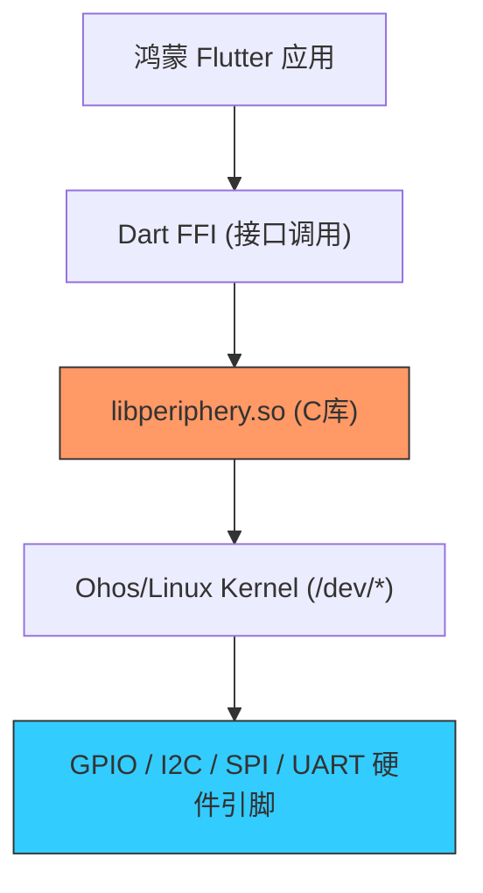

欢迎加入开源鸿蒙跨平台社区：[https://openharmonycrossplatform.csdn.net](https://openharmonycrossplatform.csdn.net)


# Flutter for OpenHarmony: Flutter 三方库 dart_periphery 让 Dart 直接驱动鸿蒙设备的 GPIO/I2C/SPI 底层硬件（嵌入式开发核武器）

## 前言

在进行 OpenHarmony 的工业级应用、物联网（IoT）网关或智能硬件开发时，我们面临的最大挑战是：如何让运行在用户态的 Dart 代码直接操控底层硬件引脚？
1. 如何在鸿蒙驱动的开发板上点亮一颗 LED（GPIO）？
2. 如何通过 I2C 读取温度传感器数据？
3. 如何通过串口（Serial/UART）与工业 PLC 通讯？

**`dart_periphery`** 是一个极其硬核的封装库。它基于 Linux 周边设备 c-periphery 库的 FFI 封装，深度适配了各类 Linux/OpenHarmony 环境，让 Flutter 开发者无需编写 C++ 驱动，即可在 Dart 层实现对硬件的“降维打击”。

---

## 一、硬件直连通讯模型

该库通过 FFI 穿透 Flutter 运行环境，直接操作鸿蒙系统内核的文件设备节点。



---

## 二、核心 API 实战

### 2.1 GPIO 控制（点亮 LED）

```dart
import 'package:dart_periphery/dart_periphery.dart';

void toggleLed() {
  // 💡 在鸿蒙设备上打开 GPIO 引脚 18
  var gpio = GPIO(18, GPIOdirection.gpioDirOut);
  
  try {
    // 💡 输出高电平
    gpio.write(true);
    print('✅ 鸿蒙设备外部 LED 已点亮');
  } finally {
    gpio.dispose();
  }
}
```

### 2.2 I2C 传感器读取

```dart
void readSensor() {
  // 💡 打开 I2C 总线 1
  var i2c = I2C(1);
  try {
    // 为特定地址的传感器写入指令并读取 2 字节数据
    var data = i2c.readBytes(0x40, 0xF5, 2);
    print('读取到原始传感数据: $data');
  } finally {
    i2c.dispose();
  }
}
```

---

## 三、常见应用场景

### 3.1 鸿蒙智能家居中控屏
利用鸿蒙平板的扩展引脚，直接连接触控屏外的物理旋钮（通过 I2C）或背景灯带（通过 PWM），实现原生的智能家居交互体验，无需经过繁琐的各层协议中转。

### 3.2 鸿蒙自动驾驶/机器人底层控制
在开发基于鸿蒙系统的无人巡检车时，利用 `dart_periphery` 的串行（UART）接口直接与电机驱动板通讯，实现微秒级的控制指令下发，保证机器人的运动响应灵敏度。

---

## 四、OpenHarmony 平台适配

### 4.1 适配鸿蒙的文件设备访问权限
💡 **技巧**：在鸿蒙 NEXT 下，访问 `/dev/gpiochip*` 等设备文件通常需要系统级权限。在开发阶段，需要通过 `hdc shell` 为当前应用或用户组赋予对应的 `rw` 权限。同时，由于 `dart_periphery` 需要加载动态链接库，确保在鸿蒙工程的 `ohos/libs` 目录下放置好对应架构（如 aarch64）的 `libperiphery.so`，这是跨端 FFI 调用的关键保障。

### 4.2 处理实时硬件响应的性能调优
硬件操作往往涉及阻塞式等待。在鸿蒙应用中，绝不能在 UI 主线程执行 `I2C.read` 或 `UART.read`。建议开启一个专门的鸿蒙 `Isolate`（隔离体），将 `dart_periphery` 的所有操作封装在内，并通过端口与主 UI 通讯。这种隔离架构能确保即使底层传感器响应缓慢，鸿蒙的前端界面依然能保持最高级别的操作丝滑感。

---

## 五、完整实战示例：鸿蒙工程“自研”串口扫描器

本示例展示如何配置并监听串口数据。

```dart
import 'package:dart_periphery/dart_periphery.dart';

class OhosSerialMaster {
  /// 💡 启动鸿蒙底层串口监听
  void startMonitor() {
    print('🚀 正在初始化鸿蒙底层 UART 链路...');
    
    // 配置串口参数：波特率 115200, 8N1
    var s = Serial('/dev/ttyAMA0', Baudrate.b115200);
    
    try {
      while (true) {
        if (s.poll(1000)) { // 等待 1 秒数据
          var data = s.read(32, 100);
          print('📥 收到底层透传数据: $data');
        }
      }
    } catch (e) {
      print('串口通讯异常: $e');
    }
  }
}

void main() {
  // 仅在真实鸿蒙嵌入式环境运行
  // OhosSerialMaster().startMonitor();
}
```

<!-- IMAGE_PLACEHOLDER: 通过鸿蒙 DevEco 调试工具展示，Dart 代码向物理引脚发送脉冲逻辑时，逻辑分析仪捕捉到的精准波形图对比截图 -->

---

## 六、总结

`dart_periphery` 软件包是 OpenHarmony 开发者打破“次元壁”的铁锤。它让原本高高在上的 Flutter 应用不仅能渲染像素，还能触碰现实世界的电流与脉冲。在构建万物智联（IoE）、强调软硬深度融合的鸿蒙原生应用生态中，掌握这套底层驱动技术，意味着你拥有了定义下一代智能硬件交互方式的核心能力。
