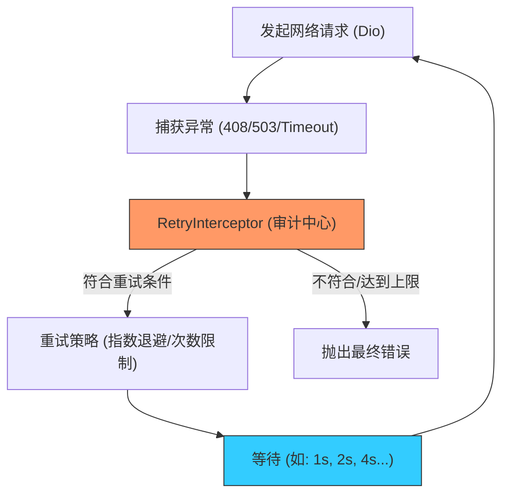

欢迎加入开源鸿蒙跨平台社区：[https://openharmonycrossplatform.csdn.net](https://openharmonycrossplatform.csdn.net)


# Flutter for OpenHarmony: Flutter 三方库 dio_smart_retry 让鸿蒙应用的网络请求具备“由于断网瞬间”自动治愈的能力（网络高可用专家）

## 前言

在进行 OpenHarmony 的移动端应用开发时，网络环境的不稳定性是常态：
1. **网络切换**：用户从电梯出来，Wi-Fi 切换为 5G。
2. **瞬时波动**：隧道内信号闪断，导致 API 请求超时。
3. **服务端偶发异常**：后端由于负载均衡调整，短暂返回 503。

如果每次波动都直接弹窗报错“网络不可用”，用户体验会极差。**`dio_smart_retry`** 是流行的网络库 Dio 的王牌插件。它能根据配置，在网络抖动时自动、优雅地进行重试，让你的鸿蒙应用具备“自愈”能力。

---

## 一、网络异常重试决策模型

该插件拦截异常，并根据策略判断是否需要再次发起请求。



---

## 二、核心 API 实战

### 2.1 基础重试配置

```dart
import 'package:dio/dio.dart';
import 'package:dio_smart_retry/dio_smart_retry.dart';

void initNetwork() {
  final dio = Dio();

  // 💡 为 Dio 注入智能重试拦截器
  dio.interceptors.add(RetryInterceptor(
    dio: dio,
    logPrint: print, // 记录详细重试日志
    retries: 3,      // 最多重试 3 次
    retryDelays: const [
      Duration(seconds: 1), // 第一次重试等待 1 秒
      Duration(seconds: 2), // 第二次重试等待 2 秒
      Duration(seconds: 3), // 第三次重试等待 3 秒
    ],
  ));
}
```

### 2.2 自定义重试判定逻辑

```dart
RetryInterceptor(
  // 💡 只有针对特定的错误类型（如只重试超时和 5xx 错误）
  retryEvaluator: (error, attempt) {
    if (error.type == DioExceptionType.connectionTimeout) return true;
    return error.response?.statusCode != null && error.response!.statusCode! >= 500;
  },
  // ... 其他属性
)
```

---

## 三、常见应用场景

### 3.1 鸿蒙应用全场景“零感”数据加载
在鸿蒙手机的瀑布流列表页中，如果因为瞬时信号不好导致数据加载失败，利用该插件静默重试。用户可能只会感觉到加载圈（Spinner）多转了两秒，随后数据便在第二次请求中成功呈现，完全规避了用户需要点击“重试按钮”的繁琐操作。

### 3.2 鸿蒙-分布式节点的心跳维持
在分布式全场景中，主控设备与从设备之间的心跳包可能因干扰丢失。利用 `dio_smart_retry` 配置极短延迟的快速重试，能有效过滤网络噪声，确保各个鸿蒙节点之间的状态连接呈现出一种“软实时”的极高稳定性，减少因网络毛刺导致的系统重置。

---

## 四、OpenHarmony 平台适配

### 4.1 适配鸿蒙的能效调优策略
💡 **技巧**：连续的失败重试会消耗鸿蒙设备的射频资源和电量。建议在重试配置中务必使用“指数退避（Exponential Backoff）”。通过逐渐拉长每次重试的时间间隔，能有效避免在极端弱网环境下给鸿蒙系统带来的无效功耗负担，同时也符合现代分布式后端系统的防熔断保护规范。

### 4.2 处理大文件断点续传的重试
在利用 Dio 下载超大型鸿蒙 HAP 系统资源包时，如果中途网络中断，`dio_smart_retry` 可以配合 Dio 的断点续传（Range Headers）逻辑。在重试拦截器中，我们可以自动通过本地文件的当前长度重新构造请求头，实现“断了自动接着下”的功能，让鸿蒙应用在大文件处理上表现得像专业下载器一样强悍。

---

## 五、完整实战示例：鸿蒙工程“防抖动”网络底座

本示例展示如何构建一个具备自愈能力的全局 Dio 单例。

```dart
import 'package:dio/dio.dart';
import 'package:dio_smart_retry/dio_smart_retry.dart';

class OhosHttpService {
  late Dio _dio;

  OhosHttpService() {
    _dio = Dio(BaseOptions(connectTimeout: const Duration(seconds: 5)));
    
    print('🚀 正在启动鸿蒙自愈型网络引擎...');

    // 💡 核心配置：开启智能重试，针对常见的 408/502/503/504
    _dio.interceptors.add(RetryInterceptor(
      dio: _dio,
      retries: 2,
      retryDelays: [
        const Duration(seconds: 2),
        const Duration(seconds: 4),
      ],
    ));
  }

  Future<void> fetchConfig() async {
    try {
      final res = await _dio.get('https://api.ohos-next.com/config');
      print('✅ 获取配置成功: ${res.data}');
    } catch (e) {
      print('❌ 经过 2 次重试后仍失败：请告知鸿蒙用户手动检查网络');
    }
  }
}

void main() async {
  final service = OhosHttpService();
  await service.fetchConfig();
}
```

<!-- IMAGE_PLACEHOLDER: 鸿蒙 DevEco 调试窗口中，展示一次成功的请求背后，包含了由于超时触发的两次自动重试日志记录，以及最终成功获取结果的时序对比截图 -->

---

## 六、总结

`dio_smart_retry` 软件包是 OpenHarmony 开发者打理“网络鲁棒性”的定海神针。它将脆弱的单次请求转化成了稳健的、具备重试逻辑的自愈链路。在构建追求极致在线率、追求极致用户顺滑感的鸿蒙原生应用生态中，引入这样一套标准化的重试方案，能让您的应用在万物互联的复杂网络汪洋中，始终航行得平稳而精准。
