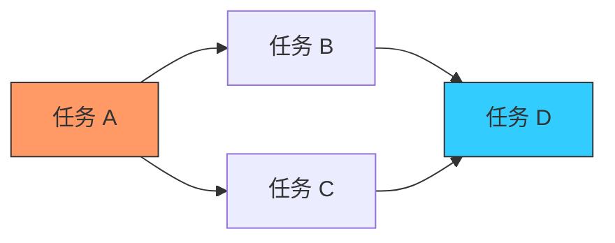

欢迎加入开源鸿蒙跨平台社区：[https://openharmonycrossplatform.csdn.net](https://openharmonycrossplatform.csdn.net)


# Flutter for OpenHarmony: Flutter 三方库 directed_graph 在鸿蒙应用中优雅处理复杂的拓扑排序与依赖关系（算法级工具）

## 前言

在进行 OpenHarmony 的复杂业务逻辑设计时，我们经常会遇到“依赖关联”问题。例如：
1. **任务调度**：任务 A 依赖于任务 B 和 C，任务 B 依赖于 D。你应该按什么顺序运行它们？
2. **数据流建模**：在鸿蒙分布式节点中，数据是如何从一个端点流向另一个端点的？是否存在循环引用（Cycle）？
3. **资源加载器**：一个大型鸿蒙 HAP 包内的资源加载优先级排序。

**`directed_graph`** 是一款纯粹的、算法级别的 Dart 库。它提供了标准的数据结构模型，能帮你极其高效地处理这些复杂的拓扑（Topology）关系。

---

## 一、有向图逻辑模型

该库支持对图节点进行深度遍历、环路检测及排序。



---

## 二、核心 API 实战

### 2.1 创建并添加边

```dart
import 'package:directed_graph/directed_graph.dart';

void buildGraph() {
  // 💡 定义节点
  var a = 'ohos-core';
  var b = 'auth-module';
  var c = 'data-sync';

  // 💡 创建有向图
  var graph = DirectedGraph<String>({
    a: {b, c},
    b: {c},
    c: {},
  });

  print('节点总数: ${graph.vertices.length}');
}
```

### 2.2 拓扑排序 (Topological Sort)

这对于确定任务执行顺序非常有用。

```dart
// 💡 获取一个不违背依赖关系的线性序列
var sorted = graph.topologicalSort();
print('执行顺序: $sorted'); // 结果会确保依赖项先于被依赖项
```

### 2.3 环路检测

```dart
if (graph.isAcyclic) {
  print('✅ 鸿蒙逻辑链路正常，不存在循环依赖');
} else {
  print('❌ 错误：检测到死循环引用！');
}
```

---

## 三、常见应用场景

### 3.1 鸿蒙组件初始化排序
在一个大型鸿蒙应用启动时，有几十个模块需要初始化。利用 `directed_graph` 建立它们的依赖图，自动生成一份最优的顺序列表，不仅能避免因初始化顺序错误导致的 Crash，还能最大化并发执行不相关的任务，缩短鸿蒙应用首屏加载时长。

### 3.2 鸿蒙对话流设计
在构建智能客服或业务导引系统时，利用有向图管理对话节点的跳转逻辑。通过库提供的路径搜索（Pathfinding）功能，可以轻松分析出用户从起始页面到目标成交页面最短的交互路径。

---

## 四、OpenHarmony 平台适配

### 4.1 适配鸿蒙的执行效率
💡 **技巧**：`directed_graph` 采用的是轻量级的邻接表（Adjacency List）实现。在鸿蒙设备上进行大规模动态图计算时，内存占用及 CPU 负载极其稳定。对于包含数千个节点的复杂逻辑引擎，配合鸿蒙系统的 AOT 优化，单次拓扑排序的耗时通常在微秒级，这使得它非常适合嵌入到鸿蒙应用的实时调度器中。

### 4.2 适配鸿蒙多设备管理拓扑
在鸿蒙分布式全场景中，不同的设备（如手机、电视、平板）可能构成一个动态的通讯拓扑。利用 `directed_graph` 的 `stronglyConnectedComponents`（强连通分量）算法，可以分析出当前鸿蒙分布式网络中哪些设备集群是互通的，从而优化数据的分发路径，提升局域网内的数据流转效率。

---

## 五、完整实战示例：鸿蒙工程化任务调度器

本示例展示如何管理一组带有依赖关系的异步任务。

```dart
import 'package:directed_graph/directed_graph.dart';

class OhosTaskRunner {
  final Map<String, Set<String>> _deps = {};

  void addDependency(String task, String dependsOn) {
    _deps.putIfAbsent(task, () => {}).add(dependsOn);
  }

  /// 💡 生成一份安全的鸿蒙任务执行蓝图
  List<String> getPlan() {
    print('🧐 正在审计鸿蒙任务依赖树...');
    final graph = DirectedGraph<String>(_deps);
    
    if (!graph.isAcyclic) {
       throw Exception('检测到循环任务，鸿蒙系统无法调度');
    }

    return graph.topologicalSort().reversed.toList();
  }
}

void main() {
  final runner = OhosTaskRunner();
  runner.addDependency('UI 渲染', '主题加载');
  runner.addDependency('主题加载', '配置下载');
  
  print('任务执行顺序：${runner.getPlan()}');
}
```

<!-- IMAGE_PLACEHOLDER: 通过 Mermaid 自动渲染出的鸿蒙模块依赖关系模型图，以及拓扑排序后的执行序列展示截图 -->

---

## 六、总结

`directed_graph` 软件包是 OpenHarmony 开发者处理“秩序”与“逻辑”的底层推手。它不参与 UI 表现，却为应用复杂的内部机制提供了严密的数学保障。在构建追求极致逻辑确定性、追求极致架构整洁度的鸿蒙原生应用时，引入这套标准化的图算法工具，能让你的业务逻辑像鸿蒙内核调度一样丝滑而精准。
