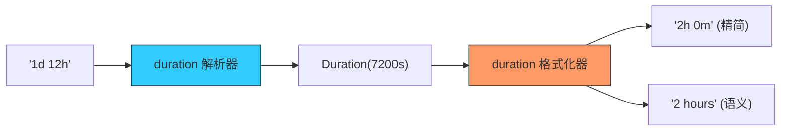

欢迎加入开源鸿蒙跨平台社区：[https://openharmonycrossplatform.csdn.net](https://openharmonycrossplatform.csdn.net)


# Flutter for OpenHarmony: Flutter 三方库 duration 让鸿蒙应用的时间长度处理变得灵动而具人情味（语义化时长专家）

## 前言

在进行 OpenHarmony 的 UI 开发时，我们经常需要处理“时长（Duration）”：
1. **视频播放器**：如何将 `Duration(seconds: 3661)` 显示为漂亮的 `01:01:01`？
2. **任务管理**：如何让用户输入 `2d 4h` 就能自动识别为 2 天 4 小时？
3. **社交动态**：如何精确显示为“剩余 5 小时 30 分钟”而不是干巴巴的数字？

**`duration`** 软件包正是为了解决这些“最后 1 公里”的显示与解析问题。它弥补了 Dart 原生 `Duration` 类在格式化方面的空白，为鸿蒙应用提供了专业的语义化时长处理能力。

---

## 一、时长语义化转换模型

该库支持在“机器时间（ms）”、“短文本（2h 3m）”与“长描述（2 hours ...）”之间自由切换。



---

## 二、核心 API 实战

### 2.1 将 Duration 转为漂亮的字符串

```dart
import 'package:duration/duration.dart';

void formatDuration() {
  final d = Duration(hours: 2, minutes: 34, seconds: 12);

  // 💡 极简输出: 2:34:12 (非常适合鸿蒙视频进度条)
  print(printDuration(d, abbreviated: true, spacer: ''));

  // 💡 全称输出: 2 hours 34 minutes 12 seconds
  print(printDuration(d, locale: DurationLocale.fromLanguageCode('zh')!));
}
```

### 2.2 字符串解析为 Duration

```dart
void parseInput() {
  // 💡 直接解析用户输入的文字
  Duration d = parseDuration('2h 45m');
  
  print('总分钟数: ${d.inMinutes}'); // 165
}
```

---

## 三、常见应用场景

### 3.1 鸿蒙运动健康应用的“累计时长”展示
在统计用户本周的运动总时长（如 15000 秒）时，通过 `duration` 库自动转换为“4 小时 10 分钟”，并能根据鸿蒙系统的多国语言设置，自动适配为英语、阿拉伯语等对应的语义格式，提升应用的国际化档次。

### 3.2 鸿蒙智能家居的“延时关机”配置
用户在鸿蒙平板上设置空调“3h 30min”后关机。利用该库强大的解析能力，开发者无需编写复杂的正则表达式，一行脚本即可将其转化为 Dart 原生 `Duration`，直接对接鸿蒙系统的计时器服务。

---

## 四、OpenHarmony 平台适配

### 4.1 适配鸿蒙的本地化语言包
💡 **技巧**：`duration` 库支持多语言。在进行鸿蒙出海开发时，建议通过 `DurationLocale` 注入对应的本地化翻译。特别是在处理波斯语、日语等具有特殊计数语序的语言时，利用该库内置的国际化算法，能保证鸿蒙应用显示的时长语法绝对无误，避免“5 小时 3 分”被错显示为“3 分 5 小时”的尴尬。

### 4.2 适配鸿蒙多分辨率的“简繁”控制
在鸿蒙智能手表的微小屏幕上，通过 `abbreviated: true` 输出极简形式（如 `4m 3s`）；而在鸿蒙平板或电视的大屏上，通过 `printDuration` 输出全称语义描述。通过该库的灵活参数调优，你可以实现一套代码、多端感知、最优展示。

---

## 五、完整实战示例：鸿蒙工程“任务倒计时”渲染器

本示例展示如何生成一个符合中文审美的高级时长描述。

```dart
import 'package:duration/duration.dart';

class OhosTimerFormatter {
  /// 💡 将秒数转化为鸿蒙精美 UI 可用的时长标签
  String formatForOhos(int seconds) {
    final d = Duration(seconds: seconds);
    
    print('🎨 正在为鸿蒙页面美化时间载荷...');
    
    return printDuration(
      d,
      delimiter: ' ',          // 元素间的分隔符
      conjugation: '又',       // 最后两个元素的连接词
      abbreviated: false,      // 是否简写
      locale: DurationLocale.fromLanguageCode('zh')!,
    );
  }
}

void main() {
  final formatter = OhosTimerFormatter();
  // 模拟输出：1 小时 10 分钟 又 5 秒
  print('任务剩余: ${formatter.formatForOhos(4205)}');
}
```

<!-- IMAGE_PLACEHOLDER: 鸿蒙手机展示视频播放器的倒计时显示、与厨房定时器设置页面的语义化时长转换对比截图 -->

---

## 六、总结

`duration` 软件包是 OpenHarmony 开发者打理“时间美学”的专业工具。它将冰冷的毫秒数值转化为带有温度、符合人类自然语言习惯的描述。在构建追求极致用户体验、追求极致多端适配能力的鸿蒙原生应用生态中，引入这样一套精细化的时长管理逻辑，能让您的应用交互体验在细微处见真章。
