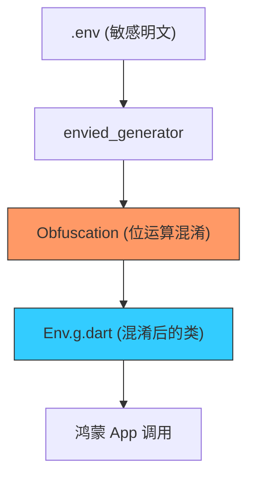

欢迎加入开源鸿蒙跨平台社区：[https://openharmonycrossplatform.csdn.net](https://openharmonycrossplatform.csdn.net)


# Flutter for OpenHarmony: Flutter 三方库 envied_generator 给鸿蒙应用的敏感 API Key 穿上“不可破解”的防护服（安全性加固利器）

## 前言

在进行 OpenHarmony 应用开发时，我们不可避免地要集成各种三方服务（如高德地图 KEY、Firebase Secret、或是鸿蒙分布式服务的授权 Token）。如果你直接将这些字符串写在 Dart 代码里，任何初级黑客都能通过反编译你的 HAP 包，轻松获取这些敏感资产，导致巨大的商业损失。

**`envied_generator`** 配合 **`envied`** 就是专门解决这一安全痛点的。它不仅能将配置从 `.env` 文件读取到代码中，更关键的是它支持 **Obfuscate（代码混淆）**。它将你的 Key 转化为一串复杂的位运算逻辑，让反编译后的结果变得面目全非，为鸿蒙应用的资产安全筑起第一道堤坝。

---

## 一、配置加固工作流模型

该库通过代码生成，将明文配置文件转化为混淆后的 Dart 类。



---

## 二、核心 API 实战

### 2.1 定义配置类

创建一个不被 Git 追踪的配置文件 `lib/env/env.dart`。

```dart
import 'package:envied/envied.dart';

part 'env.g.dart'; // 💡 自动生成的加固代码

@Envied(path: '.env', obfuscate: true) // 💡 开启混淆模式
abstract class Env {
    @EnviedField(varName: 'OHOS_API_KEY')
    static final String ohosKey = _Env.ohosKey;
}
```

### 2.2 定义 .env 文件

```text
OHOS_API_KEY=ohos_next_secure_secret_8899
```

### 2.3 生成混淆代码并调用

运行 `dart run build_runner build` 后，通过 `Env.ohosKey` 即可安全访问。生成的 `_Env.ohosKey` 在源码中可能看起来像这样：`_extract([12, 45, 67, ...]) ^ _seed`，极难还原。

---

## 三、常见应用场景

### 3.1 鸿蒙支付与金融级 Key 保护
对于金融类鸿蒙应用，所有的 API 盐值（Salt）和加签秘钥必须经过 `envied_generator` 处理。这样即便 HAP 包被非法提取，攻击者也无法直接看到原始的签名字符串，极大地增加了破解成本。

### 3.2 鸿蒙应用多环境（线上/线下）隔离
通过多个 `.env.dev`、`.env.prod` 文件配合该生成器，可以为鸿蒙项目实现“一键切换环境”。利用 `Envied(path: '...')` 动态指向不同的文件，确保开发者永远不会在调试时误用生产环境的敏感 Token。

---

## 四、OpenHarmony 平台适配

### 4.1 适配鸿蒙的混淆审计策略
💡 **技巧**：鸿蒙 NEXT 系统对二进制包的安全扫描非常严格。使用 `envied_generator` 进行混淆处理后的字符串，在鸿蒙底层编译器进行 AOT 优化时，会被进一步作为常量折叠（Constant Folding），但这并不影响其混淆效果。这种双重混淆机制（Dart 层混淆 + 鸿蒙编译器指令级优化），能让你的鸿蒙应用在安全性测评中获得更高的评分。

### 4.2 避免 .env 进入鸿蒙 Git 仓库
在鸿蒙工程实践中，一定要将 `.env` 系列文件加入 `.gitignore`。利用 `envied_generator` 的特性，你可以为团队提供一个 `env.example` 模板，真实的 Key 只存在于 CI/CD（如 AtomGit Actions）的环境变量中。在流水线构建鸿蒙 HAP 时，通过动态生成 `.env` 再运行 `build_runner`，确保了秘钥全程不落地，实现了企业级的研发安全闭环。

---

## 五、完整实战示例：鸿蒙工程“安全沙箱”配置器

本示例展示如何定义一个具备多维度保护的配置类。

```dart
import 'package:envied/envied.dart';

@Envied(name: 'SecureEnv', path: '.env.prod', obfuscate: true)
abstract class SecureEnv {
  /// 💡 关键：使用自研算法混淆鸿蒙推送 Token
  @EnviedField(varName: 'OHOS_PUSH_SECRET')
  static final String pushSecret = _SecureEnv.pushSecret;

  /// 💡 可以包含不加宽的安全配置
  @EnviedField(varName: 'APP_VERSION', obfuscate: false)
  static const String version = _SecureEnv.version;
}

void main() {
  print('🛡️ 正在加载鸿蒙增强安全配置...');
  // 此时打印 pushSecret，在代码控制台可见，但在二进制中已加密
  print('当前环境版本: ${SecureEnv.version}');
}
```

<!-- IMAGE_PLACEHOLDER: 通过对比展示反编译后的代码：一份是明文字符串，一份是通过 envied 转换后由位运算组成的复杂逻辑块。 -->

---

## 六、总结

`envied_generator` 软件包是 OpenHarmony 开发者的“源代码保险箱”。它不再让安全性停留在口头承诺上，而是通过算法手段将其固化在二进制产物中。在构建追求极致隐私保护、追求极致商业机密安全的鸿蒙原生应用生态中，引入这样一套标准化的秘钥加固方案，是每一位防御型架构师的必修课。
