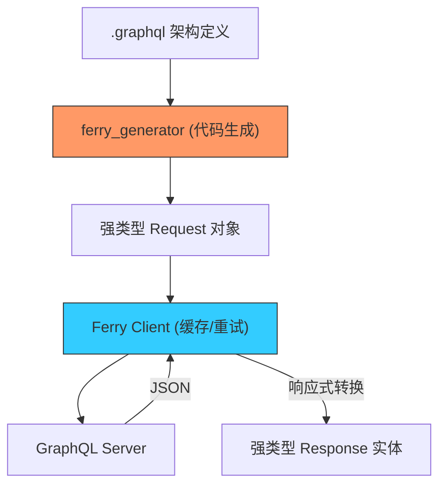

欢迎加入开源鸿蒙跨平台社区：[https://openharmonycrossplatform.csdn.net](https://openharmonycrossplatform.csdn.net)


# Flutter for OpenHarmony: Flutter 三方库 ferry 在鸿蒙应用中构建高性能类型安全的 GraphQL 通讯架构（现代 API 调用方案）

## 前言

随着后端架构的演进，越来越多的 OpenHarmony 项目开始采用 **GraphQL** 替代传统的 RESTful API。GraphQL 的优势在于“按需取值”，能有效减少冗余数据的传输，这对于追求极致性能的鸿蒙应用尤为重要。然而，手动拼接 GraphQL 字符串、解析动态 Map 依然是繁琐且易错的。

**`ferry`** 是一套为 Flutter 量身定制的 GraphQL 客户端全家桶。它通过深度集成代码生成器（Code Generation），让你的鸿蒙应用能以“强类型”方式操作查询。它不仅支持请求与变动，更内置了极致的规范化缓存（Normalized Cache）系统，是构建专业级鸿蒙 GraphQL 应用的终极武器。

---

## 一、类型全链路通讯架构

`ferry` 在本地定义与远程数据之间建立了强类型的映射隧道。



---

## 二、核心 API 实战

### 2.1 初始化 Client 与缓存

```dart
import 'package:ferry/ferry.dart';
import 'package:gql_http_link/gql_http_link.dart';
import 'package:ferry_hive_store/ferry_hive_store.dart';

void initFerry() async {
  // 💡 定义网络链路
  final link = HttpLink('https://api.harmony.com/graphql');

  // 💡 定义持久化缓存 (对接鸿蒙沙箱存储)
  final box = await Hive.openBox('graphql_cache');
  final store = HiveStore(box);
  final cache = Cache(store: store);

  final client = Client(link: link, cache: cache);
}
```

### 2.2 发起强类型查询 (Query)

```dart
import 'package:ohos_app/graphql/get_users.req.gql.dart';

void fetchUsers(Client client) {
  // 💡 无需手写字符串，直接使用生成的 GGetUsersReq
  final req = GGetUsersReq((b) => b..vars.limit = 10);
  
  client.request(req).listen((response) {
    if (response.data != null) {
      // 💡 结果也是强类型的，具备完整的代码补全
      final firstUser = response.data!.users.first;
      print('发现鸿蒙用户: ${firstUser.name}');
    }
  });
}
```

---

## 三、常见应用场景

### 3.1 鸿蒙端侧“数据响应式”更新
利用 `ferry` 的规范化缓存，当你在“详情页”执行一个 `Mutation` 更新了用户名时，所有正在监听该用户数据的“列表页”都会通过流（Stream）自动同步刷新，无需手动调用复杂的事件总线。

### 3.2 离线优先的大规模社交应用
在鸿蒙设备断网时，`ferry` 的 `Cache` 能够立即返回上一次的查询结果。当恢复网络后，它会自动在后台同步最新的变更，让你的鸿蒙应用体验始终保持丝滑。

---

## 四、OpenHarmony 平台适配

### 4.1 适配鸿蒙 AOT 编译
💡 **技巧**：`ferry` 深度依赖代码生成（基于 `built_value`）。在鸿蒙应用构建流程中，确保运行 `dart run build_runner build`。由于所有解析逻辑都在编译期确定，在鸿蒙真机 AOT 环境下的执行效率极高，完全消灭了反射（Reflection）带来的性能及包体积负担。

### 4.2 缓存存储的持久化方案
鸿蒙系统的 `files` 沙箱目录是存储 GraphQL 缓存的理想位置。在使用 `ferry_hive_store` 或自定义 Store 时，建议将路径指定为 `(await getApplicationDocumentsDirectory()).path`，这能保证缓存数据在鸿蒙系统应用升级或重启后依然持久有效，从而大幅降低由于全量网络查询带来的鸿蒙流量消耗。

---

## 五、完整实战示例：鸿蒙精美文章流订阅器

本示例展示如何利用 Ferry 构建一个具备缓存能力的实时数据流。

```dart
import 'package:ferry/ferry.dart';
import 'package:ohos_app/graphql/posts.req.gql.dart';

class OhosFeedManager {
  final Client _client;

  OhosFeedManager(this._client);

  /// 💡 订阅鸿蒙开发者社区的文章动态
  Stream<String> watchPosts() {
    final req = GFetchPostsReq();
    
    return _client.request(req).map((response) {
      if (response.loading) return "📦 正在加载鸿蒙数据...";
      if (response.hasErrors) return "❌ 错误: ${response.graphqlErrors}";
      
      // 💡 演示从强类型系统中提取最新文章标题
      return response.data?.posts.first.title ?? "暂无动态";
    });
  }
}

// 模拟使用片段
// StreamBuilder(stream: manager.watchPosts(), builder: ...)
```

<!-- IMAGE_PLACEHOLDER: 鸿蒙 DevEco Studio 展示利用 Ferry 实现的 GraphQL 类型代码自动补全与查询预览截图 -->

---

## 六、总结

`ferry` 软件包是 OpenHarmony 开发者征服 GraphQL 的“重装备”。它不仅是一个网络库，更是一整套关于数据流动与状态同步的工具链。在构建需要处理海量关系数据、追求极致 UI 更新效率的鸿蒙原生应用时，引入 Ferry 化的 GraphQL 架构，能让你的前后端通讯协议像鸿蒙内核一样严密而高效。
