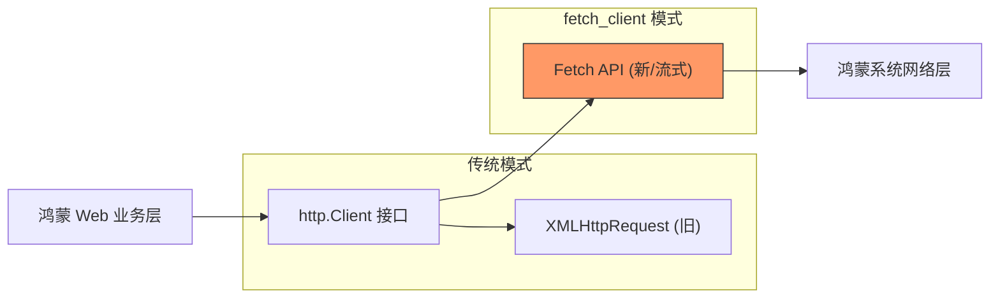

欢迎加入开源鸿蒙跨平台社区：[https://openharmonycrossplatform.csdn.net](https://openharmonycrossplatform.csdn.net)


# Flutter for OpenHarmony: Flutter 三方库 fetch_client 让鸿蒙 Web 渲染模式下的网络通讯更轻快、更现代（Fetch 专场）

## 前言

在进行 OpenHarmony 的跨平台开发时，如果你的应用涉及 **Flutter Web** 渲染，你可能会发现传统的 `http` 或 `dio` 库在 Web 环境下是通过 `XMLHttpRequest (XHR)` 实现的。虽然稳定，但 XHR 已经略显老旧，且在处理流（Streams）或高级缓存控制时力不从心。

**`fetch_client`** 是基于现代浏览器 **Fetch API** 重新封装的 HTTP 客户端。它完美遵守了 `http` 软件包的接口标准，但在鸿蒙 Web 容器内部运行得更高效、更符合现代网络协议栈标准。

---

## 一、网络底座替代模型

`fetch_client` 替换了老旧的 XHR 引擎，直接对接浏览器的 Fetch 管道。



---

## 二、核心 API 实战

### 2.1 极简替换现有 Client

```dart
import 'package:fetch_client/fetch_client.dart';
import 'package:http/http.dart' as http;

void initNetwork() {
  // 💡 直接用 FetchClient 替换普通的 http.Client()
  final http.Client client = FetchClient(
    mode: RequestMode.cors, // 配置跨域模式
    cache: RequestCache.noCache,
  );

  // 之后的所有操作与普通 http 包完全一致
  client.get(Uri.parse('https://api.ohos-cloud.com/v1/data'));
}
```

### 2.2 处理流式响应 (Streaming)

这是 Fetch 的拿手好戏。

```dart
final response = await client.send(http.Request('GET', url));
// 💡 Fetch API 支持真正的从流中读取数据，而不是等待全部下载完
response.stream.listen((chunk) {
  print('正在流式接收鸿蒙大数据包: ${chunk.length}');
});
```

---

## 三、常见应用场景

### 3.1 鸿蒙 Web 端大文件分片下载
利用 `fetch_client` 的流式处理能力，可以在鸿蒙浏览器环境下实现真正意义上的“渐进式下载”。对于几百兆的资源文件，用户可以感知到实时的下载百分比，且内存占用极低。

### 3.2 兼容鸿蒙 NEXT 浏览器的 Service Workers
如果你正在构建鸿蒙平台的 **PWA (Progressive Web Apps)**，`Fetch API` 是 Service Workers 的核心组件。利用 `fetch_client`，你可以让 Flutter 代码发出的请求被 Service Worker 精准拦截并进行离线缓存，极大提升鸿蒙 Web 挂接应用的启动速度。

---

## 四、OpenHarmony 平台适配

### 4.1 适配鸿蒙跨域 (CORS) 安全策略
💡 **技巧**：鸿蒙 Web 容器对安全性有极高要求。通过 `fetch_client` 可以精细化控制 `omit` 或 `include` 凭据（Credentials）。在对接鸿蒙内网 API 时，利用 Fetch 能更优雅地处理预检请求（Preflight），缩短网络往返耗时。

### 4.2 性能表现与负载建议
相比于 XHR 的繁琐状态机，Fetch 的基于 Promise (在 Dart 中表现为 Future) 的设计在鸿蒙系统中具有更好的执行优先级。在处理高并发、短连接的鸿蒙 Web 业务（如：秒删消息、心跳包）时，`fetch_client` 能显著减少浏览器的事件循环阻塞，保障 UI 的极致响应。

---

## 五、完整实战示例：鸿蒙工程“流式”数据监测器

本示例展示如何利用 Fetch 的流式特性读取长文本数据。

```dart
import 'package:fetch_client/fetch_client.dart';
import 'package:http/http.dart' as http;

class OhosFetchManager {
  /// 💡 在鸿蒙 Web 运行环境启动流式探测
  Future<void> monitorFlux() async {
    print('🚀 正在通过 Fetch 管道初始化鸿蒙网络审计...');
    
    final client = FetchClient();
    final request = http.Request('GET', Uri.parse('https://api.ohos.dev/stream'));
    
    final response = await client.send(request);
    
    // 💡 演示 Fetch 特有的高效流式消费
    await for (final chunk in response.stream) {
      print('📥 获取鸿蒙离线包片段，字节长度: ${chunk.length}');
    }
  }
}

void main() async {
  // 仅在 kIsWeb 环境下有效
  // OhosFetchManager().monitorFlux();
}
```

<!-- IMAGE_PLACEHOLDER: 鸿蒙手机浏览器开发者模式中，展示 XHR 与 Fetch 请求在网络瀑布流中的耗时与流式加载差异对比截图 -->

---

## 六、总结

`fetch_client` 软件包是 OpenHarmony 开发者在 Web 跨端领域的“提速器”。它将浏览器最底层、最现代的网络原语通过标准的接口暴露给 Dart。在追求极致渲染效率、追求极致网络管控能力的鸿蒙跨平台 Web 项目中，舍弃老旧的 XHR 通向 Fetch 驱动的现代架构，是保持应用生命力的必然选择。
