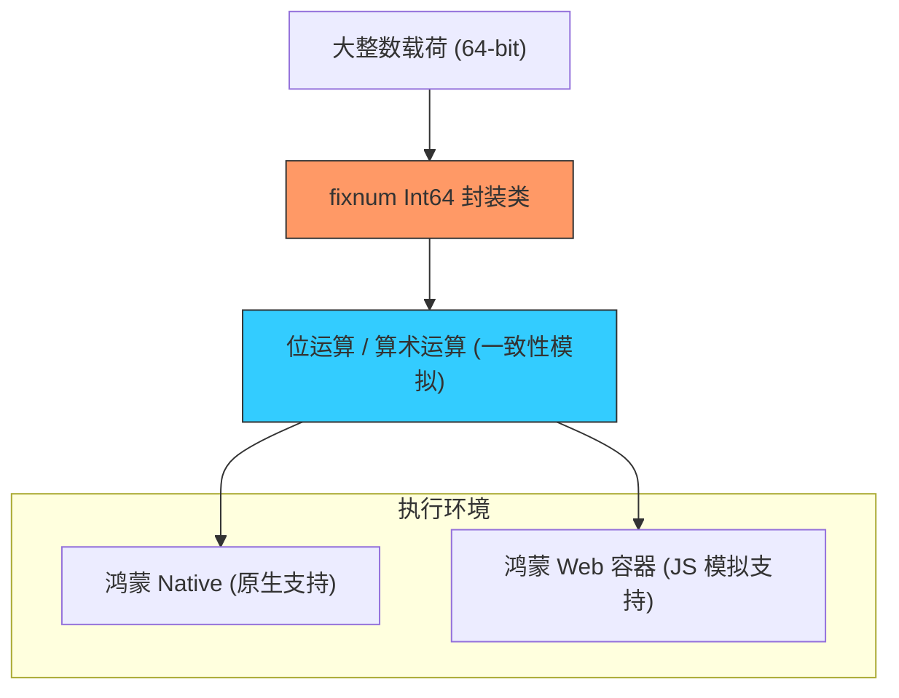

欢迎加入开源鸿蒙跨平台社区：[https://openharmonycrossplatform.csdn.net](https://openharmonycrossplatform.csdn.net)


# Flutter for OpenHarmony: Flutter 三方库 fixnum 解决鸿蒙 Web 与原生端 64 位大整数精度失真难题（精准计算护卫）

## 前言

在进行 OpenHarmony 的跨平台开发时，你可能会遇到一个诡异的 Bug：同样的 64 位长整数（如 `Int64`），在鸿蒙原生（Native）模式下运行正常，但编译为 **Flutter Web** 模式在浏览器运行时，数值却发生了精度漂移或溢出。
1. **产生原因**：JavaScript 原生的数字类型实质上是 64 位浮点数，它能安全表示的最大整数只有 53 位（$2^{53}-1$）。
2. **后果**：大额订单 ID、高精度的金融分位值、或是底层硬件的 64 位地址位，在 Web 容器中会因精度丢失而产生致命错误。

**`fixnum`** 软件包是 Google 官方出品的补丁工具。它为 Dart 提供了纯正、一致的 `Int64`（64 位有符号整数）和 `Int32`（32 位有符号整数）类，确保你的鸿蒙应用在任何环境下都能保证计算结果的绝对一致。

---

## 一、精度对齐计算模型

`fixnum` 通过软件模拟的方式，在不支持原生 64 位整数的环境下实现了位运算对齐。



---

## 二、核心 API 实战

### 2.1 创建并操作 Int64

```dart
import 'package:fixnum/fixnum.dart';

void useInt64() {
  // 💡 即使在 Web 端，也能安全表示超过 53 位的数字
  Int64 veryLargeId = Int64.parse('9223372036854775807'); // 最大正整数
  
  // 执行位运算（与、或、非、位移）
  Int64 shifted = veryLargeId >> 2;
  
  print('鸿蒙设备审计 ID: $veryLargeId');
}
```

### 2.2 跨平台安全加减

```dart
Int64 price = Int64(1024);
Int64 sum = price * 1000000000; // 💡 自动处理溢出检测
```

---

## 三、常见应用场景

### 3.1 鸿蒙金融级账单精准对账
在某些对精度要求极高的鸿蒙端侧“秒杀”或“股票交易”应用中，一分的差错都不可接受。通过 `fixnum` 强制在所有计算节点使用 `Int64`，可以屏蔽掉 JavaScript 的浮点数干扰，保证鸿蒙前端计算出的汇总金额与后端 Java/Go 服务的 64 位流水号完全匹配。

### 3.2 鸿蒙底层文件系统的偏移量读写
当处理超过 4GB 的超大型鸿蒙 HAP 压缩包或磁盘镜像时，文件指针的偏移量（Offset）可能瞬间超出 32 位甚至 53 位范围。利用 `fixnum` 进行偏移量累加，能确保文件读写位置在鸿蒙系统的多端（尤其是 Web 版管理面板）表现出极高的一致性，防止数据存取错位导致的损坏。

---

## 四、OpenHarmony 平台适配

### 4.1 适配鸿蒙跨端通讯协议 (Protobuf)
💡 **技巧**：Google 的 **Protocol Buffers** 在 Dart 中默认就是使用 `fixnum` 来处理 64 位整型的。在开发鸿蒙平台的分布式微服务时，两端通过二进制协议交换数据。无论是在鸿蒙真机还是浏览器环境，引入 `fixnum` 都能确保 Protobuf 定义的 `int64` 字段在解析后数值保持纹丝不动，是构建稳健鸿蒙 RPC 链路的工业标准。

### 4.2 性能开销分析与建议
由于 `fixnum` 在 Web 端涉及软件层面的模拟算法，其运算速度会比原生 `int` 略慢。在鸿蒙应用中，建议仅在确实需要 64 位精度支撑的某些关键业务（如：加解密、ID 生成、财务统计）中使用 `fixnum`。对于普通的循环计数或 UI 索引，直接使用 Dart 的原生 `int` 即可，以维持鸿蒙应用在低配硬件上的最优执行效能。

---

## 五、完整实战示例：鸿蒙工程“高精”分布式审计器

本示例展示如何安全地处理一个超大的分布式集群 ID。

```dart
import 'package:fixnum/fixnum.dart';

class OhosInt64Inspector {
  /// 💡 审计鸿蒙万物互联节点的海量 UUID
  void audit(String rawId) {
    print('🧐 正在启动鸿蒙大整数高精审计仪...');
    
    // 💡 转换为安全且定长的 Int64 对象
    final id = Int64.parse(rawId);
    
    // 逻辑演示：提取高 32 位作为时间戳
    final highBits = (id >> 32).toInt();
    
    print('--- 审计摘要 ---');
    print('原始大整数: $id');
    print('高位特征值: $highBits');
    print('十六进制显示: ${id.toHexString()}');
  }
}

void main() {
  final inspector = OhosInt64Inspector();
  // 一个超出 JS 精度限制的大数字
  inspector.audit('8000000000000000001');
}
```

<!-- IMAGE_PLACEHOLDER: 通过对比表格展示：传统 int 类型在浏览器中展示时出现的“末尾数漂移”Bug，与使用 fixnum 后数值保持完美锁定的效果截图。 -->

---

## 六、总结

`fixnum` 软件包是 OpenHarmony 开发者打理“数字真相”的守护者。它打破了跨端开发中隐含的精度陷阱，为关键业务逻辑提供了最后一道数学隔离带。在构建追求极致数据一致性、追求极致行业专业度的鸿蒙原生应用生态中，引入这样一套严谨的定长整数方案，是保护您的系统架构免受精度灾难侵扰的必备盾牌。
