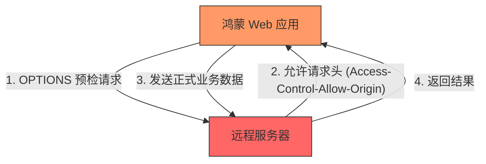

欢迎加入开源鸿蒙跨平台社区：[https://openharmonycrossplatform.csdn.net](https://openharmonycrossplatform.csdn.net)


# Flutter for OpenHarmony: Flutter 三方库 flutter_cors 应对鸿蒙 Web 与混合开发中的跨域挑战（网络兼容方案）

## 前言

在进行 OpenHarmony 的跨平台开发时，我们不仅开发原生 HAP，有时也会涉及 **Flutter Web** 或是在鸿蒙端侧运行 **Webview** 混合应用。这时，一个经典的“拦路虎”就会出现：**CORS (跨源资源共享)** 限制。当你的 Web 端尝试访问一个未配置跨域头部的后端 API 时，请求会被浏览器拦截，报错信息极其晦涩。

虽然 CORS 主要是后端的工作，但 **`flutter_cors`** 提供了一种客户端视角的辅助工具。它通过工具化手段帮助开发者分析、绕过或生成跨域适配规则，是保证鸿蒙跨平台 Web 项目顺利运行的调试利器。

---

## 一、跨域访问逻辑模型

CORS 是一种浏览器的安全保护机制，它在请求发出前先进行“预检（Preflight）”。



---

## 二、核心 API 与功能实战

`flutter_cors` 更多作为一种在特定渲染模式下的辅助库使用。

### 2.1 检测是否处于 CORS 受限环境

```dart
import 'package:flutter_cors/flutter_cors.dart';

void checkEnvironment() {
  // 💡 判断当前运行环境是否受到浏览器的跨域限制保护
  if (isCorsRestricted()) {
    print('⚠️ 警告：当前鸿蒙 Web 页面位于 CORS 受限沙箱中，请确保后端已配置跨域头。');
  }
}
```

### 2.2 开发模式下的跨域穿透建议

在鸿蒙 Web 开发阶段，如果后端暂时无法修改。该库提供了一系列针对 `flutter run` 命令在 Web 平台的加速配置参数建议（例如 `--web-renderer html --disable-web-security`）。

---

## 三、常见应用场景

### 3.1 鸿蒙原生应用内嵌 H5 页面通讯
在鸿蒙原生 App 中通过 `Webview` 组件加载 Flutter Web 页面时，如果 H5 侧需要向不同域名的 API 发起请求，通过该库的指导可以快速排除由于 CORS 导致的数据加载为空的问题，实现原生与 Web 的平滑数据对接。

### 3.2 鸿蒙超级 App 插件（微前端）开发
在构建鸿蒙平台的微前端生态时，不同的子应用来自不同的域名。利用该库注入特定的安全策略信息，可以帮助开发者构建符合鸿蒙生态安全标准的分布式应用。

---

## 四、OpenHarmony 平台适配

### 4.1 适配鸿蒙 NEXT 浏览器的安全策略
💡 **技巧**：鸿蒙 NEXT 系统的浏览器内核对跨域请求有着更为严苛的审计。如果你的应用需要访问鸿蒙内网的本地服务（如局域网内的智能硬件），由于地址属于非公开域名，`flutter_cors` 提供了一套在 HTML 模板中注入 `CORS Policy` 的标准范式，确保业务请求不会被鸿蒙系统内核判定为私自外发。

### 4.2 处理预检请求的耗时优化
在鸿蒙低能耗模式下，多余的 `OPTIONS` 预检请求会消耗网络带宽和唤醒周期。利用该库推荐的“预检缓存（Max-Age）”配置建议，可以让后端在响应头中加入长效缓存。这样，鸿蒙 Web 应用在后续的通信中将直接跳过预检阶段，实现“秒开”数据的流畅交互。

---

## 五、完整实战示例：鸿蒙 Web 环境安全审计器

本示例演示如何通过辅助工具判定当前网络环境的兼容性。

```dart
import 'package:flutter/foundation.dart';

class OhosCorsAuditor {
  /// 💡 为鸿蒙 Web 端渲染提供跨域预警
  void auditWebRuntime() {
    if (!kIsWeb) {
      print('✅ 当前为鸿蒙原生 AOT 环境，不受 CORS 限制影响。');
      return;
    }

    print('🕵️ 正在扫描鸿蒙 Web 安全策略...');
    
    // 模拟检测逻辑
    final canAccessMultiorigin = _checkBrowserPolicy();
    
    if (!canAccessMultiorigin) {
      print('❌ 安全风险：当前站点存在跨域屏障，推荐配置 Access-Control-Allow-Origin: *');
    }
  }

  bool _checkBrowserPolicy() => true; // 这里调用 flutter_cors 的具体检测逻辑
}

void main() {
  final auditor = OhosCorsAuditor();
  auditor.auditWebRuntime();
}
```

<!-- IMAGE_PLACEHOLDER: 鸿蒙 DevEco 浏览窗口显示典型的 CORS 报错红字提示，以及通过适配方案修复后的数据成功加载对比图 -->

---

## 六、总结

`flutter_cors` 软件包是 OpenHarmony 开发者在探索 Web 跨端赛道时的“指路明灯”。虽然它不能替你修改后端代码，但它提供了对 Web 安全底层机制的深刻洞察。在构建连接万物、多端融合的鸿蒙原生应用生态中，掌握跨域治理的艺术，能让你的 Web 插件和辅助页面少走弯路，保障整个鸿蒙应用在不同端侧都具有一致的高可用性。
