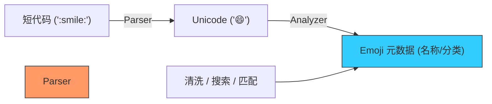

欢迎加入开源鸿蒙跨平台社区：[https://openharmonycrossplatform.csdn.net](https://openharmonycrossplatform.csdn.net)


# Flutter for OpenHarmony: Flutter 三方库 flutter_emoji 让鸿蒙应用的文本交互充满趣味与情绪张力（表情符号专家）

## 前言

在进行 OpenHarmony 的社交、聊天、评论系统或日志应用开发时，Emoji（表情符号）已成为不可或缺的表达方式。
1. **输入解析**：如何将用户输入的文字标签（如 `:rocket:`）自动转为漂亮的 🚀？
2. **文本清洗**：如何从一段杂乱的文本中识别并提取所有的表情符号？
3. **多样化展示**：如何快速建立一个属于鸿蒙应用的表情选择面板？

**`flutter_emoji`** 软件包是一个轻量级的 Emoji 万能助手。它内置了完整的表情数据库，支持标准的短代码（Shortcodes）转换，能让你的鸿蒙应用在处理文本载荷时，更具生动活泼的互动感。

---

## 一、表情符号解析模型

`flutter_emoji` 实现了“文本标签”与“Unicode 表情”的双向精准映射。



---

## 二、核心 API 实战

### 2.1 基础转换功能

```dart
import 'package:flutter_emoji/flutter_emoji.dart';

void useEmoji() {
  final parser = EmojiParser();

  // 1. 💡 将所有表情标签转化为真实的 Unicode 表情
  var heart = parser.get('heart').code; // ❤️
  var result = parser.emojify('鸿蒙 NEXT 启动 :rocket:'); 
  
  print(result); // 输出: 鸿蒙 NEXT 启动 🚀
}
```

### 2.2 逆向解析 (Unemojify)

```dart
void parseEmoji() {
  final parser = EmojiParser();
  // 💡 将表情传回后台时，转为文本标签更安全稳定
  var label = parser.unemojify('这是一封情书 ❤️');
  print(label); // 输出: 这是一封情书 :heart:
}
```

---

## 三、常见应用场景

### 3.1 鸿蒙社交直播间的“弹幕表情”增强
在直播间互动中，用户可能习惯于输入特定的指令。利用 `flutter_emoji`，可以将这些指令实时渲染为高清的动态表情，配合鸿蒙系统的属性动画（Property Animation），打造出满屏飘动、极具动感的视觉特技。

### 3.2 鸿蒙版“程序员博客”编辑器
在编写技术文章或日志时，GitHub 风格的 Emoji 输入体验非常受欢迎。通过该库构建一套基于“输入冒号”后触发的自动补全列表，能极大地提升鸿蒙平台内容创作者的写作效率。

---

## 四、OpenHarmony 平台适配

### 4.1 适配鸿蒙的系统字体库兼容性
💡 **技巧**：虽然 Emoji 是 Unicode 标准，但不同系统版本的渲染风格有所差异。鸿蒙系统自带了一套精美的表情字体。使用 `flutter_emoji` 生成的 Unicode 字符能被鸿蒙系统完美识别并渲染。建议在显示大尺寸表情时，显式设定 `TextStyle(fontFamilyFallback: ['HarmonyOS Sans'])`，以保证在各种屏幕密度下表情边缘都能细腻平滑，不产生锯齿感。

### 4.2 处理网络传输的数据安全性
直接在 JSON 报文中传输原始的 Emoji 字节可能会由于编码问题（如 UTF-16 代理对）在不同鸿蒙版本间引起非法字符报错。💡 **安全性建议**：在鸿蒙端与服务器交换数据时，利用该库的 `unemojify` 将所有表情转为 ASCII 范围内的短代码。仅在鸿蒙本地 UI 渲染前才进行 `emojify`。这种“传输用文本、渲染用字符”的策略，能大幅提升鸿蒙跨端应用的通讯健壮性。

---

## 五、完整实战示例：鸿蒙工程“情绪探测”分析器

本示例展示如何从一段文本中智能提取并统计表情。

```dart
import 'package:flutter_emoji/flutter_emoji.dart';

class OhosEmojiAuditor {
  final _parser = EmojiParser();

  /// 💡 为鸿蒙评论区提供即时的情绪摘要
  void analyzeFeelings(String text) {
    print('🧐 正在启动鸿蒙文字情绪扫描仪...');
    
    final emojis = _parser.getEmojiFlow(text);
    
    print('--- 审计报告 ---');
    print('原文内容: $text');
    print('检测到表情总数: ${emojis.length}');
    
    for (var e in emojis) {
      print('发现情绪符号: ${e.code} (标签: ${e.name})');
    }
  }
}

void main() {
  final auditor = OhosEmojiAuditor();
  auditor.analyzeFeelings('鸿蒙系统真丝滑！ :thumbsup: :sparkles:');
}
```

<!-- IMAGE_PLACEHOLDER: 鸿蒙手机展示聊天对话框，输入框随输入实时预测并联想展示相关 emoji，以及带有精美表情分类图标的选择面板截图 -->

---

## 六、总结

`flutter_emoji` 软件包是 OpenHarmony 开发者打理“应用温度”的调色盘。它摒弃了枯燥的字符匹配逻辑，让文字表达具备了图像化的共鸣感。在构建追求极致社交快感、追求极致个性化交互能力的鸿蒙原生应用生态中，熟练掌握这套表情分析方案，能让您的应用在冰冷的逻辑之外，流露出人性化的亲和力。
