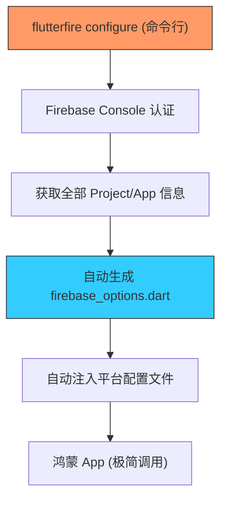

欢迎加入开源鸿蒙跨平台社区：[https://openharmonycrossplatform.csdn.net](https://openharmonycrossplatform.csdn.net)


# Flutter for OpenHarmony: Flutter 三方库 flutterfire_cli 自动化鸿蒙应用与 Firebase 云端的集成链路（工程自动化神器）

## 前言

在进行 OpenHarmony 应用的出海开发时，**Firebase** 是必不可少的后端基础设施。然而，在鸿蒙工程中手动配置 Firebase 的各个平台配置文件（如 `google-services.json` 或 `GoogleService-Info.plist`）以及管理各个功能模块（Auth, Crashlytics, Analytics）的初始化代码，不仅繁琐且极其容易出错。

**`flutterfire_cli`** 是官方提供的自动化工具链。它能通过命令行交互的方式，自动为你的 Flutter 鸿蒙项目配置所有必要的文件，并生成跨平台一致的初始化 Dart 代码。它是实现鸿蒙-Firebase 体系“零配置”集成的关键。

---

## 一、自动化集成工作流模型

`flutterfire_cli` 取代了原本需要数小时的手动配置过程。



---

## 二、核心命令与 API 实战

### 2.1 全自动配置

在鸿蒙 Flutter 项目根目录下执行（需先登录 Firebase 控制台）。

```bash
# 💡 安装 CLI
dart pub global activate flutterfire_cli

# 💡 运行配置向导
flutterfire configure
```

该命令会引导你选择对应的 Firebase 项目，并自动更新你的安卓/iOS 目录及 Dart 源代码。

### 2.2 使用生成的代码初始化

CLI 会为你生成一个 `firebase_options.dart` 文件。

```dart
import 'package:firebase_core/firebase_core.dart';
import 'firebase_options.dart'; // 💡 这是 CLI 自动生成的

void main() async {
  WidgetsFlutterBinding.ensureInitialized();
  
  // 💡 一句话完成所有平台（含鸿蒙适配层）的初始化
  await Firebase.initializeApp(
    options: DefaultFirebaseOptions.currentPlatform,
  );
  
  runApp(MyApp());
}
```

---

## 三、常见应用场景

### 3.1 鸿蒙应用的多环境（Flavors）动态集成
在处理“开发环境”、“内测环境”和“生产环境”分属于不同 Firebase Project 时，利用 `flutterfire_cli` 的 `--out=lib/firebase_options_dev.dart` 参数，可以为鸿蒙项目实现多套配置文件的一键切换，彻底告别手动改 XML/Json 文件的痛苦。

### 3.2 鸿蒙-Firebase 统计数据的极速迁移
当开发者正在将一个已有的 Android/iOS 应用迁移到鸿蒙平台时，利用 CLI 可以确保所有的统计 ID 和秘钥配置在新的鸿蒙工程架构下保持完美的一致性，实现用户数据链路的无缝衔接。

---

## 四、OpenHarmony 平台适配

### 4.1 适配鸿蒙的插件声明周期
💡 **技巧**：鸿蒙系统的后台限制较多。通过 `flutterfire_cli` 生成的初始化代码在 `main()` 启动阶段执行时，内部已经处理了各个原生插件的平台差异性。在鸿蒙设备上，建议通过生成的 `options` 对象检查 `apiKey` 是否正确加载，以此作为网络拦截器的第一道审计。

### 4.2 适配鸿蒙多版本 Gradle 脚本
鸿蒙开发通常涉及特定的 Gradle 构建脚本（如定制的 `hvos` 属性）。在使用 CLI 进行配置后，务必检查其对 `android/build.gradle` 的修改是否与鸿蒙特有的构建标签冲突。通过 CLI 统一管理这些依赖注入，能大幅降低因手动编辑 Gradle 导致的鸿蒙工程“循环依赖”或“Plugin Not Found”这类让人崩溃的编译错误。

---

## 五、完整实战示例：鸿蒙工程云端初始化守卫

本示例展示如何在鸿蒙应用中优雅地处理 Firebase 启动状态。

```dart
import 'package:firebase_core/firebase_core.dart';
import 'firebase_options.dart';

class OhosFirebaseBootstrap {
  /// 💡 为鸿蒙出海应用提供安全的 Firebase 初始化
  static Future<void> setup() async {
    print('🔥 正在同步鸿蒙与 Firebase 全球云端配置...');
    
    try {
      final app = await Firebase.initializeApp(
        options: DefaultFirebaseOptions.currentPlatform,
      );
      print('✅ 集成成功，当前 Firebase APP: ${app.name}');
    } on FirebaseException catch (e) {
      if (e.code == 'duplicate-app') {
        print('♻️ 说明：Firebase 已在后台处于热启动态');
      } else {
        print('❌ 核心预警：由于网络或配置原因，鸿蒙云端链路未开启');
      }
    }
  }
}

void main() async {
  await OhosFirebaseBootstrap.setup();
}
```

<!-- IMAGE_PLACEHOLDER: 通过终端展示 flutterfire configure 互动式选择界面以及生成的 firebase_options 强类型代码截图 -->

---

## 六、总结

`flutterfire_cli` 软件包是 OpenHarmony 开发者进军全球化市场的“加速踏板”。它将原本极其碎片化、充斥手动失误的配置过程，转化为了几秒钟的标准化自动流。在追求交付效率、追求卓越云端集成能力的鸿蒙原生应用生态中，工具化驱动的集成方式不仅能保护你的发际线，更是构建专业、可扩展出海项目的必备素养。
