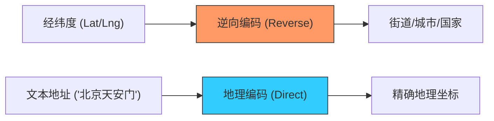

欢迎加入开源鸿蒙跨平台社区：[https://openharmonycrossplatform.csdn.net](https://openharmonycrossplatform.csdn.net)


# Flutter for OpenHarmony: Flutter 三方库 geocode 在鸿蒙应用中实现经纬度与地址的极速转换（地理编码专家）

## 前言

在进行 OpenHarmony 本地化应用开发（如外卖、社交、天气）时，我们经常需要处理地理坐标。用户习惯看到的地址是“深圳市福田区 XX 路”，而机器处理的数据往往是 `(22.5, 114.0)`。如何在不引入沉重的全图 SDK（如高德/百度 SDK）的前提下，实现这种轻量级的地理信息互转？

**`geocode`** 是一个极其纯粹的地理编码（Geocoding）工具包。它通过对接公开的地理信息接口，让你的鸿蒙 Flutter 应用能在几十行代码内完成地址的逆向查询，是构建“轻地图”业务场景的理想选择。

---

## 一、地理编码逻辑链

`geocode` 将复杂的地理层级查询抽象为简单的 API 调用。



---

## 二、核心 API 实战

### 2.1 坐标转地址 (逆向地理编码)

```dart
import 'package:geocode/geocode.dart';

void fetchAddress() async {
  GeoCode geoCode = GeoCode();

  try {
    // 💡 输入鸿蒙设备传感器获取的经纬度
    Address address = await geoCode.reverseGeocoding(
        latitude: 22.54, longitude: 114.05);

    print('鸿蒙设备当前位于: ${address.streetAddress}, ${address.city}');
  } catch (e) {
    print('解析失败: $e');
  }
}
```

### 2.2 地址转坐标 (正向地理编码)

```dart
Future<void> findLocation() async {
  GeoCode geoCode = GeoCode();
  
  // 💡 输入搜索文本
  Coordinates coordinates = await geoCode.forwardGeocoding(
      address: "深圳市华为总部");

  print("华为总部坐标: 纬度 ${coordinates.latitude}, 经度 ${coordinates.longitude}");
}
```

---

## 三、常见应用场景

### 3.1 鸿蒙运动轨迹命名
在用户完成一段跑步后，通过 `geocode` 自动获取起止点的地名，为轨迹自动生成如“南山区晨跑”的标题，提升产品的智能化体验。

### 3.2 鸿蒙应用启动自动城市定位
在应用启动瞬间，利用鸿蒙原生权限获取经纬度，随后迅速通过该库转换成城市名，从而自动为用户切换到本地化的服务频道或显示当地天气。

---

## 四、OpenHarmony 平台适配

### 4.1 网络权限与合规
💡 **技巧**：在鸿蒙的 `module.json5` 中请确保开启了 `ohos.permission.INTERNET`。同时，由于该库默认调用的可能是国外的地理元数据 API，在适配鸿蒙国内应用时，建议通过该库的构造函数或其底层的网络代理设置，将其重定向到符合中国地理标准的数据源，以保证地址反馈的精确度。

### 4.2 适配鸿蒙的电池管理
地理位置获取通常是重负载操作。利用 `geocode` 进行转换时，建议配合缓存策略（对同一个经纬度附近的查询进行限频），以降低频繁唤醒鸿蒙系统无线射频模块（Wi-Fi/4G）带来的电量损耗，这对于鸿蒙穿戴设备（如智能手表）的电池优化尤为重要。

---

## 五、完整实战示例：鸿蒙精美选址器反馈

本示例演示如何通过 `geocode` 展示一个简单的位置解析反馈流程。

```dart
import 'package:geocode/geocode.dart';

class OhosMapHelper {
  final GeoCode _geoCode = GeoCode();

  /// 💡 处理鸿蒙端地理反查逻辑
  Future<String> resolveCurrentLocation(double lat, double lng) async {
    print('🔍 正在向地理云服务请求详情 ($lat, $lng)...');
    
    try {
      final address = await _geoCode.reverseGeocoding(latitude: lat, longitude: lng);
      
      // 组合成符合中国人阅读习惯的地名
      final fullDesc = "${address.countryName} · ${address.city} · ${address.streetAddress}";
      return fullDesc;
    } catch (e) {
      return "未知地点 (经纬度: $lat, $lng)";
    }
  }
}

void main() async {
  final helper = OhosMapHelper();
  final result = await helper.resolveCurrentLocation(39.9042, 116.4074); // 北京
  print('--- 鸿蒙位置审计报告 ---');
  print('位置: $result');
}
```

<!-- IMAGE_PLACEHOLDER: 鸿蒙设备展示从原始经纬度数据到具象地名实时转换的过程截图 -->

---

## 六、总结

`geocode` 软件包是 OpenHarmony 开发者处理地理空间信息的“轻骑兵”。它避开了巨大 SDK 的配置复杂度，以一种极简、声明式的方式解决了地址映射这一刚需。在构建小巧而精致的鸿蒙原生应用时，这种低入侵、高效率的地理处理方案将是提升研发速率的关键所在。
