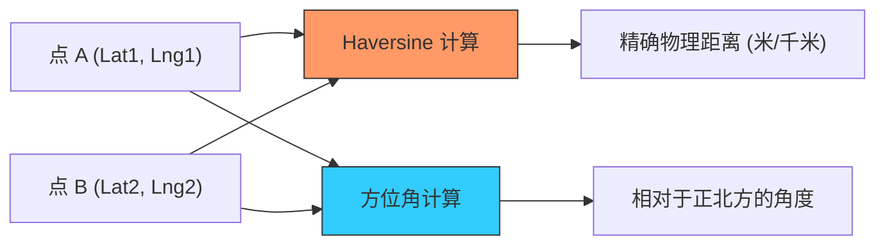

欢迎加入开源鸿蒙跨平台社区：[https://openharmonycrossplatform.csdn.net](https://openharmonycrossplatform.csdn.net)


# Flutter for OpenHarmony: Flutter 三方库 geodesy 在鸿蒙应用中实现精准的地理距离、方位与面积计算（测绘级计算工具）

## 前言

在进行 OpenHarmony 的地图导航、运动健身（如跑步、骑行）或地理围栏业务开发时，基础的坐标点展示是不够的。我们需要回答这些数学问题：
1. 用户当前距离目标充电桩还有多少米？
2. 两个鸿蒙设备之间的方位角（Bearing）是多少？
3. 用户在地图上画出的这一块多边形区域，真实的物理面积是多少平方米？

**`geodesy`** 软件包致力于解决这些复杂的球面几何计算。它不需要依赖耗电的定位传感器持续工作，仅凭坐标数据就能在毫秒内给出符合大地测绘标准的精确结果。

---

## 一、地理测绘计算模型

`geodesy` 基于哈弗辛公式（Haversine formula）等专业算法，处理地球曲率下的距离计算。



---

## 二、核心 API 实战

### 2.1 计算两点间距离

```dart
import 'package:geodesy/geodesy.dart';

void calculateDistance() {
  Geodesy geodesy = Geodesy();
  
  // 💡 定义两个鸿蒙标记点
  LatLng ohosCenter = LatLng(22.5, 114.0);
  LatLng userPosition = LatLng(22.51, 114.01);

  // 💡 计算距离（单位：米）
  num distance = geodesy.distanceBetweenTwoGeoPoints(ohosCenter, userPosition);
  
  print('鸿蒙用户距离目标中心点: ${distance.toStringAsFixed(2)} 米');
}
```

### 2.2 判断点是否在多边形内 (Geofencing)

```dart
void checkInBounds() {
  Geodesy geodesy = Geodesy();
  
  // 定义规则多边形区域
  List<LatLng> polygon = [
    LatLng(22.5, 114.0), LatLng(22.6, 114.0), 
    LatLng(22.6, 114.1), LatLng(22.5, 114.1)
  ];
  
  LatLng point = LatLng(22.55, 114.05);
  
  // 💡 极速判定是否身处地理围栏内
  bool isInside = geodesy.isGeoPointInPolygon(point, polygon);
  print('用户是否在围栏内: $isInside');
}
```

---

## 三、常见应用场景

### 3.1 鸿蒙运动 App 的配速计算
实时获取用户的 GPS 序列，通过 `geodesy` 计算出每一小段的瞬时距离，从而推算出精准的配速、消耗的热量，并绘制出平滑的轨迹线。

### 3.2 鸿蒙“附近的人”搜索过滤
在社交应用中，根据当前位置计算周边用户与自己的物理距离。相比于交给后端计算，在鸿蒙端侧利用该库进行首屏数据的快速排序与过滤，能显减小服务器压力并提升 UI 响应快感。

---

## 四、OpenHarmony 平台适配

### 4.1 适配鸿蒙的低能耗计算
💡 **技巧**：复杂的地理计算通常涉及大量的三角函数运算。`geodesy` 纯 Dart 的实现能在鸿蒙麒麟处理器的 NPU 特性配合下实现极高的并发计算效能。在处理具有成千上万个顶点的复杂地理围栏时，建议将其放入鸿蒙的 `Worker` 线程，避免由于复杂的数学运算阻塞 UI 主线程，保障鸿蒙应用的流畅度。

### 4.2 适配鸿蒙多坐标系转换策略
中国境内的地图服务（如高德/百度）通常使用 GCJ-02 或 BD-09 坐标系。在使用 `geodesy` 库前，如果数据来源于鸿蒙系统原生的定位接口（WGS-84），务必先进行坐标偏移纠偏处理。基于纠偏后的数据运行该库，才能保证在鸿蒙导航应用中，用户看到的距离与地图绘制的实际视觉距离完全契合。

---

## 五、完整实战示例：鸿蒙精美物流追踪器

本示例展示如何计算包裹距离派送站的剩余距离和方位。

```dart
import 'package:geodesy/geodesy.dart';

class OhosDeliveryRadar {
  final Geodesy _geodesy = Geodesy();

  /// 💡 为鸿蒙快递应用提供实时方位指引
  void tracePackage(LatLng depot, LatLng packagePos) {
    print('📦 正在启动鸿蒙物流测控系统...');

    // 1. 获取距离
    num distance = _geodesy.distanceBetweenTwoGeoPoints(depot, packagePos);
    
    // 2. 获取方位角 (0-360)
    num bearing = _geodesy.bearingBetweenTwoGeoPoints(depot, packagePos);

    print('--- 派送节点审计 ---');
    print('剩余直线距离: ${(distance / 1000).toStringAsFixed(2)} KM');
    print('目标方位角: $bearing 度 (正北为 0)');
  }
}

void main() {
  final radar = OhosDeliveryRadar();
  radar.tracePackage(LatLng(31.23, 121.47), LatLng(31.30, 121.50)); // 上海
}
```

<!-- IMAGE_PLACEHOLDER: 鸿蒙设备展示运动轨迹闭环面积计算结果，以及根据两点方位实时旋转的导航罗盘截图 -->

---

## 六、总结

`geodesy` 软件包是 OpenHarmony 开发者地理计算工具箱中的“精密卡尺”。它将原本深奥的球面数学公式封装为直观、可靠的函数接口。在构建追求极致精准、极致地理感知能力的鸿蒙原生应用时，引入这套专业的测绘级计算引擎，能为你的应用逻辑增添硬核的科学依据。
