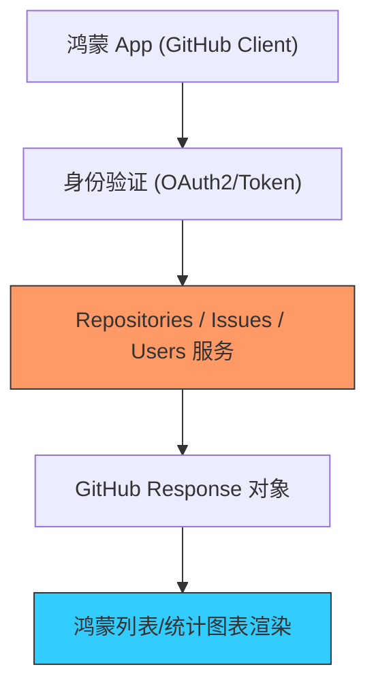

欢迎加入开源鸿蒙跨平台社区：[https://openharmonycrossplatform.csdn.net](https://openharmonycrossplatform.csdn.net)


# Flutter for OpenHarmony: Flutter 三方库 github 在鸿蒙应用中深度集成 GitHub API 构建高效的开发者协作工具（出海与工具链开发）

## 前言

在进行 OpenHarmony 为核心的开发者工具、代码托管助手或出海类社交应用开发时，与 **GitHub** 的数据打交道是必修课。我们需要实现：
1. 鸿蒙端展示用户的 GitHub 仓库列表和 Stars。
2. 自动化管理 Issues，或是监控 Repo 的 PR 动态。
3. 利用 GitHub 账号直接登录鸿蒙端的开发者社区。

**`github`** 软件包是 Flutter 生态中功能最全、维护最稳健的 GitHub REST API 封装库。它提供了 100% 强类型的接口定义，让你的鸿蒙应用能以最轻量化的方式接入全球最大的开源社区数据。

---

## 一、API 通讯与对象模型

`github` 库将繁杂的 JSON 响应转化为高度内聚的 Dart 类。



---

## 二、核心 API 实战

### 2.1 初始化客户端

```dart
import 'package:github/github.dart';

void initGithub() {
  // 💡 简单的匿名访问 (受限频率) 或 Token 授权
  final github = GitHub(auth: Authentication.withToken('ghp_your_token_xxx'));
  
  print('✅ 鸿蒙-GitHub 隧道已开启');
}
```

### 2.2 获取仓库详情

```dart
Future<void> findRepo(GitHub github) async {
  // 💡 通过 RepositorySlug 快速定位
  final slug = RepositorySlug('openharmony', 'flutter_ohos');
  final repo = await github.repositories.getRepository(slug);

  print('星标数: ${repo.stargazersCount}');
  print('最后更新: ${repo.updatedAt}');
}
```

### 2.3 分页获取用户的 Issues

```dart
github.issues.listByUser().listen((issue) {
  print('发现未处理任务: ${issue.title}');
});
```

---

## 三、常见应用场景

### 3.1 鸿蒙端“开源看板”小组件
在鸿蒙手机桌面上放置一个“原子化服务卡片”，利用该库实时获取你最关心的开源项目 Stars 变化或最新的 PR 状态，让开发者无需打开浏览器即可掌握社区脉动。

### 3.2 鸿蒙自动错误上报系统
当鸿蒙应用捕获到非致命异常时，如果项目是开源的，利用该库自动在指定的 GitHub 仓库下创建一个带有详细鸿蒙系统日志的 Issue，实现 Bug 的全闭环自动化管理。

---

## 四、OpenHarmony 平台适配

### 4.1 适配鸿蒙多网络环境监测
💡 **技巧**：访问 GitHub 及其 API 在国内部分鸿蒙设备上可能存在网络波动。在使用 `github` 库时，建议配合鸿蒙原生的网络监听接口。当检测到处于 Wi-Fi 且网络畅通时，再发起大规模的数据列表刷新。同时，利用该库提供的 `Stream` 接口，可以在鸿蒙页面中实现“增量式加载”，避免由于网络阻塞导致的页面假死。

### 4.2 处理大量的 JSON 解析性能
GitHub 的响应数据通常包含海量字段。在鸿蒙设备上，解析一个包含数百个 Repo 定义的 JSON 会消耗可观的 CPU。由于 `github` 库已经完成了强类型转换，在鸿蒙 AOT 模式下效率极高。建议将解析后的结果通过鸿蒙的本地二级缓存进行存储，避免由于频繁调用高成本的 GitHub API 导致的鸿蒙应用响应迟钝或触发频率限制。

---

## 五、完整实战示例：鸿蒙开发者“荣誉勋章”墙

本示例演示如何统计一个用户在 GitHub 上的开源贡献统计。

```dart
import 'package:github/github.dart';

class OhosGithubAuditor {
  final GitHub _github = GitHub();

  /// 💡 展示鸿蒙开发者的贡献摘要
  Future<void> showDeveloperStats(String username) async {
    print('🧐 正在审计开发者 [$username] 的开源影响力...');
    
    try {
      final user = await _github.users.getUser(username);
      
      // 获取用户所有的 Public Repo 统计
      final repos = await _github.repositories.listUserRepositories(username).toList();
      final totalStars = repos.fold<int>(0, (prev, r) => prev + r.stargazersCount);

      print('--- 鸿蒙开发者 GitHub 活动报告 ---');
      report(user, totalStars, repos.length);

    } catch (e) {
      print('查询失败：请检查鸿蒙设备的网络连通性');
    }
  }

  void report(User user, int stars, int repoCount) {
    print('用户: ${user.login} | 关注者: ${user.followersCount}');
    print('总 Stars: $stars | 项目总数: $repoCount');
  }
}

void main() async {
  final auditor = OhosGithubAuditor();
  await auditor.showDeveloperStats('happyphper');
}
```

<!-- IMAGE_PLACEHOLDER: 鸿蒙设备展示 GitHub 个人主页的贡献热力图、仓库列表以及实时粉丝波动的精美 UI 面板截图 -->

---

## 六、总结

`github` 软件包是 OpenHarmony 开发者连接全球技术动脉的“核心组件”。它将复杂的 OAuth 流程和数千个 API 终结点封装成了极致优雅的 Dart 语法。在鸿蒙应用追求全球化视野、追求与开源生态深度融合的今天，熟练掌握不仅是开发效率的飞跃，更是你能够为全球开发者打造顶级工具类应用的基础。
